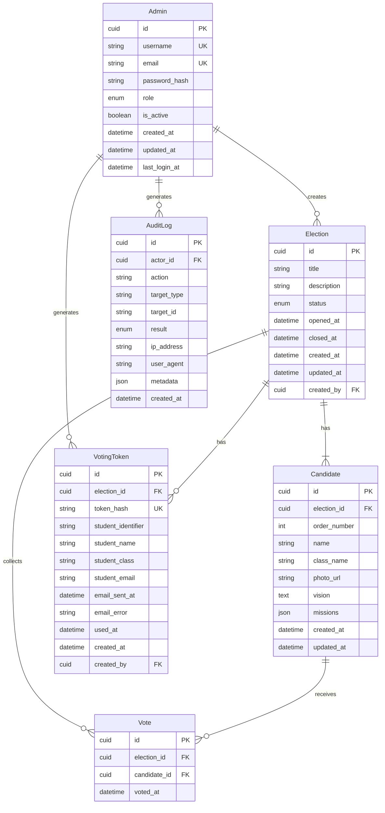

# 01 — Database Design

> **Status:** DRAFT — Pending Review  
> **Version:** 1.0.0  
> **Last Updated:** 2026-07-27  
> **Authors:** Senior Software Architect · Cybersecurity Engineer  
> **PRD Reference:** `00_PRODUCT_REQUIREMENTS_DOCUMENT.md` v1.1.0  
> **Scope:** PostgreSQL schema design via Prisma ORM — v1

---

## Purpose

Dokumen ini adalah **source of truth untuk desain database** sistem Pilketos. Dokumen ini akan menjadi dasar penulisan `schema.prisma` dan semua migration. Tidak ada kode Prisma di dokumen ini — hanya spesifikasi desain yang lengkap dan dapat langsung ditranslasi ke schema.

Setiap keputusan desain yang berasal dari PRD dirujuk secara eksplisit. Tidak ada requirement yang diperkenalkan di luar PRD.

---

## Overview

Sistem Pilketos membutuhkan 6 entitas inti:

| Entitas       | Kategori        | Mutabilitas                             |
| ------------- | --------------- | --------------------------------------- |
| `Admin`       | Auth & RBAC     | Mutable                                 |
| `Election`    | State machine   | Mutable (state saja)                    |
| `Candidate`   | Konten election | Mutable (saat SETUP)                    |
| `VotingToken` | Auth siswa      | Partially immutable (dipakai satu kali) |
| `Vote`        | Suara siswa     | **Immutable** (append-only)             |
| `AuditLog`    | Observability   | **Immutable** (append-only)             |

### Prinsip Desain Database

1. **Privacy-by-design:** Tidak ada FK langsung antara `VotingToken` dan `Vote`. _(PRD §7.2)_
2. **Append-only untuk vote dan audit log:** Record tidak pernah di-UPDATE atau di-DELETE. _(PRD §7.1, §7.3)_
3. **Transaksi atomik** untuk operasi kritis (token validation + vote insert). _(PRD §7.1)_
4. **Satu election aktif:** Hanya satu election boleh berada di state `OPEN` atau `PAUSED` dalam satu waktu. _(PRD Design Decisions)_
5. **Mode kandidat:** Mode biasa minimal 2 kandidat; mode berbobot tepat 5 kandidat. _(PRD §2)_
6. **Token sebagai HMAC-SHA256 hash:** Plaintext tidak pernah disimpan di DB. _(PRD §3, §9.2)_

---

## Entity-Relationship Diagram (ERD)



> **Catatan Kritis (PRD §7.2):** `Vote` tidak memiliki relasi ke `VotingToken`. Ini bukan kelalaian desain — ini adalah keputusan **privacy-by-design** yang disengaja untuk memastikan tidak ada cara teknis mengkorelasikan token ke kandidat.

---

## Naming Conventions

### Umum

| Aspek       | Konvensi                      | Contoh                           |
| ----------- | ----------------------------- | -------------------------------- |
| Nama tabel  | `PascalCase` (Prisma default) | `Admin`, `VotingToken`           |
| Nama kolom  | `snake_case`                  | `token_hash`, `created_at`       |
| Primary key | selalu `id`                   | `id`                             |
| Foreign key | `{entity}_id`                 | `election_id`, `actor_id`        |
| Boolean     | prefix `is_` atau `has_`      | `is_active`                      |
| Timestamp   | suffix `_at`                  | `created_at`, `used_at`          |
| Enum type   | `PascalCase`                  | `AdminRole`, `ElectionStatus`    |
| Enum value  | `SCREAMING_SNAKE_CASE`        | `SUPER_ADMIN`, `ELECTION_OPENED` |

### Enum Definitions

#### `AdminRole`

```
SUPER_ADMIN   - Akses penuh termasuk hapus election dan kelola admin
ADMIN         - Akses operasional harian
VIEWER        - Read-only access
```

_(PRD §1.2)_

#### `ElectionStatus`

```
SETUP         - Konfigurasi awal, belum bisa voting
READY         - Siap dibuka, konfigurasi terkunci
OPEN          - Voting sedang berlangsung
PAUSED        - Voting dijeda sementara
CLOSED        - Voting selesai, tidak bisa dibuka lagi
ARCHIVED      - Data permanen, read-only
```

_(PRD §6)_

#### `AuditAction`

```
-- Admin management
ADMIN_CREATED
ADMIN_UPDATED
ADMIN_DEACTIVATED
ADMIN_PASSWORD_CHANGED
ADMIN_LOGIN_SUCCESS
ADMIN_LOGIN_FAILED

-- Election management
ELECTION_CREATED
ELECTION_EMAIL_TEMPLATE_UPDATED
ELECTION_STATUS_CHANGED   -- mencakup semua transisi state
ELECTION_DELETED          -- hanya SUPER_ADMIN

-- Candidate management
CANDIDATE_CREATED
CANDIDATE_UPDATED
CANDIDATE_DELETED

-- Token management
TOKEN_BATCH_GENERATED
TOKEN_BATCH_EXPORTED
TOKEN_EMAIL_RETRIED
TOKEN_REMINDER_SENT

-- Vote
VOTE_CAST                 -- dicatat untuk integritas; tanpa referensi ke token atau siswa

-- System
BACKUP_RESTORED
```

_(PRD §7.3)_

#### `AuditResult`

```
SUCCESS
FAILURE
```

---

## Tables

### 1. `Admin`

**Purpose:** Menyimpan akun pengguna admin panel (panitia). Entitas ini sepenuhnya terpisah dari domain siswa. _(PRD §1.1)_

| Kolom           | Tipe           | Nullable | Default | Deskripsi                                |
| --------------- | -------------- | -------- | ------- | ---------------------------------------- |
| `id`            | `CUID`         | No       | auto    | Primary key                              |
| `username`      | `VARCHAR(50)`  | No       | —       | Username untuk login, unik               |
| `email`         | `VARCHAR(255)` | No       | —       | Email admin, unik                        |
| `password_hash` | `TEXT`         | No       | —       | Hash Argon2id dari password _(PRD §9.2)_ |
| `role`          | `AdminRole`    | No       | `ADMIN` | RBAC role _(PRD §1.2)_                   |
| `is_active`     | `BOOLEAN`      | No       | `true`  | Soft-disable admin tanpa hapus data      |
| `last_login_at` | `TIMESTAMPTZ`  | Yes      | `null`  | Timestamp login terakhir (UTC)           |
| `created_at`    | `TIMESTAMPTZ`  | No       | `now()` | Waktu pembuatan (UTC)                    |
| `updated_at`    | `TIMESTAMPTZ`  | No       | `now()` | Waktu update terakhir (UTC), auto-update |

**Constraints:**

- `UNIQUE(username)`
- `UNIQUE(email)`
- `CHECK(role IN ('SUPER_ADMIN', 'ADMIN', 'VIEWER'))`

**Indexes:**

- `idx_admin_username` — login lookup
- `idx_admin_email` — deduplikasi dan lookup
- `idx_admin_role` — RBAC filtering
- `idx_admin_is_active` — filter admin aktif

**Lifecycle:**

- Di-create oleh `SUPER_ADMIN`.
- Di-deactivate (`is_active = false`) oleh `SUPER_ADMIN`, tidak di-delete (preserve audit trail).
- `password_hash` bisa di-update oleh admin itu sendiri atau `SUPER_ADMIN`.

**Rationale:**

- Tidak ada kolom `deleted_at` — soft delete via `is_active` sudah cukup dan menjaga referential integrity dengan `AuditLog`.
- `email` wajib unik untuk future notification support (v2), meski v1 tidak mengirim email.

---

### 2. `Election`

**Purpose:** Merepresentasikan satu sesi pemilihan Ketua OSIS dengan state machine 6 state. Hanya satu election boleh berada dalam state `OPEN` atau `PAUSED` dalam satu waktu. _(PRD §6, Design Decisions)_

| Kolom                          | Tipe             | Nullable | Default    | Deskripsi                                    |
| ------------------------------ | ---------------- | -------- | ---------- | -------------------------------------------- |
| `id`                           | `CUID`           | No       | auto       | Primary key                                  |
| `title`                        | `VARCHAR(255)`   | No       | —          | Judul election (e.g., "Pilketos 2025/2026")  |
| `description`                  | `TEXT`           | Yes      | `null`     | Deskripsi singkat opsional                   |
| `status`                       | `ElectionStatus` | No       | `SETUP`    | State machine saat ini _(PRD §6)_            |
| `mode`                         | `ElectionMode`   | No       | `STANDARD` | Mode kandidat bebas atau 5 kandidat berbobot |
| `opened_at`                    | `TIMESTAMPTZ`    | Yes      | `null`     | Waktu state berubah ke OPEN                  |
| `closed_at`                    | `TIMESTAMPTZ`    | Yes      | `null`     | Waktu state berubah ke CLOSED                |
| `google_sheets_spreadsheet_id` | `VARCHAR(128)`   | Yes      | `null`     | Spreadsheet status pemilih per election      |
| `google_sheets_synced_at`      | `TIMESTAMPTZ`    | Yes      | `null`     | Waktu sync Sheets terakhir yang berhasil     |
| `google_sheets_sync_error`     | `TEXT`           | Yes      | `null`     | Error sync terakhir yang terlihat di admin   |
| `token_email_subject`          | `VARCHAR(200)`   | Yes      | `null`     | Template subjek email token per election     |
| `token_email_message`          | `TEXT`           | Yes      | `null`     | Template pesan pembuka email token           |
| `reminder_email_subject`       | `VARCHAR(200)`   | Yes      | `null`     | Template subjek reminder                     |
| `reminder_email_message`       | `TEXT`           | Yes      | `null`     | Template pesan pembuka reminder              |
| `reminder_queued_at`           | `TIMESTAMPTZ`    | Yes      | `null`     | Waktu antrean reminder dimulai               |
| `reminder_completed_at`        | `TIMESTAMPTZ`    | Yes      | `null`     | Waktu seluruh antrean selesai diproses       |
| `created_by`                   | `CUID`           | No       | —          | FK ke `Admin.id` yang membuat election       |
| `created_at`                   | `TIMESTAMPTZ`    | No       | `now()`    | Waktu pembuatan (UTC)                        |
| `updated_at`                   | `TIMESTAMPTZ`    | No       | `now()`    | Waktu update terakhir (UTC), auto-update     |

**Constraints:**

- `CHECK(status IN ('SETUP','READY','OPEN','PAUSED','CLOSED','ARCHIVED'))`
- **Partial Unique Index:** `CREATE UNIQUE INDEX idx_one_active_election ON Election(status) WHERE status IN ('OPEN', 'PAUSED')` — memastikan hanya satu election aktif.
- `FK(created_by) REFERENCES Admin(id) ON DELETE RESTRICT`

**Indexes:**

- `idx_election_status` — filter berdasarkan state
- `idx_one_active_election` (partial unique, lihat constraints)
- `idx_election_created_by` — relasi ke admin
- `idx_election_google_sheets_spreadsheet_id` — lookup spreadsheet sync per election

**State Transition Rules (enforced at application layer + audit log):**

```
SETUP    -> READY    (oleh ADMIN/SUPER_ADMIN, ketika kandidat sesuai mode dan ada >= 1 token)
READY    -> OPEN     (oleh ADMIN/SUPER_ADMIN)
OPEN     -> PAUSED   (oleh ADMIN/SUPER_ADMIN)
PAUSED   -> OPEN     (oleh ADMIN/SUPER_ADMIN)
OPEN     -> CLOSED   (oleh ADMIN/SUPER_ADMIN)
PAUSED   -> CLOSED   (oleh ADMIN/SUPER_ADMIN)
CLOSED   -> ARCHIVED (oleh ADMIN/SUPER_ADMIN)
ARCHIVED -> (tidak ada transisi; SUPER_ADMIN bisa hard-delete)
```

**Lifecycle:**

- Hard delete hanya diizinkan oleh `SUPER_ADMIN` dan hanya saat state `ARCHIVED` atau `SETUP`.
- Saat di-delete, cascade ke `Candidate`, `VotingToken`, dan `Vote` (lihat §Relationships).

**Rationale:**

- Partial unique index pada `status IN ('OPEN','PAUSED')` adalah cara paling efisien dan atomic untuk enforce "satu election aktif" di level database tanpa memerlukan application-level lock.

---

### 3. `Candidate`

**Purpose:** Menyimpan profil kandidat yang bisa dipilih pemilih. Kandidat terikat ke satu election.
Mode biasa memiliki minimal 2 kandidat; mode berbobot memiliki tepat 5 kandidat. _(PRD §2)_

| Kolom          | Tipe           | Nullable | Default | Deskripsi                                                       |
| -------------- | -------------- | -------- | ------- | --------------------------------------------------------------- |
| `id`           | `CUID`         | No       | auto    | Primary key                                                     |
| `election_id`  | `CUID`         | No       | —       | FK ke `Election.id`                                             |
| `order_number` | `SMALLINT`     | No       | —       | Nomor urut kandidat, unik per election _(PRD §2)_               |
| `name`         | `VARCHAR(255)` | No       | —       | Nama lengkap kandidat                                           |
| `class_name`   | `VARCHAR(50)`  | No       | —       | Kelas kandidat (e.g., "XII IPA 1")                              |
| `photo_url`    | `TEXT`         | No       | —       | URL foto kandidat (storage eksternal / Supabase Storage)        |
| `vision`       | `TEXT`         | No       | —       | Visi kandidat (teks singkat)                                    |
| `missions`     | `JSONB`        | No       | `[]`    | Array string misi; preview 2 item di card, selebihnya via modal |
| `created_at`   | `TIMESTAMPTZ`  | No       | `now()` | Waktu pembuatan (UTC)                                           |
| `updated_at`   | `TIMESTAMPTZ`  | No       | `now()` | Waktu update terakhir (UTC), auto-update                        |

**Constraints:**

- `UNIQUE(election_id, order_number)` — nomor urut unik per election
- `CHECK(order_number BETWEEN 1 AND 5)` — batas nomor urut
- `FK(election_id) REFERENCES Election(id) ON DELETE CASCADE`
- Constraint jumlah kandidat sesuai mode di-enforce di application layer karena CHECK tidak bisa menghitung row.

**Indexes:**

- `idx_candidate_election_id` — lookup kandidat per election
- `idx_candidate_election_order` (`election_id, order_number`) — lookup terurut

**Lifecycle:**

- Bisa di-edit saat election berstatus `SETUP`.
- Setelah `READY`, candidate menjadi **read-only** (application layer enforcement).
- Cascade delete saat election dihapus.

**Rationale:**

- `missions` disimpan sebagai `JSONB` karena jumlah misi bervariasi dan tidak memerlukan query per-misi. Ini lebih sederhana dari relasi tabel terpisah `CandidateMission`. Jika v2 membutuhkan query misi individual, migrasi ke tabel terpisah mudah dilakukan.
- `photo_url` menyimpan URL (bukan binary), gambar disimpan di Supabase Storage / object storage.

---

### 4. `VotingToken`

**Purpose:** Menyimpan token anonim yang dibagikan ke pemilih. Validasi token memakai HMAC-SHA256 hash. Untuk distribusi email, sistem juga menyimpan ciphertext token server-side agar email gagal bisa di-retry tanpa menampilkan plaintext token ke admin. Setelah dipakai (`used_at` tidak null), token tidak bisa dipakai lagi dan ciphertext dibersihkan. _(PRD §3)_

| Kolom                | Tipe           | Nullable | Default | Deskripsi                                                    |
| -------------------- | -------------- | -------- | ------- | ------------------------------------------------------------ |
| `id`                 | `CUID`         | No       | auto    | Primary key                                                  |
| `election_id`        | `CUID`         | No       | —       | FK ke `Election.id`                                          |
| `token_hash`         | `VARCHAR(64)`  | No       | —       | HMAC-SHA256 hex-encoded hash dari token plaintext _(PRD §3)_ |
| `token_ciphertext`   | `TEXT`         | Yes      | `null`  | Token terenkripsi untuk retry email server-side              |
| `voter_type`         | `VoterType`    | Yes      | `null`  | `STUDENT`, `TEACHER`, `OSIS`, `MPK`, atau `GURU`             |
| `student_identifier` | `VARCHAR(100)` | Yes      | `null`  | ID pemilih untuk distribusi satu token per orang             |
| `student_name`       | `VARCHAR(255)` | Yes      | `null`  | Nama pemilih untuk distribusi token                          |
| `student_class`      | `VARCHAR(100)` | Yes      | `null`  | Kelas/jabatan pemilih                                        |
| `student_email`      | `VARCHAR(255)` | Yes      | `null`  | Email pemilih untuk pengiriman token                         |
| `email_sent_at`      | `TIMESTAMPTZ`  | Yes      | `null`  | Timestamp token berhasil dikirim email                       |
| `email_error`        | `TEXT`         | Yes      | `null`  | Pesan error pengiriman email terakhir                        |
| `reminder_sent_at`   | `TIMESTAMPTZ`  | Yes      | `null`  | Timestamp reminder pembukaan berhasil dikirim                |
| `reminder_error`     | `TEXT`         | Yes      | `null`  | Error reminder terakhir                                      |
| `used_at`            | `TIMESTAMPTZ`  | Yes      | `null`  | Timestamp saat token dipakai; null = belum dipakai           |
| `created_by`         | `CUID`         | No       | —       | FK ke `Admin.id` yang meng-generate token                    |
| `created_at`         | `TIMESTAMPTZ`  | No       | `now()` | Waktu pembuatan (UTC)                                        |

**Constraints:**

- `UNIQUE(token_hash)` — global uniqueness, mencegah hash collision aktif
- `UNIQUE(election_id, student_identifier)` — satu ID pemilih hanya mendapat satu token per election
- `FK(election_id) REFERENCES Election(id) ON DELETE CASCADE`
- `FK(created_by) REFERENCES Admin(id) ON DELETE RESTRICT`
- `CHECK(used_at IS NULL OR used_at >= created_at)` — temporal consistency

**Indexes:**

- `idx_voting_token_hash` — critical path: lookup saat validasi token (harus cepat)
- `idx_voting_token_election_id` — list token per election
- `idx_voting_token_election_used_at` — count token sudah/belum dipakai per election
- `idx_voting_token_election_student_email` — pencarian email pemilih per election
- `idx_voting_token_election_email_retry` — daftar email belum terkirim yang bisa di-retry
- `idx_voting_token_election_reminder_sent_at` — status reminder per election
- `idx_voting_token_election_voter_type` — filter siswa/guru per election
- `idx_voting_token_created_by` — audit: siapa generate batch ini

**Lifecycle:**

- Di-generate dalam batch oleh admin saat state `SETUP`.
- Bisa dibuat sebagai batch biasa atau mode satu token per siswa dengan metadata NIS/ID, nama, kelas, dan email.
- Plaintext hanya ada di memory saat generate dan di CSV export; tidak pernah disimpan di DB.
- Jika SMTP aktif, token dikirim ke email siswa dan statusnya dicatat di `email_sent_at`/`email_error`.
- Saat election pertama kali `OPEN`, reminder diantrikan hanya untuk token belum dipakai yang email
  awalnya berhasil terkirim. Hasil dicatat terpisah di `reminder_sent_at`/`reminder_error`.
- Saat siswa vote: `used_at` di-set dalam transaksi atomik bersama insert `Vote`. _(PRD §7.1)_
- `used_at` bersifat **write-once** — tidak pernah di-update setelah di-set.
- Cascade delete saat election dihapus.

**Rationale:**

- Tidak ada kolom `candidate_id` atau referensi apapun ke `Vote` — ini adalah penegasan anonimitas _(PRD §7.2)_.
- Metadata siswa dan email hanya dipakai untuk distribusi token dan pengecekan status `used_at`; metadata ini tidak mencatat kandidat yang dipilih.
- `token_hash` adalah HMAC-SHA256 (64 hex char) bukan bcrypt — performa lookup O(1) vs O(n) untuk hash verification.
- Index gabungan `election_id, used_at` mempercepat query partisipasi dan status token per election.

---

### 5. `Vote`

**Purpose:** Menyimpan record suara yang diberikan siswa. Entitas ini **append-only dan immutable**. Tidak ada referensi ke `VotingToken` — ini adalah keputusan privacy-by-design. _(PRD §7.1, §7.2)_

| Kolom          | Tipe          | Nullable | Default | Deskripsi                                 |
| -------------- | ------------- | -------- | ------- | ----------------------------------------- |
| `id`           | `CUID`        | No       | auto    | Primary key                               |
| `election_id`  | `CUID`        | No       | —       | FK ke `Election.id`                       |
| `candidate_id` | `CUID`        | No       | —       | FK ke `Candidate.id`                      |
| `voter_type`   | `VoterType`   | Yes      | `null`  | Role kelompok anonim untuk hasil berbobot |
| `voted_at`     | `TIMESTAMPTZ` | No       | `now()` | Timestamp suara masuk (UTC)               |

**Constraints:**

- `FK(election_id) REFERENCES Election(id) ON DELETE CASCADE`
- `FK(candidate_id) REFERENCES Candidate(id) ON DELETE RESTRICT` — kandidat tidak bisa dihapus jika sudah ada suara
- `CHECK(voted_at <= now())` — timestamp tidak boleh di masa depan

**Intentionally Absent Columns:**

- ❌ `token_id` — tidak ada. _(PRD §7.2: privacy-by-design)_
- ❌ `voter_identity` — tidak ada. Anonim by design.
- ❌ `updated_at` — tidak ada. Record immutable.

**Indexes:**

- `idx_vote_election_id` — count total suara per election (dashboard)
- `idx_vote_candidate_id` — count suara per kandidat (dashboard)
- `idx_vote_election_candidate` (`election_id, candidate_id`) — aggregate query dashboard
- `idx_vote_voted_at` — waktu vote terakhir dan time-series analysis

**Lifecycle:**

- **Hanya INSERT, tidak pernah UPDATE atau DELETE** (kecuali cascade dari election delete).
- `voter_type` tidak mengandung identitas dan hanya dipakai menghitung distribusi OSIS/MPK/GURU.
- Tidak ada UI atau API untuk mengedit atau menghapus vote individual.

**Rationale:**

- Memisahkan `Vote` dari `VotingToken` secara desain tabel adalah satu-satunya cara untuk menjamin anonimitas di level database — bahkan seorang DBA dengan akses langsung tidak dapat mengkorelasikan siapa memilih siapa _(PRD §7.2)_.
- Minimnya kolom bukan kekurangan — ini adalah keputusan sadar untuk membatasi data yang bisa di-eksfiltrasi.

---

### 6. `AuditLog`

**Purpose:** Mencatat setiap aksi admin secara permanen dan tidak dapat diubah. Audit log adalah append-only; tidak ada UPDATE atau DELETE yang diizinkan. _(PRD §7.3)_

| Kolom         | Tipe           | Nullable | Default | Deskripsi                                                        |
| ------------- | -------------- | -------- | ------- | ---------------------------------------------------------------- |
| `id`          | `CUID`         | No       | auto    | Primary key                                                      |
| `actor_id`    | `CUID`         | No       | —       | FK ke `Admin.id` yang melakukan aksi                             |
| `action`      | `AuditAction`  | No       | —       | Jenis aksi (enum) _(PRD §7.3)_                                   |
| `target_type` | `VARCHAR(50)`  | Yes      | `null`  | Tipe entitas target (e.g., `election`, `candidate`)              |
| `target_id`   | `VARCHAR(100)` | Yes      | `null`  | ID entitas target                                                |
| `result`      | `AuditResult`  | No       | —       | `SUCCESS` atau `FAILURE`                                         |
| `ip_address`  | `INET`         | Yes      | `null`  | IP address actor (PostgreSQL native INET type)                   |
| `user_agent`  | `TEXT`         | Yes      | `null`  | User agent string browser actor                                  |
| `metadata`    | `JSONB`        | Yes      | `null`  | Data konteks tambahan (e.g., `{"count": 200}` untuk token batch) |
| `created_at`  | `TIMESTAMPTZ`  | No       | `now()` | Waktu aksi (UTC)                                                 |

**Intentionally Absent Columns:**

- ❌ `updated_at` — tidak ada. Record immutable.

**Constraints:**

- `FK(actor_id) REFERENCES Admin(id) ON DELETE RESTRICT` — log tidak bisa hilang jika admin dihapus; gunakan `is_active = false` sebagai gantinya
- `CHECK(result IN ('SUCCESS', 'FAILURE'))`

**Indexes:**

- `idx_audit_actor_id` — riwayat aksi per admin
- `idx_audit_action` — filter berdasarkan jenis aksi
- `idx_audit_created_at` — time-range query (default sort desc)
- `idx_audit_target` (`target_type, target_id`) — riwayat per entitas
- `idx_audit_result` — filter aksi gagal (monitoring)

**Lifecycle:**

- **Hanya INSERT.** Tidak ada UPDATE atau DELETE yang diizinkan melalui UI, API, maupun Prisma models.
- Export CSV diizinkan sesuai permission matrix semua role. _(PRD §7.3)_
- Tidak ada TTL atau purge policy di v1.

**Rationale:**

- `ip_address` menggunakan tipe PostgreSQL native `INET` bukan `VARCHAR` — mendukung IPv4 dan IPv6 natively, memungkinkan query berbasis subnet di masa depan.
- `actor_id` tidak bisa di-cascade delete karena itu akan menghapus jejak audit. Deaktivasi admin (`is_active = false`) adalah pendekatan yang benar.
- `metadata` sebagai `JSONB` memberi fleksibilitas untuk menyimpan konteks spesifik per aksi tanpa memerlukan kolom tambahan.

---

## Relationships

### Diagram Relasi (Deskriptif)

```
Admin
  ├── membuat banyak Election (created_by)
  ├── men-generate banyak VotingToken (created_by)
  └── menghasilkan banyak AuditLog (actor_id)

Election
  ├── memiliki Candidate sesuai mode (election_id)
  ├── memiliki banyak VotingToken (election_id)
  └── mengumpulkan banyak Vote (election_id)

Candidate
  └── menerima banyak Vote (candidate_id)

VotingToken
  └── [tidak ada relasi ke Vote — privacy-by-design]

Vote
  ├── FK ke Election (election_id)
  └── FK ke Candidate (candidate_id)
  [tidak ada FK ke VotingToken]

AuditLog
  └── FK ke Admin (actor_id)
```

### Cascade Rules

| Parent      | Child                      | On Delete |
| ----------- | -------------------------- | --------- |
| `Election`  | `Candidate`                | CASCADE   |
| `Election`  | `VotingToken`              | CASCADE   |
| `Election`  | `Vote`                     | CASCADE   |
| `Admin`     | `Election` (created_by)    | RESTRICT  |
| `Admin`     | `VotingToken` (created_by) | RESTRICT  |
| `Admin`     | `AuditLog` (actor_id)      | RESTRICT  |
| `Candidate` | `Vote`                     | RESTRICT  |

> **Alasan RESTRICT pada Admin:** Admin tidak bisa dihapus jika masih ada data yang mereferensikannya. Gunakan `is_active = false` untuk menonaktifkan. Ini menjaga integritas audit trail. _(PRD §7.3)_

---

## ID Strategy

**Pilihan: CUID (Collision-Resistant Unique Identifier)**

| Aspek                | CUID             | UUID v4 | Auto-increment               |
| -------------------- | ---------------- | ------- | ---------------------------- |
| URL safety           | ✅               | ✅      | ❌ (sequential, predictable) |
| Sortable             | ✅ (time-prefix) | ❌      | ✅                           |
| Collision resistance | ✅               | ✅      | N/A                          |
| Prisma default       | ✅               | ✅      | ✅                           |
| Leaks row count      | ❌               | ❌      | ✅ (security concern)        |

**Keputusan:** Gunakan **CUID** untuk semua primary key.

**Alasan:**

- Auto-increment mengekspos jumlah row (e.g., `/admin/elections/5` berarti hanya ada ~5 election).
- CUID bersifat time-sortable, memudahkan debugging.
- Prisma mendukung CUID natively via `@default(cuid())`.

---

## Timestamp Strategy

- **Semua timestamp dalam UTC** menggunakan PostgreSQL `TIMESTAMPTZ`.
- Konversi ke timezone lokal dilakukan di **application layer**, tidak di database.
- `created_at`: selalu ada, default `now()`, tidak pernah diupdate.
- `updated_at`: ada di entitas mutable (`Admin`, `Election`, `Candidate`). Auto-update via Prisma `@updatedAt`.
- Entitas immutable (`Vote`, `AuditLog`): hanya punya `created_at` (atau `voted_at`).
- `used_at` di `VotingToken`: null = belum dipakai, tidak-null = sudah dipakai (write-once).

---

## Immutable vs Mutable Entities

| Entitas       | Mutabilitas       | Kolom yang Bisa Diubah                                                     |
| ------------- | ----------------- | -------------------------------------------------------------------------- |
| `Admin`       | Mutable           | `username`, `email`, `password_hash`, `role`, `is_active`, `last_login_at` |
| `Election`    | Partially mutable | `title`, `description`, `status`, `opened_at`, `closed_at`                 |
| `Candidate`   | Partially mutable | Semua kolom — hanya saat `Election.status = SETUP`                         |
| `VotingToken` | Write-once        | `used_at` (satu kali, tidak bisa di-unset)                                 |
| `Vote`        | **Immutable**     | Tidak ada                                                                  |
| `AuditLog`    | **Immutable**     | Tidak ada                                                                  |

---

## Transaction Boundaries

### TX-1: Vote Cast (Critical Path)

**Scope:** Token validation + vote insert + token mark-as-used

```
BEGIN TRANSACTION
  1. SELECT VotingToken WHERE token_hash = $hash AND used_at IS NULL (WITH FOR UPDATE)
  2. Validate election status = OPEN
  3. Validate candidate_id belongs to election
  4. INSERT Vote (election_id, candidate_id, voted_at)
  5. UPDATE VotingToken SET used_at = now() WHERE id = $token_id
COMMIT
-- Jika salah satu langkah gagal: ROLLBACK (tidak ada vote tanpa token terpakai, tidak ada token terpakai tanpa vote)
```

_(PRD §7.1: "Penandaan token sebagai used dan insert record vote dilakukan dalam satu transaksi database yang tidak dapat dipisah.")_

### TX-2: Election State Transition

```
BEGIN TRANSACTION
  1. SELECT Election WHERE id = $id (WITH FOR UPDATE)
  2. Validate current state allows transition
  3. Validate constraints (e.g., >= 2 candidates before SETUP -> READY)
  4. UPDATE Election SET status = $new_status, [opened_at|closed_at] = now()
  5. INSERT AuditLog (ELECTION_STATUS_CHANGED)
COMMIT
```

### TX-3: Token Batch Generation

```
BEGIN TRANSACTION
  1. Validate election status = SETUP
  2. Generate N plaintext tokens in memory
  3. Compute HMAC-SHA256(token, SERVER_SECRET) for each
  4. Encrypt token untuk pengiriman email server-side bila ada email tujuan
  5. INSERT batch into VotingToken (election_id, token_hash, token_ciphertext, voter_type, created_by)
  6. INSERT AuditLog (TOKEN_BATCH_GENERATED, metadata: {count: N})
COMMIT
-- Plaintext token mode per pemilih dikirim lewat email dan tidak ditampilkan ke admin
```

---

## Database Rules (Enforced Layer)

| Rule                                            | Source (PRD)     | Enforcement Layer                           |
| ----------------------------------------------- | ---------------- | ------------------------------------------- |
| Satu election aktif (`OPEN` atau `PAUSED`)      | Design Decisions | Database (partial unique index)             |
| Kandidat sesuai mode: min 2 atau tepat 5        | §2               | Application layer (Prisma + API)            |
| Nomor urut kandidat unik per election           | §2               | Database (UNIQUE constraint)                |
| Token hash: global unik                         | §3               | Database (UNIQUE constraint)                |
| Token: satu kali pakai                          | §3               | Database (used_at write-once) + TX-1        |
| Vote tidak boleh referensi token                | §7.2             | Database (schema design, FK tidak ada)      |
| Vote: append-only                               | §7.1             | Application layer (no UPDATE/DELETE in API) |
| AuditLog: append-only                           | §7.3             | Application layer + database role           |
| State machine election: satu arah               | §6               | Application layer (transition validator)    |
| Admin tidak bisa dihapus jika ada referensi     | —                | Database (ON DELETE RESTRICT)               |
| Kandidat tidak bisa dihapus jika sudah ada vote | —                | Database (ON DELETE RESTRICT)               |

---

## Indexes Summary

| Tabel         | Index                                     | Tipe             | Tujuan                            |
| ------------- | ----------------------------------------- | ---------------- | --------------------------------- |
| `Admin`       | `idx_admin_username`                      | B-tree unique    | Login lookup                      |
| `Admin`       | `idx_admin_email`                         | B-tree unique    | Deduplikasi                       |
| `Admin`       | `idx_admin_role`                          | B-tree           | RBAC filtering                    |
| `Admin`       | `idx_admin_is_active`                     | B-tree           | Filter aktif                      |
| `Election`    | `idx_election_status`                     | B-tree           | Filter state                      |
| `Election`    | `idx_one_active_election`                 | Partial unique   | Satu election aktif               |
| `Candidate`   | `idx_candidate_election_id`               | B-tree           | Lookup per election               |
| `Candidate`   | `idx_candidate_election_order`            | B-tree composite | Urutan kandidat                   |
| `VotingToken` | `idx_voting_token_hash`                   | B-tree unique    | **Critical path**: validasi token |
| `VotingToken` | `idx_voting_token_election_id`            | B-tree           | List token per election           |
| `VotingToken` | `idx_voting_token_election_used_at`       | B-tree composite | Count token sudah/belum dipakai   |
| `VotingToken` | `idx_voting_token_election_student_email` | B-tree composite | Cari email siswa per election     |
| `VotingToken` | `idx_voting_token_election_email_retry`   | Partial index    | Retry email token gagal           |
| `VotingToken` | `idx_voting_token_election_voter_type`    | B-tree composite | Filter siswa/guru                 |
| `VotingToken` | `idx_voting_token_created_by`             | B-tree           | Audit: siapa generate             |
| `Vote`        | `idx_vote_election_id`                    | B-tree           | Total suara per election          |
| `Vote`        | `idx_vote_candidate_id`                   | B-tree           | Suara per kandidat                |
| `Vote`        | `idx_vote_election_candidate`             | B-tree composite | Dashboard aggregate               |
| `Vote`        | `idx_vote_voted_at`                       | B-tree           | Waktu vote terakhir               |
| `AuditLog`    | `idx_audit_actor_id`                      | B-tree           | Riwayat per admin                 |
| `AuditLog`    | `idx_audit_action`                        | B-tree           | Filter jenis aksi                 |
| `AuditLog`    | `idx_audit_created_at`                    | B-tree desc      | Time-range query                  |
| `AuditLog`    | `idx_audit_target`                        | B-tree composite | Riwayat per entitas               |
| `AuditLog`    | `idx_audit_result`                        | B-tree           | Filter aksi gagal                 |

---

## Scalability Considerations

Untuk konteks v1 (satu sekolah, satu election, ~200–500 siswa), sistem ini sangat ringan. Desain berikut mempersiapkan skala yang wajar tanpa over-engineering:

| Aspek                     | Skala v1            | Catatan                                                     |
| ------------------------- | ------------------- | ----------------------------------------------------------- |
| Total vote per election   | ~500                | Tidak memerlukan partitioning                               |
| Concurrent voters         | ~20–50              | Connection pooling default cukup (Supabase: 15 connections) |
| Token per batch           | ~500                | Single INSERT batch cukup                                   |
| AuditLog records          | ~1000/election      | Tidak memerlukan archiving di v1                            |
| Dashboard query frequency | Throttled (N detik) | Mencegah query berlebihan _(PRD §8)_                        |

**Untuk v2 (multi-election, multi-school):**

- Partisi tabel `Vote` dan `AuditLog` per `election_id`.
- Connection pooling lebih agresif (PgBouncer).
- Read replica untuk dashboard queries.

---

## Migration Strategy

### Pendekatan

- Gunakan **Prisma Migrate** untuk semua perubahan schema.
- Setiap perubahan schema = satu migration file dengan nama deskriptif.
- Migration bersifat **forward-only** di production (tidak ada rollback otomatis).
- Rollback manual hanya melalui migration baru yang memperbaiki.

### Naming Convention Migration

```
{timestamp}_{deskripsi_singkat}
Contoh:
  20260101000000_init_schema
  20260115000000_add_admin_last_login
  20260201000000_add_election_description
```

### Initial Migration Checklist

```
[ ] Create enum AdminRole
[ ] Create enum ElectionStatus
[ ] Create enum AuditAction
[ ] Create enum AuditResult
[ ] Create table Admin (dengan indexes)
[ ] Create table Election (dengan partial unique index)
[ ] Create table Candidate (dengan constraints)
[ ] Create table VotingToken (dengan partial index)
[ ] Create table Vote (tanpa FK ke VotingToken)
[ ] Create table AuditLog (dengan INET type)
[ ] Seed: satu akun SUPER_ADMIN default
```

### Seeding Strategy

- **Development:** Seed lengkap (1 election SETUP, 3 kandidat, 50 token, 1 SUPER_ADMIN, 1 ADMIN, 1 VIEWER).
- **Production:** Seed minimal (1 akun SUPER_ADMIN saja). Admin membuat akun lain via dashboard.
- Seed production dijalankan sekali saat initial deployment, tidak pernah dijalankan ulang.

---

## Design Decisions Summary

| Keputusan           | Pilihan                          | Alasan                                                    | PRD Ref          |
| ------------------- | -------------------------------- | --------------------------------------------------------- | ---------------- |
| ID strategy         | CUID                             | URL-safe, tidak sequential, time-sortable                 | —                |
| Timestamp           | TIMESTAMPTZ (UTC)                | Konsistensi antar timezone                                | —                |
| Token storage       | HMAC-SHA256 hex (64 char)        | Keyed hash; lebih aman dari SHA-256 polos                 | §3, §9.2         |
| Anonimitas vote     | No FK VotingToken → Vote         | Privacy-by-design; tidak bisa di-bypass di level DB       | §7.2             |
| Integritas vote     | Atomic transaction               | Cukup untuk v1; Hash Chain di v2                          | §7.1             |
| Satu election aktif | Partial unique index             | Database-level enforcement, lebih reliable dari app check | Design Decisions |
| Max 5 kandidat      | Application layer                | DB CHECK tidak bisa count rows                            | §2               |
| missions kolom      | JSONB                            | Jumlah misi variable; tidak perlu query per-misi          | §2               |
| AuditLog immutable  | Schema + no API endpoint         | Garansi legal dan operasional                             | §7.3             |
| ip_address type     | PostgreSQL INET                  | Native IPv4/IPv6, query-able                              | §7.3             |
| Cascade strategy    | CASCADE election; RESTRICT admin | Jaga audit trail, hapus data orphan saat election dihapus | —                |
| Soft delete Admin   | `is_active = false`              | Jaga referential integrity dengan AuditLog                | §7.3             |
| missions preview    | App layer (2 items)              | Tidak perlu kolom `missions_preview` terpisah             | §2               |

---

> **Dokumen ini akan menjadi source of truth untuk `schema.prisma`.** Setiap deviasi dari dokumen ini selama implementasi harus dikoordinasikan dan dicatat sebagai amendment di sini terlebih dahulu.
