# 02 — System Architecture

> **Status:** DRAFT — Pending Review
> **Version:** 1.1.0
> **Last Updated:** 2026-07-27
> **Authors:** Senior Software Architect · Cybersecurity Engineer
> **PRD Reference:** `00_PRODUCT_REQUIREMENTS_DOCUMENT.md` v1.1.0
> **DB Reference:** `01_DATABASE_DESIGN.md` v1.0.0
> **Scope:** Full-stack system architecture — v1
>
> **Changelog v1.1.0:** Replace Supabase Realtime dengan polling sebagai default dashboard; hapus temporary student session; tambah architectural decision: no Server Actions; tambah StorageService abstraction; tambah Configuration Layer; tambah LoggerService; tambah Health Check endpoint; perbaiki semua Mermaid diagrams dan tabel yang hilang dari v1.0.0.

---

## Purpose

Dokumen ini mendefinisikan **arsitektur sistem Pilketos secara menyeluruh**: bagaimana komponen-komponen berinteraksi, di mana batas-batas autentikasi berada, bagaimana request mengalir dari browser ke database, dan bagaimana deployment dikonfigurasi. Dokumen ini bukan panduan implementasi — tidak ada kode aplikasi di sini.

Setiap keputusan arsitektural dirujuk ke PRD atau Database Design. Tidak ada keputusan yang diperkenalkan tanpa dasar.

---

## Overview

### Technology Stack

| Layer                | Teknologi                                   | Peran                                             |
| -------------------- | ------------------------------------------- | ------------------------------------------------- |
| **UI**               | Next.js 16+, React, TypeScript              | Rendering (SSR/CSR), routing, client state        |
| **Styling**          | TailwindCSS, shadcn/ui                      | Design system, komponen UI                        |
| **Backend**          | Next.js Route Handlers                      | API endpoints, business logic                     |
| **Auth**             | Auth.js (NextAuth) v5, Credentials Provider | Session admin, RBAC                               |
| **Password**         | Argon2id                                    | Hashing password admin _(PRD §9.2)_               |
| **ORM**              | Prisma                                      | Type-safe DB access, migrations                   |
| **Database**         | PostgreSQL (via Supabase)                   | Persistent storage                                |
| **Dashboard Update** | HTTP Polling (3–5 detik)                    | Dashboard live update — default v1 _(PRD §8)_     |
| **Middleware**       | Next.js Proxy (formerly Middleware)         | Route protection, security headers, auth boundary |
| **Storage**          | StorageService → Supabase Storage           | Foto kandidat (via abstraction layer)             |
| **Deployment**       | Docker / Vercel / VPS                       | Lihat §Deployment Architecture                    |

### Prinsip Arsitektur

1. **Two-domain separation:** Domain voting siswa dan domain admin sepenuhnya terpisah secara teknis. _(PRD §1.1)_
2. **Server-first:** Operasi sensitif (validasi token, insert vote, state machine) selalu di server, tidak pernah di client.
3. **Defense in depth:** Validasi berlapis — middleware → route handler → service layer → database constraint.
4. **Least privilege:** Setiap komponen hanya punya akses ke resource yang dibutuhkan.
5. **Fail closed:** Jika validasi gagal, request ditolak. Tidak ada "default allow".
6. **Simplicity over complexity:** Pilih solusi paling sederhana yang memenuhi requirement. Polling > WebSocket untuk v1.
7. **Abstraction at integration points:** Storage, logging, dan konfigurasi menggunakan abstraction layer agar mudah diganti.

---

## System Context Diagram

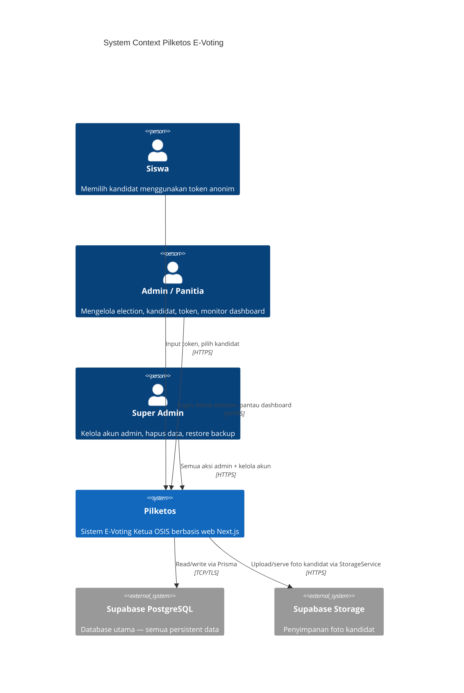

---

## High-Level Architecture

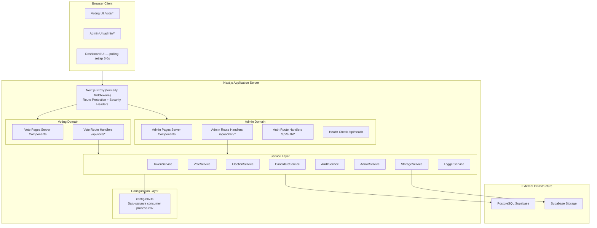

---

## Layered Architecture

Sistem menggunakan arsitektur berlapis yang tegas. Setiap layer hanya boleh memanggil layer di bawahnya.

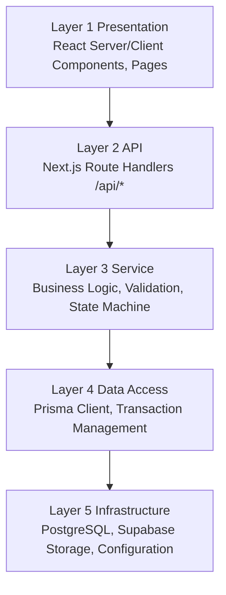

### Tanggung Jawab Per Layer

#### Layer 1 — Presentation

- React Server Components (RSC) untuk rendering awal (SEO, no JS bundle overhead).
- React Client Components hanya untuk interaktivitas: stepper, fullscreen enforcement, polling dashboard.
- Tidak ada business logic. Tidak ada direct database access.
- Menerima data via props (dari RSC) atau API calls (dari Client Components).

#### Layer 2 — API (Route Handlers)

- Entry point untuk semua request dari browser.
- Validasi input (Zod schema) sebelum meneruskan ke service.
- Penegakan autentikasi dan otorisasi (session NextAuth untuk admin; token plain untuk siswa via request body).
- Rate limiting per endpoint.
- Tidak ada database query langsung — semua via service layer.
- Mengembalikan response HTTP yang konsisten (format standar, kode status tepat).
- **Server Actions tidak digunakan** (lihat §Architectural Decision: No Server Actions).

#### Layer 3 — Service

- Semua business logic berada di sini: state machine transition, token validation, batch generation, permission check.
- Memanggil Prisma dalam transaksi atomik untuk operasi kritis.
- Memanggil `AuditService` untuk mencatat setiap aksi admin.
- Memanggil `LoggerService` untuk application logging (bukan audit).
- Tidak tahu tentang HTTP (tidak punya akses ke `request` atau `response` object).

#### Layer 4 — Data Access

- Prisma Client sebagai satu-satunya interface ke database.
- Semua query menggunakan parameterized queries (Prisma default — mencegah SQL injection). _(PRD §9.2)_
- Transaction management: `prisma.$transaction()` untuk operasi atomik. _(DB Design TX-1, TX-2, TX-3)_
- Tidak ada raw SQL kecuali untuk partial unique index via migration SQL manual.

#### Layer 5 — Infrastructure

- PostgreSQL via Supabase.
- Supabase Storage (diakses hanya via `StorageService`).
- Configuration via `config/env.ts` (diakses hanya via modul ini).
- Constraint enforcement di DB: UNIQUE, CHECK, FK, partial unique index.
- Tidak ada stored procedure atau trigger — logika ada di application layer.

---

## Component Responsibilities

### Voting Domain Components

| Komponen                | Path               | Tanggung Jawab                                               |
| ----------------------- | ------------------ | ------------------------------------------------------------ |
| `TokenPage`             | `/vote`            | Form input token; memanggil API validasi                     |
| `FullscreenGate`        | `/vote/fullscreen` | Enforce fullscreen; Keyboard Lock API + fallbacks _(PRD §5)_ |
| `CandidateListPage`     | `/vote/candidates` | Tampil card kandidat dengan stepper                          |
| `CandidateDetailModal`  | component          | Modal detail kandidat (visi + misi lengkap)                  |
| `ConfirmationPage`      | `/vote/confirm`    | Review pilihan sebelum submit                                |
| `ThankYouPage`          | `/vote/done`       | Countdown 3 detik; redirect ke `/vote`                       |
| `VotingProgressStepper` | component          | Stepper: Token → Kandidat → Konfirmasi → Selesai             |
| `FullscreenOverlay`     | component          | Overlay saat keluar fullscreen/pindah tab                    |

### Admin Domain Components

| Komponen               | Path                | Tanggung Jawab                                      |
| ---------------------- | ------------------- | --------------------------------------------------- |
| `LoginPage`            | `/admin/login`      | Form login; submit ke NextAuth Credentials Provider |
| `DashboardPage`        | `/admin/dashboard`  | Polling-based stats, toggle Live Mode _(PRD §8)_    |
| `ElectionManagerPage`  | `/admin/elections`  | CRUD election, kontrol state machine                |
| `CandidateManagerPage` | `/admin/candidates` | CRUD kandidat per election                          |
| `TokenManagerPage`     | `/admin/tokens`     | Generate batch token, export CSV                    |
| `AuditLogPage`         | `/admin/audit`      | View audit log (read-only)                          |
| `AdminSettingsPage`    | `/admin/settings`   | Kelola akun admin — SUPER_ADMIN only _(PRD §1.3)_   |
| `LiveDashboardMode`    | component           | Toggle read-only mode untuk proyektor _(PRD §8)_    |

### API Route Handlers

| Endpoint                           | Method             | Tanggung Jawab                               | Auth Required                       |
| ---------------------------------- | ------------------ | -------------------------------------------- | ----------------------------------- |
| `/api/vote/validate-token`         | POST               | Validasi token siswa, cek election OPEN      | None (token-based)                  |
| `/api/vote/cast`                   | POST               | Atomic: mark token + insert vote _(DB TX-1)_ | None (token plaintext re-validated) |
| `/api/auth/[...nextauth]`          | ALL                | Auth.js handler (login, session, logout)     | N/A                                 |
| `/api/admin/elections`             | GET, POST          | List / create election                       | ADMIN+                              |
| `/api/admin/elections/[id]`        | GET, PATCH, DELETE | Detail / update / delete election            | ADMIN+ / SUPER_ADMIN                |
| `/api/admin/elections/[id]/status` | PATCH              | State machine transition _(DB TX-2)_         | ADMIN+                              |
| `/api/admin/candidates`            | GET, POST          | List / create kandidat                       | ADMIN+                              |
| `/api/admin/candidates/[id]`       | PATCH, DELETE      | Update / delete kandidat                     | ADMIN+                              |
| `/api/admin/candidates/[id]/photo` | POST               | Upload foto via StorageService               | ADMIN+                              |
| `/api/admin/tokens/generate`       | POST               | Batch generate tokens _(DB TX-3)_            | ADMIN+                              |
| `/api/admin/tokens/export`         | GET                | Export CSV token plaintext                   | ADMIN+                              |
| `/api/admin/dashboard/stats`       | GET                | Aggregate stats untuk polling dashboard      | VIEWER+                             |
| `/api/admin/audit`                 | GET                | List audit log dengan filter                 | VIEWER+                             |
| `/api/admin/admins`                | GET, POST          | List / create akun admin                     | SUPER_ADMIN                         |
| `/api/admin/admins/[id]`           | PATCH, DELETE      | Update / deactivate akun admin               | SUPER_ADMIN                         |
| `/api/health`                      | GET                | Health check: DB, storage, version, uptime   | None (public)                       |

---

## Architectural Decision: No Server Actions

> **Keputusan:** Business logic **TIDAK BOLEH** diimplementasikan menggunakan Next.js Server Actions.

Semua write operation harus mengikuti alur:

```
Client
  --> Route Handler (/api/*)
  --> Service Layer
  --> Prisma
  --> Database
```

**Alasan:**

| Aspek                  | Server Actions                    | Route Handlers + Service              |
| ---------------------- | --------------------------------- | ------------------------------------- |
| API boundary           | Tidak jelas (mixed server/client) | Jelas dan eksplisit                   |
| Testability            | Sulit di-unit test secara isolasi | Service layer mudah di-unit test      |
| Future migration       | Terikat ke Next.js                | Mudah dipindah ke service terpisah    |
| Separation of concerns | Blur antara UI dan business logic | Tegas — UI hanya memanggil API        |
| Rate limiting          | Tidak ada built-in                | Bisa diterapkan di Route Handler      |
| Error handling         | Inconsistent                      | Konsisten via standard HTTP responses |

**Pengecualian:** Server Actions **boleh** digunakan hanya untuk operasi UI non-bisnis seperti form revalidation atau redirect. Tidak untuk operasi yang menyentuh database secara langsung.

---

## Request Flows

### Flow 1 — Voting: Token Submission & Validation

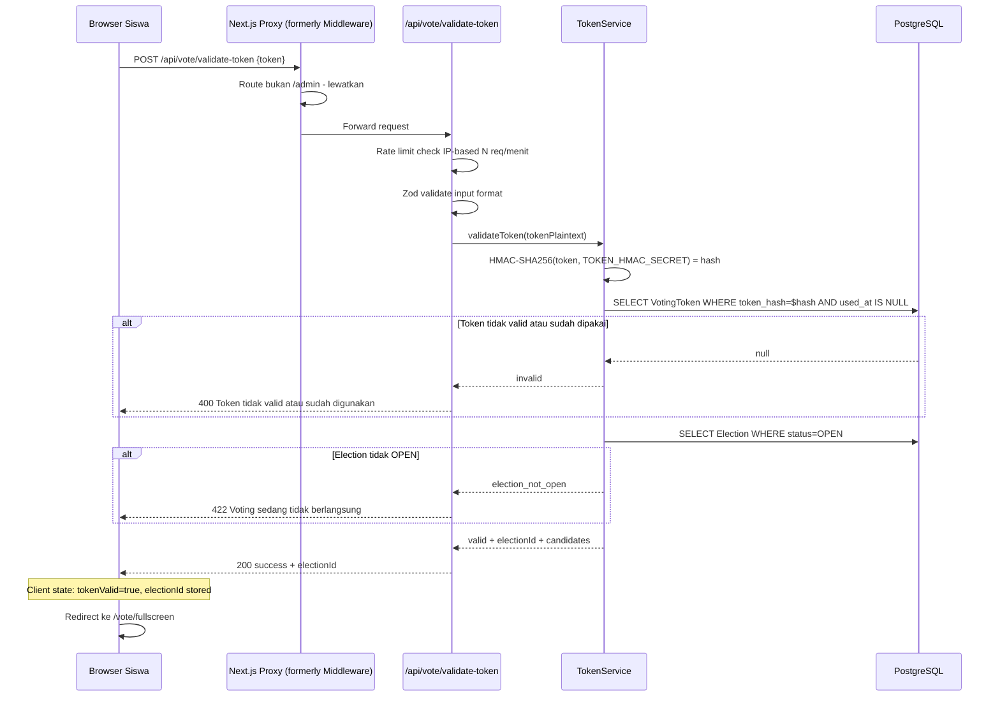

> **Catatan:** Tidak ada server-side session yang dibuat. Token plaintext hanya ada di memori saat pemrosesan, kemudian dibuang. `electionId` dan state voting disimpan di **client state** (React state/sessionStorage). Token di-re-validasi ulang saat vote cast _(Flow 2)_.

### Flow 2 — Voting: Vote Cast (Critical Path)

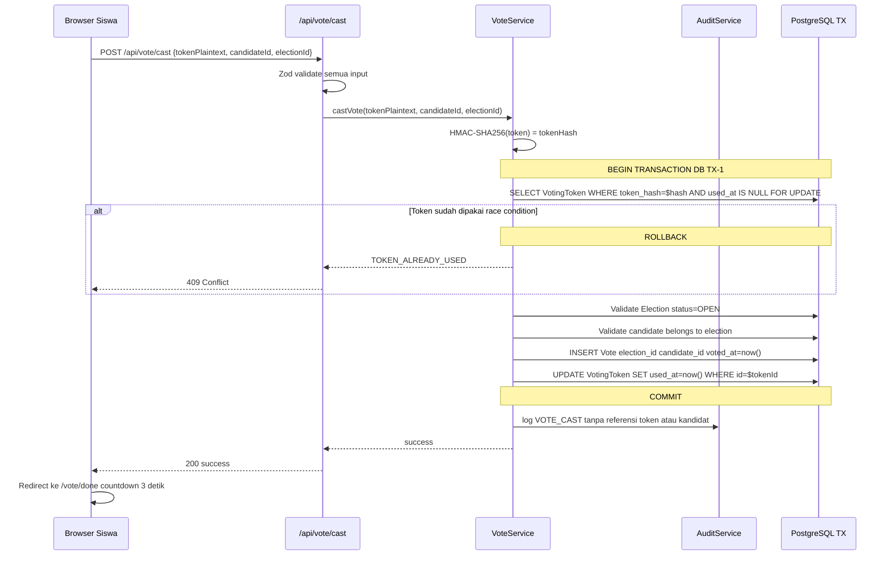

### Flow 3 — Admin: Authentication

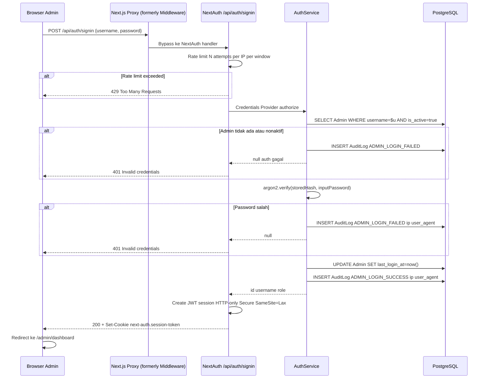

> **Catatan:** Pesan error autentikasi selalu identik ("Invalid credentials") untuk mencegah user enumeration attack — tidak membedakan antara "username tidak ada" dan "password salah". _(PRD §9.2)_

### Flow 4 — Admin: Route Protection (Middleware)

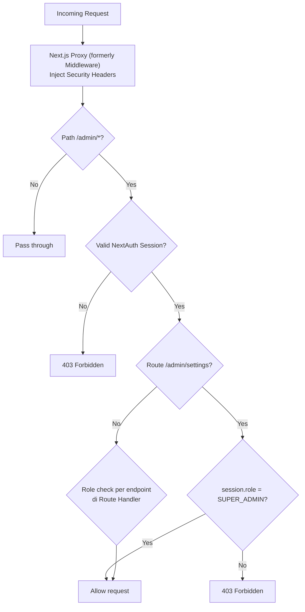

> _(PRD §9.2: "Middleware Next.js: `/vote` = token only, `/admin/*` = login wajib, `/admin/settings` = SUPER_ADMIN only. Gagal akses → HTTP 403")_

### Flow 5 — Dashboard: Polling Update (Default v1)

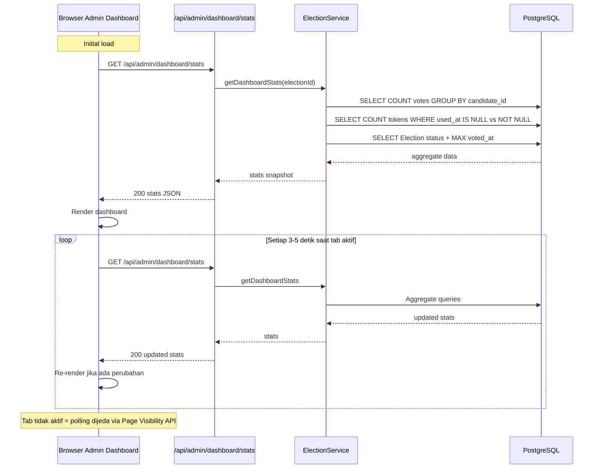

**Polling Design Rules:**

- Interval: **3–5 detik** saat tab aktif. Polling dijeda otomatis via `Page Visibility API` saat tab tidak aktif.
- Response selalu berupa **aggregate query** (COUNT GROUP BY), bukan individual vote records.
- Endpoint mengembalikan data yang sama untuk semua requestor — tidak ada data per-individu.
- Ini mempertahankan throttle guarantee dari PRD §8: tidak ada pola per-individu yang bisa diinferensikan.

### Alternative Architecture: Supabase Realtime (Future/Optional)

Supabase Realtime dapat diadopsi di v2 atau saat traffic/skala membutuhkan push-based update. Arsitektur bisnis tidak perlu berubah — hanya mekanisme trigger di client.

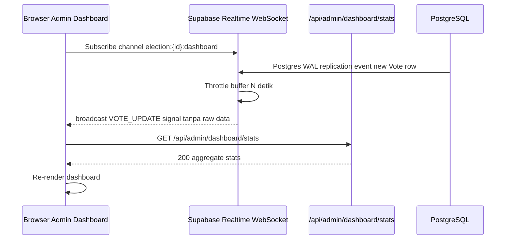

**Keunggulan vs polling:** Lebih efisien untuk skala besar (push vs pull). **Kekurangan:** Membutuhkan WebSocket connection persistent, lebih sulit di-debug, memerlukan Supabase Realtime plan yang sesuai.

> **Catatan migrasi:** Karena business logic (aggregate stats) tetap di API yang sama, migrasi dari polling ke Realtime hanya memerlukan perubahan di client (`useDashboardPolling` → `useDashboardRealtime`) tanpa mengubah service layer atau database schema.

---

## Authentication Boundaries

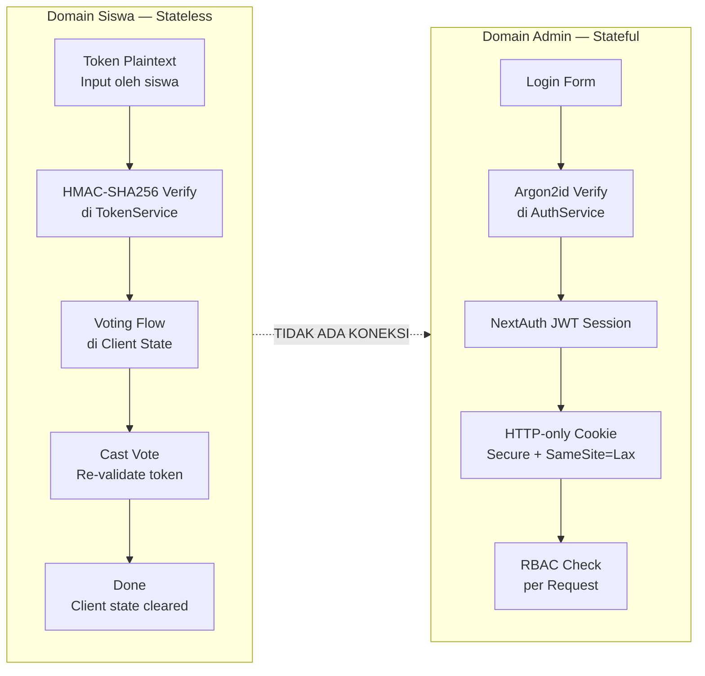

### Student Authentication Detail

| Aspek         | Detail                                                               |
| ------------- | -------------------------------------------------------------------- |
| Mekanisme     | HMAC-SHA256 token verification di setiap operasi                     |
| Session       | **Tidak ada** — stateless sepenuhnya                                 |
| Client state  | Voting progress disimpan di React state / sessionStorage (ephemeral) |
| Re-validation | Token di-re-validate ulang saat vote cast (bukan dari session)       |
| Persistence   | Tidak ada cookie, tidak ada server session                           |
| Identity      | Tidak ada — anonim by design _(PRD §1.1)_                            |
| Anonymity     | Token plaintext dibuang dari memori setelah HMAC computed            |

> **Rationale (revisi dari v1.0.0):** Menghapus temporary server-side session menyederhanakan arsitektur secara signifikan. Token di-re-validate langsung di `/api/vote/cast` dari request body, bukan dari session. Ini tetap aman karena HMAC verification dilakukan ulang server-side, dan `FOR UPDATE` lock pada database mencegah double-voting bahkan dalam race condition.

### Admin Authentication Detail

| Aspek    | Detail                                                                         |
| -------- | ------------------------------------------------------------------------------ |
| Provider | NextAuth Credentials Provider                                                  |
| Password | Argon2id (memory-hard, tahan GPU/ASIC attack) _(PRD §9.2)_                     |
| Session  | JWT dalam HTTP-only + Secure + SameSite=Lax cookie                             |
| RBAC     | Role dikodekan dalam session JWT; diverifikasi di middleware dan service layer |
| Timeout  | Session expire sesuai konfigurasi NextAuth (rekomendasi: 8 jam)                |

---

## Middleware Architecture

Next.js Proxy (formerly Middleware) berjalan di **Edge Runtime** (sebelum request mencapai route handler).

```
Request
  |
  v
+------------------------------------------+
|         Next.js Proxy (formerly Middleware)               |
|  1. Inject Security Headers              |
|     (CSP, HSTS, X-Frame-Options,         |
|      X-Content-Type-Options,             |
|      Referrer-Policy)                    |
|  2. Route classification                 |
|  3. Auth validation untuk /admin/*       |
|     - cek NextAuth session cookie        |
|     - cek role untuk /admin/settings     |
|  4. Return 403 on unauthorized           |
+------------------------------------------+
  |
  v
Route Handler / Page
```

**Security Headers _(PRD §9.2)_:**

| Header                      | Value (Rekomendasi)                                                                                                          |
| --------------------------- | ---------------------------------------------------------------------------------------------------------------------------- |
| `Content-Security-Policy`   | `default-src 'self'; script-src 'self'; style-src 'self' 'unsafe-inline'; img-src 'self' data: blob: [supabase-storage-url]` |
| `Strict-Transport-Security` | `max-age=31536000; includeSubDomains`                                                                                        |
| `X-Frame-Options`           | `DENY`                                                                                                                       |
| `X-Content-Type-Options`    | `nosniff`                                                                                                                    |
| `Referrer-Policy`           | `strict-origin-when-cross-origin`                                                                                            |

---

## StorageService Abstraction

> **Keputusan:** Application layer tidak boleh memanggil Supabase Storage SDK secara langsung. Semua operasi storage harus melalui `StorageService` interface.

```
Application (CandidateService)
  |
  v
StorageService Interface
  uploadFile(path, buffer, mimeType): Promise<string>
  deleteFile(path): Promise<void>
  getPublicUrl(path): string
  |
  v
StorageServiceSupabase (v1 implementation)
  --> Supabase Storage SDK

Future providers (tanpa mengubah application code):
  --> Amazon S3
  --> Cloudflare R2
  --> MinIO (self-hosted)
  --> Local filesystem (development/testing)
```

**Alasan:**

- Business logic tidak bergantung pada provider spesifik.
- Testing mudah dengan mock implementation.
- Migrasi storage provider tidak memerlukan perubahan di service layer.

**Folder:**

```
src/lib/storage/
  index.ts           -- interface IStorageService
  supabase.ts        -- SupabaseStorageService (v1 implementation)
  local.ts           -- LocalStorageService (dev/test only)
```

---

## Configuration Layer

> **Keputusan:** `process.env` hanya boleh diakses dari satu tempat: `src/config/env.ts`. Modul lain tidak boleh mengakses `process.env` secara langsung.

```
src/config/env.ts
  |
  +--> Membaca process.env
  +--> Validasi semua required variables (throw pada startup jika missing)
  +--> Export typed config object
  |
  v
Service Layer, StorageService, AuthService, dll.
  --> import { config } from "@/config/env"
  --> config.database.url
  --> config.auth.secret
  --> config.token.hmacSecret
```

**Manfaat:**

- Validasi terpusat: aplikasi crash pada startup (bukan saat runtime) jika ada env var yang hilang.
- Mudah di-mock dalam unit testing.
- Menghindari scattered `process.env.XYZ` di seluruh codebase.
- Satu tempat untuk melihat semua konfigurasi yang dibutuhkan sistem.

**Config Groups:**

| Group             | Variables                          |
| ----------------- | ---------------------------------- |
| `config.database` | `url`, `directUrl`                 |
| `config.auth`     | `secret`, `url`                    |
| `config.token`    | `hmacSecret`                       |
| `config.supabase` | `url`, `anonKey`, `serviceRoleKey` |
| `config.app`      | `publicUrl`, `version`, `nodeEnv`  |

---

## Logging Architecture

> **Keputusan:** Gunakan `LoggerService` abstraction. Jangan gunakan `console.log()` secara langsung di application code.

### Perbedaan Audit Log vs Application Log

| Aspek        | Audit Log                                   | Application Log                                             |
| ------------ | ------------------------------------------- | ----------------------------------------------------------- |
| **Tujuan**   | Rekam jejak aksi user                       | Debugging dan monitoring runtime                            |
| **Siapa**    | User (admin) melakukan aksi                 | System, errors, request/response                            |
| **Storage**  | Database (`AuditLog` table) — **immutable** | Console / structured log service                            |
| **Retensi**  | Permanen, tidak bisa dihapus _(PRD §7.3)_   | Tidak ada retensi formal di v1                              |
| **Contoh**   | `ELECTION_OPENED`, `TOKEN_GENERATED`        | `ERROR: DB connection timeout`, `INFO: health check passed` |
| **Konsumer** | Admin UI, export CSV                        | DevOps, deployment monitoring                               |

### LoggerService Architecture

```
Application Code
  |
  v
LoggerService Interface
  log(level, message, context?): void
  error(message, error?, context?): void
  warn(message, context?): void
  info(message, context?): void
  |
  v
ConsoleLogger (development)
  --> console.log / console.error dengan format structured JSON

  (Future)
  --> Structured Logger (Pino, Winston)
  --> Log aggregation service (Datadog, Logtail, etc.)
```

**Folder:**

```
src/lib/logger/
  index.ts        -- interface ILogger + export default instance
  console.ts      -- ConsoleLogger implementation
```

**Log Levels:**

- `ERROR`: Exceptions, DB failures, unhandled errors — selalu dicatat
- `WARN`: Degraded behavior, retry attempts, deprecated usage
- `INFO`: Request lifecycle, service start/stop, health check results
- `DEBUG`: Verbose detail — hanya di development (`NODE_ENV=development`)

---

## Health Check Endpoint

```
GET /api/health
```

**Purpose:** Digunakan oleh deployment platform (Docker health check, Vercel, uptime monitor) dan DevOps untuk memverifikasi bahwa aplikasi dan semua dependensinya berfungsi normal.

**Authentication:** Tidak diperlukan (public endpoint). Tidak mengembalikan data sensitif.

**Response (200 — Healthy):**

```json
{
  "status": "ok",
  "timestamp": "2026-07-27T15:30:00.000Z",
  "version": "1.0.0",
  "uptime": 3600,
  "checks": {
    "database": "ok",
    "storage": "ok"
  }
}
```

**Response (503 — Degraded):**

```json
{
  "status": "degraded",
  "timestamp": "2026-07-27T15:30:00.000Z",
  "version": "1.0.0",
  "uptime": 3600,
  "checks": {
    "database": "error: connection timeout",
    "storage": "ok"
  }
}
```

**Checks yang dilakukan:**

1. **Database:** `prisma.$queryRaw('SELECT 1')` — lightweight connectivity test
2. **Storage:** `storageService.ping()` — HEAD request ke storage bucket
3. **Version:** Dibaca dari `config.app.version` (package.json version)
4. **Uptime:** `process.uptime()` dalam detik

**Status code:** `200` jika semua checks OK, `503` jika ada check yang gagal.

---

## Error Handling Strategy

### HTTP Status Codes

| Kode  | Situasi                    | Contoh                                     |
| ----- | -------------------------- | ------------------------------------------ |
| `200` | Sukses                     | Vote berhasil, data berhasil diambil       |
| `400` | Input tidak valid (format) | Token format salah, kandidat ID bukan CUID |
| `401` | Belum autentikasi          | Request ke `/api/admin/*` tanpa session    |
| `403` | Tidak punya akses          | ADMIN mencoba `/admin/settings`            |
| `404` | Resource tidak ditemukan   | Election ID tidak ada                      |
| `409` | Konflik state              | Token sudah dipakai (race condition)       |
| `422` | Business logic gagal       | Election tidak dalam state OPEN saat vote  |
| `429` | Rate limit                 | Terlalu banyak percobaan validasi token    |
| `500` | Server error               | Database connection error                  |
| `503` | Service unavailable        | Health check degraded                      |

### Error Response Format (Standar)

```json
{
  "success": false,
  "error": {
    "code": "TOKEN_ALREADY_USED",
    "message": "Token ini sudah digunakan sebelumnya.",
    "details": null
  }
}
```

### Error Handling Rules

1. **Jangan expose stack trace** ke client di production. Log di server via `LoggerService`, kembalikan pesan generik.
2. **Semua error dari service layer** dibungkus dalam custom error class dengan `code` string.
3. **Database errors** ditangkap di data access layer, tidak pernah bubble ke client.
4. **Validation errors** (Zod) dikembalikan sebagai `400` dengan `details` berisi field yang salah.
5. **Auth errors** selalu mengembalikan pesan yang sama untuk mencegah user enumeration.

---

## Deployment Architecture

_(PRD: "Docker / Vercel / VPS")_

### Option A — Vercel + Supabase (Recommended untuk Production Awal)

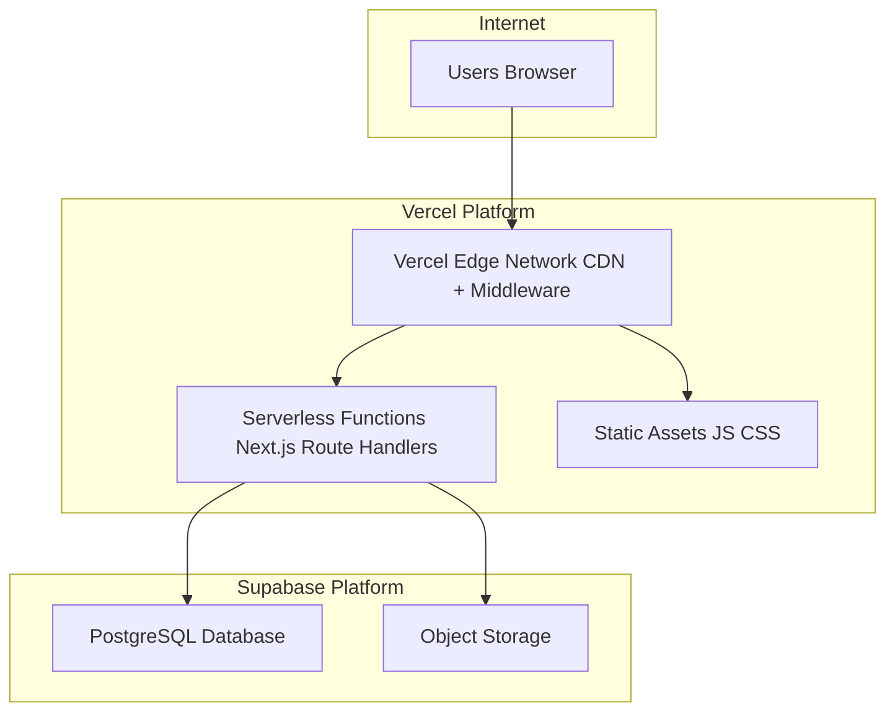

**Keunggulan:** Zero-ops, auto-scaling, CDN global, gratis untuk traffic kecil.
**Kekurangan:** Vendor lock-in (Vercel), cold start serverless, biaya naik seiring skala.

### Option B — Docker + VPS (Self-hosted)

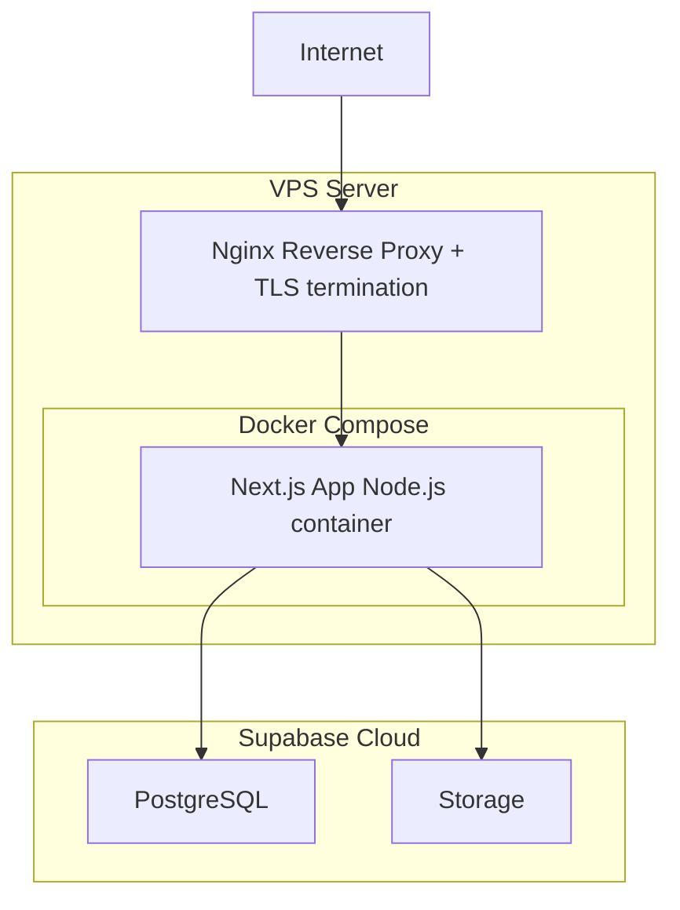

**Keunggulan:** Kontrol penuh, biaya tetap, tidak ada cold start.
**Kekurangan:** Membutuhkan ops knowledge, manual TLS management, manual scaling.

### Environment Variables (Required)

| Variable                    | Keterangan                                         | Di Browser?                          |
| --------------------------- | -------------------------------------------------- | ------------------------------------ |
| `DATABASE_URL`              | Prisma connection string PostgreSQL (via pooler)   | ❌ Server only                       |
| `DIRECT_URL`                | Direct connection (bypass pooler, untuk migration) | ❌ Server only                       |
| `AUTH_SECRET`               | NextAuth JWT signing secret                        | ❌ Server only                       |
| `TOKEN_HMAC_SECRET`         | Secret untuk HMAC-SHA256 token hashing _(PRD §3)_  | ❌ Server only                       |
| `NEXTAUTH_URL`              | Base URL aplikasi                                  | ❌ Server only                       |
| `SUPABASE_URL`              | Supabase project URL                               | ✅ Client safe                       |
| `SUPABASE_ANON_KEY`         | Supabase anonymous key                             | ✅ Client safe                       |
| `SUPABASE_SERVICE_ROLE_KEY` | Supabase service role key                          | ❌ **Never to browser** _(PRD §9.2)_ |
| `NEXT_PUBLIC_APP_URL`       | Public app URL                                     | ✅ Client safe                       |
| `APP_VERSION`               | Versi aplikasi (untuk health check)                | ❌ Server only                       |

> _(PRD §9.2: "service role key tidak pernah dikirim ke browser")_

---

## Folder Structure Rationale

```
src/
├── app/
│   ├── vote/               # Voting domain pages
│   ├── admin/              # Admin domain pages
│   └── api/
│       ├── vote/           # Vote Route Handlers
│       ├── admin/          # Admin Route Handlers
│       ├── auth/           # NextAuth handler
│       └── health/         # Health check endpoint
├── components/
│   ├── voting/             # Komponen spesifik voting
│   ├── dashboard/          # Komponen dashboard + polling hook
│   ├── admin/              # Komponen admin panel
│   ├── ui/                 # shadcn/ui base components
│   └── common/             # Error boundary, loading state
├── config/
│   └── env.ts              # SATU-SATUNYA consumer process.env
├── lib/
│   ├── prisma/             # Prisma client singleton
│   ├── auth/               # NextAuth config, Argon2id helper
│   ├── storage/            # StorageService interface + implementations
│   └── logger/             # LoggerService interface + implementations
├── services/
│   ├── token.service.ts
│   ├── vote.service.ts
│   ├── election.service.ts
│   ├── candidate.service.ts
│   ├── audit.service.ts
│   └── admin.service.ts
├── hooks/
│   ├── useFullscreen.ts            # Fullscreen + Keyboard Lock + fallbacks
│   ├── useVotingState.ts           # Client-side voting step state
│   └── useDashboardPolling.ts      # Polling hook dengan Page Visibility API
├── types/                  # TypeScript interfaces dan enums
├── utils/                  # Pure utility functions
├── schemas/                # Zod validation schemas per endpoint
└── proxy.ts            # Route protection + security headers
```

**Perubahan dari PRD awal:**

- Ditambahkan `services/` — memisahkan business logic dari route handlers.
- Ditambahkan `schemas/` — Zod schemas per endpoint.
- Ditambahkan `config/` — Configuration Layer terpusat.
- `lib/` diperluas dengan `storage/` dan `logger/` abstraction.
- `hooks/useDashboardPolling.ts` menggantikan `useDashboardRealtime.ts`.

---

## Data Flow: Anonymity Guarantee

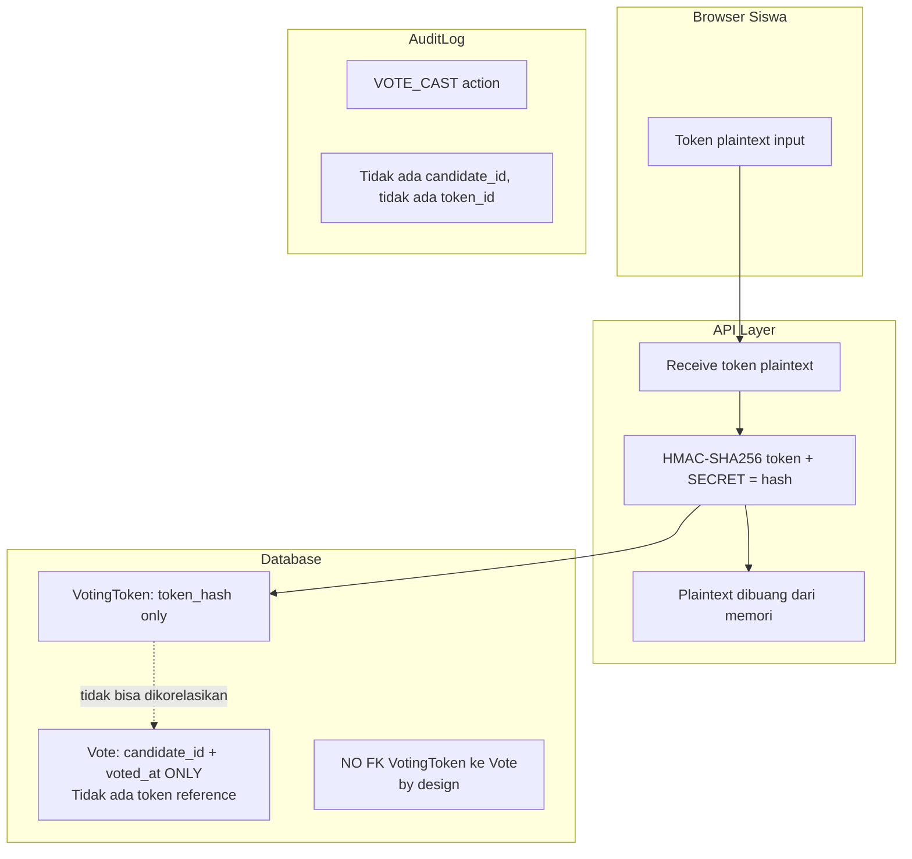

_(PRD §7.2: "Korelasi antara token dan kandidat secara teknis tidak dapat dilakukan dari dalam database.")_

---

## Scalability Considerations

| Aspek                | v1 (Current)                        | v2 (Future)                                 |
| -------------------- | ----------------------------------- | ------------------------------------------- |
| Concurrent voters    | ~20–50                              | Horizontal scaling App container            |
| Database connections | Supabase pooler default             | PgBouncer / Supabase transaction pooler     |
| Dashboard update     | Polling 3–5s (pull)                 | Supabase Realtime WebSocket (push)          |
| Dashboard queries    | Aggregate per poll                  | Read replica + materialized view            |
| File storage         | Supabase Storage via StorageService | S3 / R2 / MinIO — ganti implementation saja |
| Multi-election       | Tidak didukung _(PRD §10)_          | Partition Vote/AuditLog per election_id     |
| Session storage      | Stateless JWT                       | Redis session store jika diperlukan         |
| Logging              | Console (dev)                       | Pino + log aggregation service              |
| Config               | env.ts validasi                     | Secrets manager (Vault, AWS SSM)            |

---

## Design Decisions Summary

| Keputusan            | Pilihan                                    | Alasan                                                           | Ref                |
| -------------------- | ------------------------------------------ | ---------------------------------------------------------------- | ------------------ |
| Full-stack framework | Next.js App Router                         | SSR/CSR unified, Route Handlers sebagai API, middleware built-in | PRD Tech Stack     |
| Backend pattern      | Route Handlers + Service layer             | Tidak overengineer; mudah refactor ke microservice               | —                  |
| No Server Actions    | Route Handlers only                        | Consistent API boundary, testability, separation of concerns     | §No Server Actions |
| Dashboard update v1  | HTTP Polling 3–5s                          | Simpler, zero dependency, sufficient untuk ~500 voters           | PRD §8             |
| Dashboard update v2  | Supabase Realtime (optional)               | Push-based untuk skala lebih besar; API stats endpoint sama      | PRD §8             |
| Student session      | Stateless — tidak ada server session       | Simplify architecture; token re-validated per request            | PRD §7.2           |
| Storage abstraction  | StorageService interface                   | Decoupling dari provider; mudah diganti atau di-mock             | —                  |
| Configuration layer  | config/env.ts saja                         | Central validation; no scattered process.env                     | —                  |
| Logging              | LoggerService abstraction                  | Testable; mudah upgrade ke structured logging                    | —                  |
| Health check         | GET /api/health                            | Operational monitoring; standard DevOps practice                 | —                  |
| Auth library         | NextAuth v5                                | Mature, CSRF built-in, HTTP-only cookie native                   | PRD §9.2           |
| Validation           | Zod                                        | Type-safe, composable, runtime validation                        | —                  |
| Error format         | Standard {success, error: {code, message}} | Konsistensi client-server                                        | —                  |
| Deployment           | Vercel + Supabase atau Docker VPS          | Fleksibel untuk budget sekolah berbeda                           | PRD Deployment     |
| Security headers     | Injected di Middleware Edge                | Berjalan sebelum route handler                                   | PRD §9.2           |

---

> **Dokumen ini harus diperbarui setiap kali ada perubahan arsitektur yang signifikan.** Perubahan yang tidak konsisten dengan PRD atau Database Design harus dikoordinasikan terlebih dahulu sebelum diimplementasikan.
