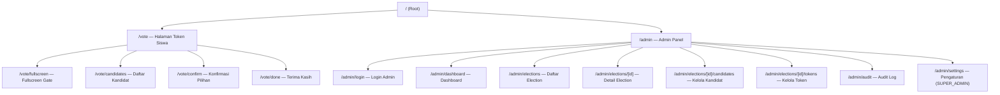
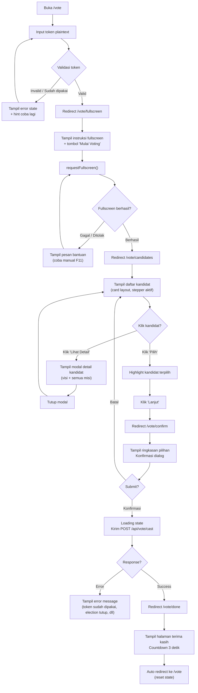
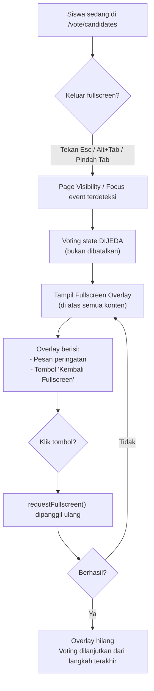
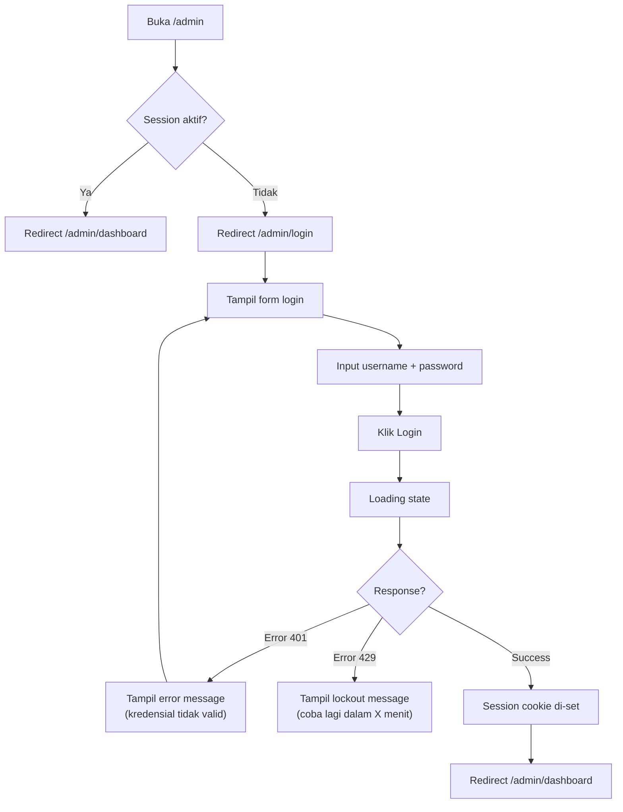
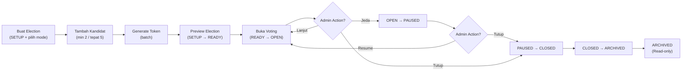
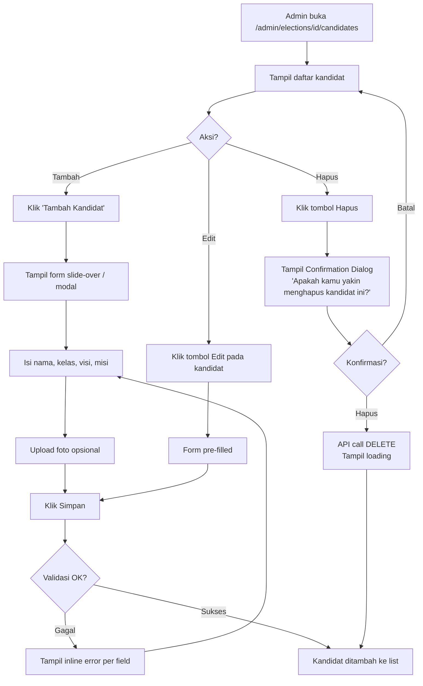
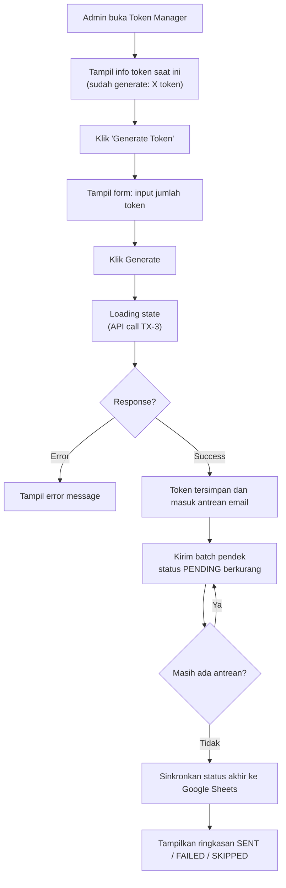
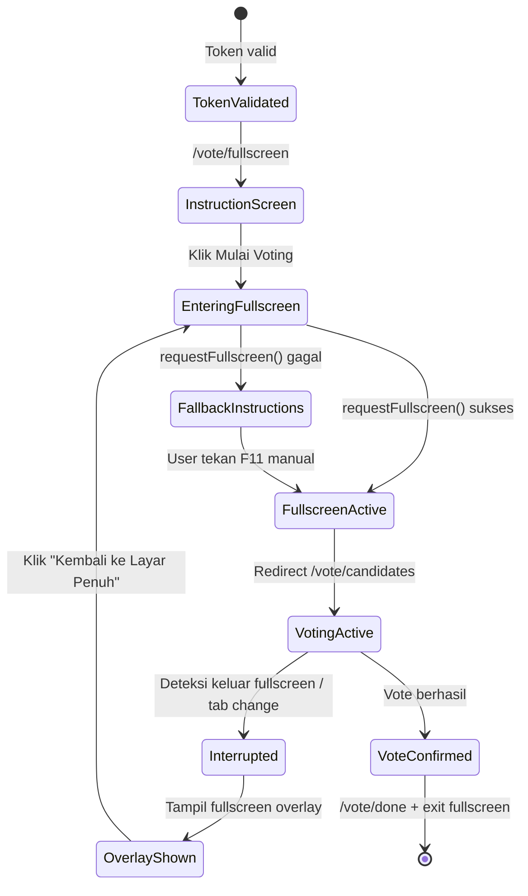

# 04 — UI/UX Specification

> **Status:** DRAFT — Pending Review
> **Version:** 1.0.0
> **Last Updated:** 2026-07-27
> **Authors:** Product Manager · Senior Software Architect · UI/UX Designer
> **PRD Reference:** `00_PRODUCT_REQUIREMENTS_DOCUMENT.md` v1.1.0
> **DB Reference:** `01_DATABASE_DESIGN.md` v1.0.0
> **Arch Reference:** `02_SYSTEM_ARCHITECTURE.md` v1.1.0
> **API Reference:** `03_API_SPECIFICATION.md` v1.0.0
> **Scope:** Full UI/UX blueprint — v1
> **Audience:** Frontend Developer · UI Designer · QA Engineer

---

## Purpose

Dokumen ini adalah **blueprint lengkap UI/UX** sistem Pilketos. Mencakup seluruh pengalaman pengguna, struktur antarmuka, user flow, layout, state, feedback, navigasi, aksesibilitas, responsive behavior, design system, dan interaction rules.

Frontend developer harus dapat membangun seluruh tampilan hanya dari dokumen ini. UI designer harus dapat membuat Figma hanya dari dokumen ini. Tidak ada kode React, tidak ada implementasi — hanya spesifikasi.

Setiap keputusan UI konsisten dengan PRD, Database Design, System Architecture, dan API Specification. Tidak ada fitur baru yang diperkenalkan.

---

## Design Principles

| Prinsip                    | Deskripsi                                            | Aplikasi di Pilketos                                        |
| -------------------------- | ---------------------------------------------------- | ----------------------------------------------------------- |
| **Simplicity**             | Tampilan sesederhana mungkin tanpa mengurangi fungsi | Halaman voting siswa hanya satu aksi utama per langkah      |
| **Accessibility**          | Dapat digunakan oleh semua pengguna                  | Kontras tinggi, keyboard navigable, ARIA labels             |
| **Consistency**            | Pola UI yang sama di seluruh aplikasi                | Satu design system, satu error format, satu loading pattern |
| **Minimal Cognitive Load** | Kurangi keputusan yang harus dibuat pengguna         | Stepper yang jelas, satu tombol aksi utama per halaman      |
| **Fast Task Completion**   | Siswa harus bisa vote dalam < 2 menit                | Flow linear, tidak ada navigasi yang membingungkan          |
| **Error Prevention**       | Cegah kesalahan sebelum terjadi                      | Konfirmasi sebelum submit, validasi inline, disabled state  |
| **Progressive Disclosure** | Tampilkan informasi secara bertahap                  | Preview 2 misi di card, "Lihat Selengkapnya" untuk detail   |
| **Privacy by Design**      | UI tidak mengekspos data yang tidak perlu            | Tidak ada nama siswa, tidak ada bukti pilihan setelah vote  |
| **Responsive First**       | Desain untuk semua ukuran layar                      | Layout responsif dari 320px hingga 4K                       |
| **Touch Friendly**         | Target sentuh minimum 44×44px                        | Semua tombol interaktif memenuhi standar ini                |

---

## User Personas

### Persona 1 — Siswa Pemilih

| Aspek                  | Detail                                                                           |
| ---------------------- | -------------------------------------------------------------------------------- |
| **Nama Representatif** | Andi, 16 tahun, Kelas XI IPA                                                     |
| **Goals**              | Memberikan suara dengan mudah dan cepat                                          |
| **Needs**              | Antarmuka yang sangat sederhana; tidak perlu daftar akun; instruksi yang jelas   |
| **Pain Points**        | Bingung dengan teknologi; takut salah pilih; khawatir privasi                    |
| **Technical Skill**    | Rendah–sedang; familiar dengan smartphone                                        |
| **Device**             | Komputer lab sekolah (Desktop Chrome); mungkin laptop pribadi                    |
| **Expected Journey**   | Menerima token → buka browser → input token → pilih kandidat → selesai < 2 menit |
| **Anxiety Points**     | "Apakah pilihanku sudah tersimpan?", "Apakah orang lain tahu aku pilih siapa?"   |

### Persona 2 — Admin / Panitia Pemilihan

| Aspek                  | Detail                                                                                                    |
| ---------------------- | --------------------------------------------------------------------------------------------------------- |
| **Nama Representatif** | Bu Sari, 35 tahun, Guru Pembimbing OSIS                                                                   |
| **Goals**              | Mengelola pemilihan dari awal hingga akhir dengan mudah                                                   |
| **Needs**              | Dashboard yang informatif; kontrol state election yang jelas; generate token mudah                        |
| **Pain Points**        | Tidak terbiasa dengan sistem kompleks; takut salah tekan tombol kritis                                    |
| **Technical Skill**    | Sedang; terbiasa dengan spreadsheet dan email                                                             |
| **Device**             | Laptop Windows, Chrome                                                                                    |
| **Expected Journey**   | Login → setup election → tambah kandidat → generate token → buka voting → pantau dashboard → tutup voting |

### Persona 3 — Viewer (Pengawas Read-Only)

| Aspek                  | Detail                                                           |
| ---------------------- | ---------------------------------------------------------------- |
| **Nama Representatif** | Pak Hendra, 45 tahun, Kepala Sekolah                             |
| **Goals**              | Melihat progress voting secara real-time tanpa mengubah apapun   |
| **Needs**              | Dashboard yang bersih dan informatif; data partisipasi           |
| **Pain Points**        | Tidak familiar dengan admin panel; hanya butuh angka             |
| **Technical Skill**    | Rendah; hanya butuh melihat dashboard                            |
| **Device**             | Laptop, kadang tablet                                            |
| **Expected Journey**   | Login → langsung ke dashboard → lihat grafik dan angka → selesai |

### Persona 4 — Super Admin (IT/Koordinator)

| Aspek                  | Detail                                                             |
| ---------------------- | ------------------------------------------------------------------ |
| **Nama Representatif** | Mas Dito, 28 tahun, Staff IT Sekolah                               |
| **Goals**              | Mengelola akun admin, memastikan sistem berjalan, akses penuh      |
| **Needs**              | Kontrol penuh; akses settings; kelola akun; lihat semua audit log  |
| **Pain Points**        | Harus cepat menyelesaikan masalah jika ada error; butuh log detail |
| **Technical Skill**    | Tinggi; familiar dengan sistem web                                 |
| **Device**             | Desktop / Laptop, Chrome / Edge                                    |
| **Expected Journey**   | Login → kelola admin → verifikasi sistem → monitoring              |

---

## Information Architecture

### Sitemap



### Route Access Matrix

| Route                              | Siswa | VIEWER | ADMIN  | SUPER_ADMIN |
| ---------------------------------- | :---: | :----: | :----: | :---------: |
| `/vote`                            |  ✅   |   ❌   |   ❌   |     ❌      |
| `/vote/fullscreen`                 |  ✅   |   ❌   |   ❌   |     ❌      |
| `/vote/candidates`                 |  ✅   |   ❌   |   ❌   |     ❌      |
| `/vote/confirm`                    |  ✅   |   ❌   |   ❌   |     ❌      |
| `/vote/done`                       |  ✅   |   ❌   |   ❌   |     ❌      |
| `/admin/login`                     |  ❌   | Public | Public |   Public    |
| `/admin/dashboard`                 |  ❌   |   ✅   |   ✅   |     ✅      |
| `/admin/elections`                 |  ❌   |   ✅   |   ✅   |     ✅      |
| `/admin/elections/[id]`            |  ❌   |   ✅   |   ✅   |     ✅      |
| `/admin/elections/[id]/candidates` |  ❌   |   ✅   |   ✅   |     ✅      |
| `/admin/elections/[id]/tokens`     |  ❌   |   ✅   |   ✅   |     ✅      |
| `/admin/audit`                     |  ❌   |   ✅   |   ✅   |     ✅      |
| `/admin/settings`                  |  ❌   |   ❌   |   ❌   |     ✅      |

---

## User Flows

### Flow 1 — Student Voting Flow (Happy Path)



### Flow 2 — Fullscreen Interruption Recovery



### Flow 3 — Admin Login Flow



### Flow 4 — Election Lifecycle Management



### Flow 5 — Candidate CRUD Flow



### Flow 6 — Token Generation Flow



### Flow 7 — Dashboard Monitoring Flow

```mermaid
flowchart TD
    A["Admin buka /admin/dashboard"] --> B["Load initial stats\n(GET /api/admin/dashboard/stats)"]
    B --> C["Render dashboard\n(grafik, angka, status)"]
    C --> D{Tab aktif?}
    D -->|Ya| E["Polling setiap 3-5 detik"]
    E --> F["GET /api/admin/dashboard/stats"]
    F --> G["Update komponen jika ada perubahan"]
    G --> D
    D -->|Tidak (tab background)| H["Pause polling\n(Page Visibility API)"]
    H --> I{Tab aktif kembali?}
    I -->|Ya| E
    C --> J{Toggle Live Mode?}
    J --> K["Sembunyikan kontrol admin\n(hanya tampil stats + grafik)"]
    K --> L["Mode proyektor aktif"]
```

---

## Design System

### Color Palette

#### Base Colors

| Token                 | Hex       | HSL            | Penggunaan               |
| --------------------- | --------- | -------------- | ------------------------ |
| `--color-primary-50`  | `#EEF2FF` | `239 100% 97%` | Background ringan, hover |
| `--color-primary-100` | `#E0E7FF` | `238 100% 94%` | Badge background         |
| `--color-primary-500` | `#6366F1` | `239 84% 67%`  | Primary button, link     |
| `--color-primary-600` | `#4F46E5` | `243 75% 59%`  | Primary button hover     |
| `--color-primary-700` | `#4338CA` | `245 73% 52%`  | Primary button active    |
| `--color-primary-900` | `#1E1B4B` | `245 75% 20%`  | Dark text on primary     |
| `--color-neutral-50`  | `#F9FAFB` | `210 20% 98%`  | Page background          |
| `--color-neutral-100` | `#F3F4F6` | `220 14% 96%`  | Card background, input   |
| `--color-neutral-200` | `#E5E7EB` | `220 13% 91%`  | Border                   |
| `--color-neutral-400` | `#9CA3AF` | `220 9% 65%`   | Placeholder, muted text  |
| `--color-neutral-600` | `#4B5563` | `220 9% 46%`   | Secondary text           |
| `--color-neutral-800` | `#1F2937` | `217 19% 27%`  | Body text                |
| `--color-neutral-900` | `#111827` | `222 47% 11%`  | Heading                  |
| `--color-white`       | `#FFFFFF` | —              | Surface, card background |

#### Semantic Colors

| Token                 | Hex       | Penggunaan           |
| --------------------- | --------- | -------------------- |
| `--color-success-50`  | `#F0FDF4` | Success background   |
| `--color-success-500` | `#22C55E` | Success icon, border |
| `--color-success-700` | `#15803D` | Success text         |
| `--color-warning-50`  | `#FFFBEB` | Warning background   |
| `--color-warning-500` | `#F59E0B` | Warning icon, border |
| `--color-warning-700` | `#B45309` | Warning text         |
| `--color-danger-50`   | `#FEF2F2` | Error background     |
| `--color-danger-500`  | `#EF4444` | Error icon, border   |
| `--color-danger-700`  | `#B91C1C` | Error text           |
| `--color-info-50`     | `#EFF6FF` | Info background      |
| `--color-info-500`    | `#3B82F6` | Info icon, border    |
| `--color-info-700`    | `#1D4ED8` | Info text            |

#### Voting Domain Accent

Domain voting siswa menggunakan warna yang lebih hangat dan menyambut:

| Token                          | Hex       | Penggunaan                |
| ------------------------------ | --------- | ------------------------- |
| `--color-vote-primary`         | `#6366F1` | CTA utama voting          |
| `--color-vote-surface`         | `#F8F7FF` | Background halaman voting |
| `--color-vote-card`            | `#FFFFFF` | Card kandidat             |
| `--color-vote-selected`        | `#EEF2FF` | Card kandidat terpilih    |
| `--color-vote-border-selected` | `#6366F1` | Border card terpilih      |

### Typography

Font: **Inter** (Google Fonts). Fallback: `system-ui, -apple-system, sans-serif`.

| Scale   | Token            | Size             | Weight | Line Height | Penggunaan                 |
| ------- | ---------------- | ---------------- | ------ | ----------- | -------------------------- |
| Display | `--text-display` | 48px / 3rem      | 700    | 1.1         | Judul besar halaman voting |
| H1      | `--text-h1`      | 36px / 2.25rem   | 700    | 1.2         | Page title admin           |
| H2      | `--text-h2`      | 28px / 1.75rem   | 600    | 1.25        | Section heading            |
| H3      | `--text-h3`      | 22px / 1.375rem  | 600    | 1.3         | Card title, subsection     |
| H4      | `--text-h4`      | 18px / 1.125rem  | 600    | 1.4         | Label besar                |
| Body LG | `--text-body-lg` | 16px / 1rem      | 400    | 1.6         | Body text utama            |
| Body MD | `--text-body-md` | 14px / 0.875rem  | 400    | 1.6         | Body text sekunder         |
| Body SM | `--text-body-sm` | 12px / 0.75rem   | 400    | 1.5         | Caption, helper text       |
| Label   | `--text-label`   | 14px / 0.875rem  | 500    | 1.4         | Form label, badge          |
| Code    | `--text-code`    | 13px / 0.8125rem | 400    | 1.5         | Token display, code        |

### Spacing Scale

Berbasis 4px grid:

| Token        | Value | Penggunaan                 |
| ------------ | ----- | -------------------------- |
| `--space-1`  | 4px   | Gap terkecil, padding icon |
| `--space-2`  | 8px   | Gap dalam komponen         |
| `--space-3`  | 12px  | Padding kecil              |
| `--space-4`  | 16px  | Padding standar card       |
| `--space-5`  | 20px  | Gap antar elemen           |
| `--space-6`  | 24px  | Section padding            |
| `--space-8`  | 32px  | Container padding          |
| `--space-10` | 40px  | Section gap besar          |
| `--space-12` | 48px  | Page padding vertikal      |
| `--space-16` | 64px  | Jarak antar section besar  |

### Border Radius

| Token           | Value  | Penggunaan          |
| --------------- | ------ | ------------------- |
| `--radius-sm`   | 4px    | Badge, tag kecil    |
| `--radius-md`   | 8px    | Input, button kecil |
| `--radius-lg`   | 12px   | Card, modal         |
| `--radius-xl`   | 16px   | Card besar, panel   |
| `--radius-2xl`  | 24px   | Modal fullscreen    |
| `--radius-full` | 9999px | Avatar, pill badge  |

### Elevation & Shadow

| Level | Token           | Shadow CSS                     | Penggunaan      |
| ----- | --------------- | ------------------------------ | --------------- |
| 0     | `--shadow-none` | `none`                         | Flat surface    |
| 1     | `--shadow-sm`   | `0 1px 2px rgba(0,0,0,0.05)`   | Card ringan     |
| 2     | `--shadow-md`   | `0 4px 6px rgba(0,0,0,0.07)`   | Card standar    |
| 3     | `--shadow-lg`   | `0 10px 15px rgba(0,0,0,0.1)`  | Dropdown, modal |
| 4     | `--shadow-xl`   | `0 20px 25px rgba(0,0,0,0.15)` | Overlay, dialog |

### Animation & Transition

| Token               | Value                               | Penggunaan           |
| ------------------- | ----------------------------------- | -------------------- |
| `--duration-fast`   | 150ms                               | Hover, focus         |
| `--duration-normal` | 250ms                               | State change, button |
| `--duration-slow`   | 350ms                               | Modal open/close     |
| `--duration-page`   | 400ms                               | Page transition      |
| `--ease-default`    | `cubic-bezier(0.4, 0, 0.2, 1)`      | Default easing       |
| `--ease-bounce`     | `cubic-bezier(0.34, 1.56, 0.64, 1)` | Success animation    |
| `--ease-in`         | `cubic-bezier(0.4, 0, 1, 1)`        | Element keluar       |
| `--ease-out`        | `cubic-bezier(0, 0, 0.2, 1)`        | Element masuk        |

Semua transisi CSS menggunakan `transition: all var(--duration-normal) var(--ease-default)` sebagai default.

**Reduced Motion:** Semua animasi dihapus/dipercepat jika `prefers-reduced-motion: reduce`.

### Grid System

| Breakpoint                 | Columns | Gutter | Max Width |
| -------------------------- | ------- | ------ | --------- |
| Mobile (`< 640px`)         | 4       | 16px   | 100%      |
| Tablet (`640px – 1024px`)  | 8       | 24px   | 100%      |
| Laptop (`1024px – 1280px`) | 12      | 24px   | 1280px    |
| Desktop (`≥ 1280px`)       | 12      | 32px   | 1440px    |

---

## Component Library

### Button

| Variant          | Penggunaan                          | Visual                               |
| ---------------- | ----------------------------------- | ------------------------------------ |
| `primary`        | CTA utama (Pilih, Submit, Login)    | Background primary-600, text white   |
| `secondary`      | Aksi sekunder (Batal, Kembali)      | Border primary-300, text primary-700 |
| `ghost`          | Aksi tersier, tombol icon           | Transparent, text neutral-600        |
| `danger`         | Aksi destruktif (Hapus, Deactivate) | Background danger-600, text white    |
| `danger-outline` | Konfirmasi hapus                    | Border danger-300, text danger-700   |

**Size:**

| Size | Height | Padding H | Font Size | Penggunaan                       |
| ---- | ------ | --------- | --------- | -------------------------------- |
| `sm` | 32px   | 12px      | 13px      | Tombol dalam tabel, badge action |
| `md` | 40px   | 16px      | 14px      | Default                          |
| `lg` | 48px   | 24px      | 16px      | CTA utama halaman                |
| `xl` | 56px   | 32px      | 18px      | CTA voting (mobile-friendly)     |

**States:** default, hover, active (pressed), focus (ring), loading (spinner + text disabled), disabled (opacity 50%).

**Loading State:** Spinner kiri + text tetap terlihat (tidak hilang). Tombol disabled selama loading.

**Minimum touch target:** 44×44px (padding atas bawah ditambah jika perlu).

---

### Input / Text Field

| Elemen      | Deskripsi                                                      |
| ----------- | -------------------------------------------------------------- |
| Label       | Di atas input, `--text-label`, warna neutral-700               |
| Input       | Height 40px (md) / 48px (lg); radius-md; border neutral-200    |
| Helper Text | Di bawah input, `--text-body-sm`, neutral-500                  |
| Error Text  | Di bawah input, danger-600, icon `AlertCircle`                 |
| Placeholder | Neutral-400                                                    |
| Focus Ring  | `2px solid primary-500`, `outline-offset: 2px`                 |
| Disabled    | Opacity 50%, cursor not-allowed, background neutral-100        |
| Valid       | Border success-500 (opsional, hanya jika ada validasi positif) |
| Error       | Border danger-500, error text muncul                           |

**Token Input** (halaman /vote) mendapat `inputmode="text"`, `autocomplete="off"`, `autocorrect="off"`, `spellcheck="false"`, font monospace, letter spacing lebih besar untuk readability.

---

### Card

Struktur umum:

```
+----------------------------------+
| [Header: padding 16px]           |
|   Title (H3)                     |
|   Subtitle (body-sm, neutral-500)|
+----------------------------------+
| [Body: padding 16px]             |
|   Content                        |
+----------------------------------+
| [Footer: padding 12px 16px]      |
|   Actions                        |
+----------------------------------+
```

Shadow: `--shadow-md`. Radius: `--radius-lg`. Background: white.

---

### Candidate Card

Komponen card khusus untuk daftar kandidat. Menampilkan:

```
+---------------------------------------------+
| [Nomor Urut Badge]  [Foto Kandidat 80×80px]  |
|                                              |
| Nama Lengkap (H3)                            |
| Kelas (body-sm, neutral-500)                 |
|                                              |
| Visi: (label, primary-700)                   |
| "Teks visi kandidat..."                      |
|                                              |
| Misi:                                        |
| • Misi pertama                               |
| • Misi kedua                                 |
| [Lihat Selengkapnya →] (jika > 2 misi)       |
|                                              |
| [Lihat Detail]      [Pilih Kandidat Ini]     |
+---------------------------------------------+
```

**States:**

| State    | Visual                                                                 |
| -------- | ---------------------------------------------------------------------- |
| Default  | Shadow-md, border neutral-200                                          |
| Hover    | Shadow-lg, border primary-200, scale 1.01                              |
| Selected | Background vote-selected, border vote-border-selected (2px), shadow-lg |
| Disabled | Opacity 60%, cursor default                                            |

**Responsif:**

- Desktop: 2–3 kolom grid
- Tablet: 2 kolom
- Mobile: 1 kolom full width

---

### Stat Card (Dashboard)

```
+-----------------------------+
| [Icon]  Label (body-sm)     |
|                             |
| Value (Display / H1)        |
| Trend (body-sm, optional)   |
+-----------------------------+
```

Digunakan di dashboard admin. Menampilkan: Total Suara, Partisipasi %, Token Digunakan, Status Election.

---

### Stepper (Progress Indicator)

Komponen horizontal progress indicator untuk alur voting:

```
[●]─────[○]─────[○]─────[○]
Token  Kandidat  Konfirmasi  Selesai
```

| Step    | State     | Visual                                                              |
| ------- | --------- | ------------------------------------------------------------------- |
| Selesai | Completed | Lingkaran filled primary-600, centang putih                         |
| Aktif   | Current   | Lingkaran filled primary-100, border primary-600, angka primary-600 |
| Belum   | Pending   | Lingkaran filled neutral-100, border neutral-300, angka neutral-400 |

- Line antar step: `1px solid` neutral-200 (pending) atau primary-300 (completed).
- Label di bawah setiap step, `body-sm`.
- Di mobile: hanya tampilkan nomor langkah aktif dan total (`Langkah 2 dari 4`).

---

### Modal / Dialog

| Elemen           | Spesifikasi                                                |
| ---------------- | ---------------------------------------------------------- |
| Overlay          | Background `rgba(0,0,0,0.5)`, `backdrop-filter: blur(4px)` |
| Panel            | Background white, radius-2xl, shadow-xl                    |
| Size SM          | Max width 400px                                            |
| Size MD          | Max width 560px                                            |
| Size LG          | Max width 720px                                            |
| Close button     | Atas kanan, icon `X`, ghost variant                        |
| Animation        | Fade in overlay (150ms) + slide up panel (250ms ease-out)  |
| Scroll           | Panel body scrollable jika konten panjang                  |
| Focus trap       | Fokus terkunci di dalam modal saat terbuka                 |
| Close on overlay | Ya (opsional, tidak untuk dialog konfirmasi kritis)        |
| Close on Escape  | Ya                                                         |

---

### Confirmation Dialog

Digunakan untuk aksi destruktif (hapus kandidat, tutup election). Tidak bisa ditutup dengan klik overlay — hanya via tombol eksplisit.

```
+-------------------------------+
| [Icon Warning]                |
|                               |
| Judul Konfirmasi (H3)         |
| "Apakah kamu yakin..."        |
|                               |
| [Batal]    [Ya, Hapus]        |
+-------------------------------+
```

- Tombol "Ya, Hapus" menggunakan variant `danger`.
- Default focus pada tombol "Batal" (safer default).

---

### Toast Notification

Muncul di pojok kanan bawah (desktop) atau bawah tengah (mobile). Auto-dismiss setelah 5 detik. Bisa di-dismiss manual.

| Variant   | Icon            | Warna                                   |
| --------- | --------------- | --------------------------------------- |
| `success` | `CheckCircle`   | Success-700 text, success-50 background |
| `error`   | `AlertCircle`   | Danger-700 text, danger-50 background   |
| `warning` | `AlertTriangle` | Warning-700 text, warning-50 background |
| `info`    | `Info`          | Info-700 text, info-50 background       |

Max 3 toast ditampilkan sekaligus (stack dari bawah). Toast baru menggeser yang lama.

---

### Table

Untuk daftar audit log, daftar admin, daftar token stats:

| Elemen             | Spesifikasi                                                 |
| ------------------ | ----------------------------------------------------------- |
| Header             | Background neutral-50, `text-label`, uppercase, neutral-500 |
| Row                | Background white, hover neutral-50                          |
| Border             | Horizontal border bottom neutral-100                        |
| Padding cell       | 12px 16px                                                   |
| Striped (opsional) | Baris genap neutral-50/30                                   |
| Loading            | Skeleton rows (3–5 baris)                                   |
| Empty              | Empty state component di tengah tabel                       |

---

### Badge

| Variant   | Penggunaan                  |
| --------- | --------------------------- |
| `neutral` | Default status, role viewer |
| `primary` | Nomor urut kandidat         |
| `success` | Status OPEN, vote success   |
| `warning` | Status PAUSED, READY        |
| `danger`  | Status CLOSED, error        |
| `info`    | Status SETUP, ARCHIVED      |

Format: `radius-full`, padding `2px 8px`, `text-body-sm`, `font-weight: 500`.

---

### Skeleton Loader

Digunakan saat data sedang di-load:

- Warna: neutral-200 → neutral-100 (shimmer animation kiri ke kanan)
- Duration: 1.5s infinite
- Bentuk menyesuaikan elemen yang akan dimuat (text line, card, image circle)
- Disabled jika `prefers-reduced-motion: reduce`

---

### Sidebar (Admin Panel)

Layout admin menggunakan sidebar kiri:

```
+------------------+--------------------------------+
| SIDEBAR (240px)  |  MAIN CONTENT                  |
|                  |                                |
| Logo             |  [Topbar: breadcrumb + user]   |
|                  |                                |
| Nav Links:       |  Page Content                  |
| - Dashboard      |                                |
| - Elections      |                                |
| - Audit Log      |                                |
| - Settings*      |                                |
|                  |                                |
| User Info        |                                |
| + Logout         |                                |
+------------------+--------------------------------+
* Hanya SUPER_ADMIN
```

- Desktop: Sidebar visible selalu.
- Mobile/Tablet: Sidebar collapsed, toggle via hamburger button.
- Active link: background primary-50, text primary-700, left border 3px primary-600.

---

### Pagination Component

```
[← Prev]  [1]  [2]  [3]  ...  [8]  [Next →]
             Menampilkan 1–20 dari 347 item
```

- Tombol disabled jika di halaman pertama (Prev) atau terakhir (Next).
- Max 7 page buttons ditampilkan, dengan ellipsis jika lebih.

---

## Screen Specifications — Student Domain

---

### Screen S-01 — Token Input (`/vote`)

**Purpose:** Entry point bagi siswa. Satu-satunya tempat untuk memasukkan token voting. Dirancang sesederhana mungkin.

**Target User:** Siswa (Persona 1)

**Layout:**

```
+-----------------------------------------------+
|                                               |
|          [Logo Pilketos — centered]           |
|                                               |
|     Selamat Datang di Sistem E-Voting         |
|     Pilihan Ketua OSIS 2025/2026              |
|     (H2, centered, neutral-800)               |
|                                               |
|  +------------------------------------------+|
|  | Masukkan Token Voting Kamu               ||
|  | ________________________________________ ||
|  | [Input: token, monospace, letter-space]  ||
|  |                                          ||
|  | [Tombol: Validasi Token] (full width, lg)||
|  +------------------------------------------+|
|                                               |
|  Jika kamu belum memiliki token,              |
|  hubungi panitia pemilihan.                   |
|  (body-sm, neutral-500, centered)             |
|                                               |
+-----------------------------------------------+
```

**Layout Properties:**

- Full viewport height, konten vertikal centered.
- Max width konten: 400px, horizontal centered.
- Background: `--color-vote-surface` (#F8F7FF).

**Components:**

- Logo: SVG Pilketos, max-height 48px.
- Heading H2 + subtext paragraph.
- Status election aktif: judul, deskripsi, dan waktu dibuka; tampilkan empty state jika tidak ada
  election `OPEN` dan perbarui otomatis.
- Token Input (large, `inputmode="text"`, `autocomplete="off"`, monospace font).
- Submit button (primary, xl, full width).
- Helper text di bawah form.

**Actions:**

| Aksi           | Trigger             | Behavior                                                                 |
| -------------- | ------------------- | ------------------------------------------------------------------------ |
| Validasi Token | Klik tombol / Enter | API call `POST /api/vote/validate-token`; loading state; handle response |
| Ketik token    | Input field         | Trim whitespace otomatis; uppercase otomatis (opsional)                  |

**Validation:**

| Rule                | Pesan Error                                                |
| ------------------- | ---------------------------------------------------------- |
| Field kosong        | "Token tidak boleh kosong."                                |
| Panjang < 8         | "Token terlalu pendek."                                    |
| Token invalid       | "Token tidak valid atau sudah digunakan. Hubungi panitia." |
| Election tidak OPEN | "Pemilihan sedang tidak berlangsung saat ini."             |

**Loading State:** Tombol submit menampilkan spinner + teks "Memvalidasi..." dan disabled.

**Error State:** Alert merah di atas form dengan pesan error. Input tidak di-clear (siswa bisa perbaiki).

**Success State:** Tidak ada success state di halaman ini — langsung redirect ke `/vote/fullscreen`.

**Accessibility Notes:**

- `<label>` eksplisit pada input token.
- `aria-describedby` mengarah ke helper text.
- `aria-live="polite"` pada area error untuk screen reader.
- Tombol submit: `type="submit"` dalam `<form>`.

**Responsive Behavior:**

- Mobile: Padding 16px kiri kanan; tombol xl height 56px untuk touch.
- Desktop: Centered card dengan shadow-md.

**Business Rules:**

- Tidak ada rate limit feedback yang terekspos ke siswa (hanya pesan generik "Terlalu banyak percobaan, coba lagi nanti").
- Token plaintext tidak disimpan di localStorage atau sessionStorage oleh client.

**API Used:** `GET /api/vote/active-election`, `POST /api/vote/validate-token`
**PRD Reference:** §3 (Token), §5 (Alur Siswa)
**API Reference:** V-01

---

### Screen S-02 — Fullscreen Gate (`/vote/fullscreen`)

**Purpose:** Transisi antara validasi token dan voting. Memaksa siswa masuk ke mode fullscreen sebelum melanjutkan. Ini adalah mekanisme deterrence UX. _(PRD §5)_

**Target User:** Siswa

**Layout:**

```
+-----------------------------------------------+
|                                               |
|         [Icon: Maximize2, 64px, primary]      |
|                                               |
|     Voting Dimulai dalam Mode Layar Penuh     |
|     (H2, centered)                            |
|                                               |
|  Untuk menjaga kerahasiaan suaramu, voting   |
|  harus dilakukan dalam mode layar penuh.      |
|                                               |
|  Klik tombol di bawah, lalu JANGAN keluar    |
|  dari layar penuh sampai selesai memilih.    |
|                                               |
|  [Mulai Voting (Mode Layar Penuh)] (primary, xl) |
|                                               |
|  Langkah 1 dari 4 (Stepper — hanya step ini) |
|                                               |
+-----------------------------------------------+
```

**Actions:**

| Aksi             | Trigger                     | Behavior                                                                                                                  |
| ---------------- | --------------------------- | ------------------------------------------------------------------------------------------------------------------------- |
| Masuk fullscreen | Klik tombol                 | `document.documentElement.requestFullscreen()` → jika sukses, redirect ke `/vote/candidates`; jika gagal, tampil fallback |
| Keyboard Lock    | Setelah fullscreen berhasil | `navigator.keyboard.lock(['Escape', 'F5', 'Tab'])` — best effort, tidak blocking jika API tidak tersedia                  |

**Fallback (Browser tidak support / Ditolak):**

Tampilkan panel tambahan:

```
+-----------------------------------------------+
| [Icon AlertTriangle, warning]                 |
|                                               |
| Mode layar penuh tidak dapat diaktifkan       |
| secara otomatis.                              |
|                                               |
| Tekan F11 untuk masuk layar penuh,            |
| lalu klik "Saya sudah layar penuh".           |
|                                               |
| [Saya sudah layar penuh] (secondary button)   |
+-----------------------------------------------+
```

- Tombol fallback tidak memverifikasi apakah benar-benar fullscreen (karena browser restriction). Ini adalah trade-off yang diterima. _(PRD §5)_

**Loading State:** Tidak ada (transisi instan).

**Accessibility Notes:**

- Semua instruksi tersedia dalam teks (tidak hanya visual).
- Tombol fokus saat halaman di-load (`autoFocus`).

**Responsive Behavior:**

- Mobile: Padding 24px; instruksi disesuaikan untuk layar kecil.
- Mobile fullscreen: `document.documentElement.requestFullscreen()` bekerja berbeda di iOS (tidak didukung penuh) — tampilkan pesan khusus iOS jika terdeteksi.

**Business Rules:**

- Siswa tidak bisa melanjutkan ke kandidat tanpa melewati halaman ini.
- Token sudah divalidasi sebelum halaman ini — jika siswa mengakses langsung tanpa token valid, redirect ke `/vote`.

**API Used:** Tidak ada (client-side only).
**PRD Reference:** §5 (Fullscreen Enforcement)

---

### Screen S-03 — Candidate List (`/vote/candidates`)

**Purpose:** Menampilkan semua kandidat dan memungkinkan siswa memilih satu. Ini adalah halaman utama voting.

**Target User:** Siswa (dalam mode fullscreen)

**Layout:**

```
+-----------------------------------------------+
| [Stepper: Token ✓ | KANDIDAT • | Konfirmasi ○ | Selesai ○] |
+-----------------------------------------------+
|                                               |
|   Pilih Calon Ketua OSIS 2025/2026            |
|   (H2, centered)                             |
|   "Pilih satu kandidat yang kamu percayai"   |
|   (body, neutral-600)                        |
|                                               |
|  [Card Kandidat 1]   [Card Kandidat 2]        |
|  [Card Kandidat 3]   [Card Kandidat 4]        |
|  [Card Kandidat 5]                            |
|                                               |
| +-----------------------------------------+  |
| | [Kandidat dipilih: Budi Santoso] ✓      |  |
| | [Tombol: Lanjut →] (primary, lg)        |  |
| +-----------------------------------------+  |
|                                               |
+-----------------------------------------------+
```

**Components:**

- Stepper (langkah 2 aktif).
- Heading + subtitle.
- Grid card kandidat (2 kolom desktop, 1 kolom mobile).
- Fixed bottom bar: summary pilihan + tombol Lanjut.

**Candidate Card State:**

- Default: Shadow-md, border neutral-200.
- Hover: Shadow-lg, slight scale up (1.01), border primary-200.
- Selected: Background `--color-vote-selected`, border 2px `--color-vote-border-selected`, centang primary di sudut kanan atas.
- Maksimal 1 kandidat bisa dipilih sekaligus (radio behavior).

**Bottom Action Bar:**

- Fixed position di bawah layar saat scrolling.
- Background white, shadow-xl (atas).
- Jika belum ada yang dipilih: Tombol "Lanjut" disabled + helper text "Pilih salah satu kandidat terlebih dahulu."
- Jika sudah dipilih: Nama kandidat terpilih + tombol "Lanjut" enabled.

**Actions:**

| Aksi                      | Trigger             | Behavior                                            |
| ------------------------- | ------------------- | --------------------------------------------------- |
| Klik "Lihat Detail"       | Tombol di card      | Buka Candidate Detail Modal                         |
| Klik "Pilih Kandidat Ini" | Tombol di card      | Set kandidat sebagai selected, scroll ke action bar |
| Klik "Lanjut"             | Action bar          | Redirect ke `/vote/confirm`                         |
| Keluar fullscreen         | Esc / Tab / Alt+Tab | Tampil Fullscreen Overlay (S-05)                    |

**Loading State:** Skeleton cards (sesuai jumlah kandidat) saat fetch pertama kali.

**Empty State:** Tidak akan terjadi (election harus punya kandidat untuk bisa OPEN) — tapi jika terjadi: "Belum ada kandidat untuk ditampilkan." + tombol kembali.

**Accessibility Notes:**

- Cards bertindak sebagai radio buttons secara semantik (`role="radio"`, `aria-checked`).
- Group dalam `role="radiogroup"` dengan label "Daftar Kandidat".
- Kandidat terpilih diumumkan ke screen reader via `aria-live`.

**Responsive Behavior:**

- Desktop ≥ 1024px: 2–3 kolom.
- Tablet 640–1023px: 2 kolom.
- Mobile < 640px: 1 kolom, card full width.

**Business Rules:**

- Jika election bukan `OPEN` saat halaman di-load, redirect ke `/vote` dengan pesan "Voting telah ditutup."
- Tidak ada timer; siswa bisa membaca selama yang mereka mau.

**API Used:** Data kandidat dari state/context (diambil saat token divalidasi).
**PRD Reference:** §5 (Alur Siswa), §2 (Kandidat)
**API Reference:** V-01 (kandidat data di response)

---

### Screen S-04 — Candidate Detail Modal

**Purpose:** Menampilkan detail lengkap kandidat: foto besar, visi, dan semua misi. Muncul di atas halaman kandidat list.

**Target User:** Siswa

**Layout (Modal LG):**

```
+------------------------------------------+
| [X] Tutup                                |
+------------------------------------------+
| [Foto Kandidat — 200×200px, centered]    |
| [Badge: No. 01]                          |
| Nama Kandidat (H2, centered)             |
| Kelas XI IPA 1 (body, neutral-500)       |
+------------------------------------------+
| Visi (label, primary-700)                |
| "Teks visi lengkap..."                   |
|                                          |
| Misi (label, primary-700)                |
| 1. Misi pertama                          |
| 2. Misi kedua                            |
| 3. Misi ketiga                           |
| 4. dst...                                |
+------------------------------------------+
| [Tutup]   [Pilih Kandidat Ini]           |
+------------------------------------------+
```

**Actions:**

| Aksi           | Trigger                   | Behavior                                                |
| -------------- | ------------------------- | ------------------------------------------------------- |
| Tutup modal    | Klik X / Escape / Overlay | Modal close, kembali ke kandidat list                   |
| Pilih Kandidat | Tombol di modal           | Set sebagai selected, tutup modal, scroll ke action bar |

**Accessibility Notes:**

- `role="dialog"`, `aria-modal="true"`, `aria-labelledby` ke heading nama kandidat.
- Focus trap di dalam modal.
- Close pada Escape.

**API Used:** Data dari state (tidak ada API call baru).

---

### Screen S-05 — Fullscreen Overlay (Interruption)

**Purpose:** Overlay yang muncul di atas semua konten voting ketika siswa keluar dari fullscreen atau pindah tab. Memblokir interaksi dengan konten di bawahnya.

**Target User:** Siswa

**Layout:**

```
+============================================+
‖ [Gradient background: semi-transparent]   ‖
‖                                           ‖
‖    [Icon: AlertTriangle, 64px, warning]   ‖
‖                                           ‖
‖    Voting Terhenti!                       ‖
‖    (H2, white)                            ‖
‖                                           ‖
‖    Kamu keluar dari layar penuh.          ‖
‖    Klik tombol untuk melanjutkan voting.  ‖
‖    (body, white/80%)                      ‖
‖                                           ‖
‖    [Kembali ke Layar Penuh] (primary, xl) ‖
‖                                           ‖
+============================================+
```

**Properties:**

- `position: fixed`, `inset: 0`, `z-index: 9999` (di atas semua konten).
- Background: `rgba(15, 10, 60, 0.92)` + `backdrop-filter: blur(8px)`.
- Overlay tidak bisa di-dismiss dengan klik luar — hanya via tombol.
- Konten di bawah overlay tidak bisa diinteraksi (`pointer-events: none`).

**Trigger Conditions:**

| Event              | Trigger                                 |
| ------------------ | --------------------------------------- |
| `fullscreenchange` | `document.fullscreenElement === null`   |
| `visibilitychange` | `document.visibilityState === 'hidden'` |
| `blur`             | Window kehilangan fokus                 |

**Recovery:** Klik tombol → `requestFullscreen()` → jika sukses, overlay hilang, voting dilanjutkan dari langkah terakhir (state tidak hilang).

**PRD Reference:** §5 (Fullscreen Enforcement, Keyboard Lock)

---

### Screen S-06 — Vote Confirmation (`/vote/confirm`)

**Purpose:** Menampilkan ringkasan pilihan siswa sebelum submit final. Langkah terakhir sebelum suara dicatat.

**Target User:** Siswa

**Layout:**

```
+-----------------------------------------------+
| [Stepper: Token ✓ | Kandidat ✓ | KONFIRMASI • | Selesai ○] |
+-----------------------------------------------+
|                                               |
|         Konfirmasi Pilihanmu                  |
|         (H2, centered)                        |
|                                               |
| +-------------------------------------------+ |
| | Kamu memilih:                             | |
| |                                           | |
| | [Foto 80x80]  No. 01 — Budi Santoso      | |
| |               Kelas XII IPA 1             | |
| |               [Badge: Terpilih ✓]        | |
| |                                           | |
| | "Keputusan ini tidak dapat diubah         | |
| |  setelah dikonfirmasi."                   | |
| | (body-sm, warning-700, icon AlertTriangle)| |
| +-------------------------------------------+ |
|                                               |
| [← Kembali Pilih Ulang]  [Ya, Konfirmasi] →  |
|                                               |
+-----------------------------------------------+
```

**Actions:**

| Aksi       | Trigger           | Behavior                                                           |
| ---------- | ----------------- | ------------------------------------------------------------------ |
| Kembali    | Tombol Kembali    | Redirect ke `/vote/candidates` (pilihan ter-retain)                |
| Konfirmasi | Tombol Konfirmasi | Loading state → API call → redirect `/vote/done` atau tampil error |

**Loading State:** Tombol "Ya, Konfirmasi" diganti dengan spinner + teks "Mengirim suara..."; seluruh form disabled.

**Error State:** Alert merah muncul di atas form:

- Token sudah dipakai: "Suara gagal dicatat. Token ini sudah digunakan sebelumnya." + tombol kembali ke `/vote`.
- Election tertutup: "Pemilihan telah ditutup oleh panitia." + tombol kembali ke `/vote`.
- Error generic: "Terjadi kesalahan. Silakan coba lagi." + retry button.

**Accessibility Notes:**

- Peringatan "tidak dapat diubah" di-announce via `aria-live="assertive"`.
- Default focus pada tombol "Kembali" (safer default sesuai accessibility guideline).

**Business Rules:**

- Jika siswa me-refresh halaman ini, redirect ke `/vote` (state hilang karena stateless).
- Double-click prevention: tombol disabled segera setelah klik pertama.

**API Used:** `POST /api/vote/cast`
**PRD Reference:** §5, §7.1
**API Reference:** V-02

---

### Screen S-07 — Success (`/vote/done`)

**Purpose:** Konfirmasi bahwa suara sudah berhasil dicatat. Countdown 3 detik sebelum redirect.

**Target User:** Siswa

**Layout:**

```
+-----------------------------------------------+
| [Stepper: Token ✓ | Kandidat ✓ | Konfirmasi ✓ | SELESAI ●] |
+-----------------------------------------------+
|                                               |
|   [Animasi: CheckCircle sukses, 80px]         |
|   (spring animation: scale 0 → 1.2 → 1)      |
|                                               |
|       Terima Kasih!                           |
|       (H1, centered, success-700)             |
|                                               |
|   Suaramu telah berhasil dicatat.             |
|   Partisipasimu sangat berarti untuk         |
|   masa depan OSIS kita.                      |
|   (body, centered, neutral-700)              |
|                                               |
|   Halaman ini akan tertutup dalam 3 detik...  |
|   [Progress bar countdown: 3 → 0]            |
|                                               |
+-----------------------------------------------+
```

**Behavior:**

- `CheckCircle` animasi muncul dengan spring (scale 0 → 1.2 → 1, 600ms).
- Countdown progress bar dari 100% ke 0% dalam 3 detik.
- Setelah 3 detik: exit fullscreen (`document.exitFullscreen()`) → redirect ke `/vote`.
- Token state dibersihkan dari client state.

**Business Rules:**

- Halaman ini tidak boleh bisa di-back-button ke `/vote/confirm` (history di-replace).
- Jika siswa reload halaman ini, redirect ke `/vote`.

**PRD Reference:** §5
**API Reference:** Tidak ada.

---

### Screen S-08 — Error States (Student Domain)

#### S-08a — Token Invalid / Sudah Dipakai

Muncul sebagai alert di bawah form input pada `/vote`:

```
[AlertCircle] Token tidak valid atau sudah digunakan.
              Hubungi panitia pemilihan jika masalah berlanjut.
```

Warna: danger-50 background, danger-700 text, danger-500 border.

#### S-08b — Election Tidak Buka

```
[Info] Pemilihan belum dimulai atau telah ditutup.
       Silakan tunggu informasi dari panitia.
```

#### S-08c — Rate Limited

```
[AlertTriangle] Terlalu banyak percobaan. Silakan tunggu beberapa menit.
```

#### S-08d — Server Error

```
[AlertCircle] Terjadi kesalahan pada sistem. Coba lagi dalam beberapa saat.
              Jika masalah berlanjut, hubungi panitia.
```

Semua error state di domain siswa menggunakan inline alert di bawah form, bukan halaman error terpisah.

---

## Screen Specifications — Admin Domain

---

### Screen A-01 — Admin Login (`/admin/login`)

**Purpose:** Autentikasi admin sebelum masuk ke panel.

**Target User:** Admin, Viewer, Super Admin

**Layout:**

```
+-------------------------------------------+
|  [Logo Pilketos, 40px]  Admin Panel       |
+-------------------------------------------+
|                                           |
|  +------------------------------------+   |
|  |    Masuk ke Panel Admin            |   |
|  |    (H2)                            |   |
|  |                                    |   |
|  |  Username                          |   |
|  |  [Input: username]                 |   |
|  |                                    |   |
|  |  Password                          |   |
|  |  [Input: password] [Show/Hide 👁]  |   |
|  |                                    |   |
|  |  [Masuk] (primary, full width)     |   |
|  |                                    |   |
|  |  "Jika lupa password, hubungi     |   |
|  |   Super Admin."                   |   |
|  +------------------------------------+   |
|                                           |
+-------------------------------------------+
```

**Components:**

- Form dengan label eksplisit.
- Password input dengan toggle show/hide (`EyeOff`/`Eye` Lucide icon).
- Submit button primary full width.
- Helper text (no forgot password link — by design).

**Actions:**

| Aksi            | Trigger             | Behavior                                           |
| --------------- | ------------------- | -------------------------------------------------- |
| Login           | Submit form / Enter | API call NextAuth signin; loading; handle response |
| Toggle password | Klik icon mata      | Toggle input type text/password                    |

**Validation (Inline):**

| Field        | Rule     | Pesan                                                       |
| ------------ | -------- | ----------------------------------------------------------- |
| Username     | Required | "Username wajib diisi."                                     |
| Password     | Required | "Password wajib diisi."                                     |
| Auth failed  | API 401  | "Username atau password salah." (tidak membedakan keduanya) |
| Rate limited | API 429  | "Terlalu banyak percobaan. Coba lagi dalam X menit."        |

**Loading State:** Tombol "Masuk" spinner + "Memverifikasi..."; form disabled.

**Success State:** Redirect ke `/admin/dashboard` (tidak ada feedback di halaman ini).

**Accessibility Notes:**

- `autocomplete="username"` dan `autocomplete="current-password"`.
- Error diumumkan via `aria-live="assertive"`.

**API Used:** `POST /api/auth/signin`
**PRD Reference:** §9.1
**API Reference:** A-01

---

### Screen A-02 — Admin Dashboard (`/admin/dashboard`)

**Purpose:** Pusat monitoring election. Menampilkan statistik real-time (via polling) dan status election aktif.

**Target User:** Semua role admin

**Layout:**

```
+------------------+----------------------------------------+
| SIDEBAR          | [Topbar: Dashboard | User: bu_sari ▼] |
|                  +----------------------------------------+
|                  |                                        |
|                  | Status: [Badge: OPEN — Pilketos 2026]  |
|                  |                                        |
|                  | +----------+ +----------+ +----------+ |
|                  | |Total     | |Partisipasi| |Sisa      | |
|                  | |Suara     | |            | |Token     | |
|                  | |  87      | |  43.5%    | |  113     | |
|                  | +----------+ +----------+ +----------+ |
|                  |                                        |
|                  | Hasil Per Kandidat                     |
|                  | +------------------------------------+ |
|                  | | No.1 Budi  [====-------] 34 (39%) | |
|                  | | No.2 Siti  [=========--] 53 (61%) | |
|                  | +------------------------------------+ |
|                  |                                        |
|                  | [Refresh manual] [Update: 14:35:22]   |
|                  | [Toggle Live Mode] (ADMIN+ only)       |
|                  |                                        |
+------------------+----------------------------------------+
```

**Components:**

- Topbar dengan breadcrumb dan user menu.
- Status badge election (warna sesuai status).
- 3 Stat Cards: Total Suara, Partisipasi %, Sisa Token.
- Horizontal bar chart per kandidat (CSS bars, tidak perlu library chart).
- Refresh status bar: timestamp terakhir update + "Refresh" button manual.
- Toggle Live Mode button (ADMIN+ only; VIEWER tidak melihat tombol ini).

**Polling Behavior:**

- Interval: 5 detik saat tab aktif.
- Dijeda via `Page Visibility API` saat tab background.
- Loading indicator kecil (spinner kecil di sudut atas kanan) saat polling request berlangsung.
- Jika polling gagal: tampil warning "Koneksi bermasalah. Mencoba ulang..." tanpa menghapus data terakhir.
- Timestamp "Terakhir diperbarui: 14:35:22" diupdate setiap poll berhasil.

**Live Mode State:**

- Toggle button mengubah tampilan dashboard ke mode proyektor.
- Semua kontrol admin (tombol state machine, navigasi sidebar, menu user) disembunyikan.
- Hanya stat cards dan bar chart yang terlihat, full screen.
- URL tidak berubah.
- Badge "LIVE MODE" merah di pojok atas untuk indikator.
- Toggle kembali via tombol yang tersisa di pojok layar.

**Empty State (Tidak ada election aktif):**

```
[BarChart3 icon, 48px, neutral-300]
Tidak ada pemilihan aktif saat ini.
[Tombol: Buat Pemilihan Baru] (hanya ADMIN+)
```

**API Used:** `GET /api/admin/dashboard/stats` (setiap 5 detik)
**PRD Reference:** §8 (Dashboard), §6 (State Machine)
**API Reference:** D-01

---

### Screen A-03 — Election List (`/admin/elections`)

**Purpose:** Menampilkan semua election; CRUD election baru; navigasi ke detail.

**Target User:** Semua role

**Layout:**

```
+------------------+-------------------------------------------+
| SIDEBAR          | Elections                        [+ Baru] |
|                  +-------------------------------------------+
|                  | [Search: cari election...]                 |
|                  | [Filter: Status ▼]  [Sort: Terbaru ▼]    |
|                  +-------------------------------------------+
|                  | Nama Election       Status    Kandidat  Aksi |
|                  | Pilketos 2026       [OPEN]    3         [→]  |
|                  | Pilketos 2025       [ARCHIVED] 4        [→]  |
|                  +-------------------------------------------+
|                  | [Pagination]                               |
+------------------+-------------------------------------------+
```

**Components:**

- Page header dengan tombol "Buat Election" (ADMIN+ only; VIEWER tidak melihat tombol ini).
- Search input (filter client-side atau API).
- Filter dropdown (Status).
- Tabel election.
- Per-baris: badge status, jumlah kandidat, tombol "Detail →".
- Pagination.

**Row Actions:**

- "Detail →": navigasi ke `/admin/elections/[id]`.
- ADMIN+: Tombol "..." menu: Edit, Ubah Status, Delete (dengan kondisi).

**Empty State:**

```
[Vote icon, 48px]
Belum ada pemilihan.
[Buat Pemilihan Pertama] (ADMIN+ only)
```

**API Used:** `GET /api/admin/elections`
**API Reference:** E-01

---

### Screen A-04 — Election Detail (`/admin/elections/[id]`)

**Purpose:** Detail election; kontrol state machine; navigasi ke sub-resource.

**Layout:**

```
+------------------+-------------------------------------------+
| SIDEBAR          | ← Elections  /  Pilketos 2026             |
|                  +-------------------------------------------+
|                  | [H2: Pilketos 2025/2026]   [OPEN badge]   |
|                  | Dibuat oleh admin_panitia, 20 Jul 2026    |
|                  |                                           |
|                  | [State Machine Control Panel]             |
|                  | State saat ini: OPEN                      |
|                  | [Jeda Voting] [Tutup Voting] (danger)     |
|                  |                                           |
|                  | [Tab: Ringkasan | Kandidat | Token | Audit]|
|                  |                                           |
|                  | (Konten tab terpilih)                     |
+------------------+-------------------------------------------+
```

**State Machine Control Panel:**

Tampilkan tombol aksi yang relevan berdasarkan state saat ini:

| State Saat Ini | Tombol yang Tampil                                        |
| -------------- | --------------------------------------------------------- |
| `SETUP`        | "Tandai Siap" (primary)                                   |
| `READY`        | "Buka Voting" (success), "← Kembali ke Setup" (secondary) |
| `OPEN`         | "Jeda Voting" (warning), "Tutup Voting" (danger)          |
| `PAUSED`       | "Lanjutkan Voting" (success), "Tutup Voting" (danger)     |
| `CLOSED`       | "Arsipkan" (secondary)                                    |
| `ARCHIVED`     | (tidak ada tombol)                                        |

Setiap tombol aksi state machine memunculkan **Confirmation Dialog** sebelum eksekusi (karena aksi ini berpengaruh besar).

**Tabs:**

- **Ringkasan:** Info dasar (title, description, timestamps, stats).
- **Kandidat:** Shortcut ke `/admin/elections/[id]/candidates`.
- **Token:** Shortcut ke `/admin/elections/[id]/tokens`.
- **Audit:** Filter audit log untuk election ini.

**Email Operations:**

- Form editable untuk subjek dan pesan email token awal serta reminder.
- Status reminder menampilkan jumlah layak, antre, terkirim, dan gagal.
- Saat `READY -> OPEN`, confirmation dialog menjelaskan bahwa reminder otomatis dimulai.
- Admin dapat melanjutkan antrean pending atau retry reminder gagal selama election `OPEN`.

**API Used:** `GET/PATCH /api/admin/elections/[id]`,
`PATCH /api/admin/elections/[id]/status`, `POST /api/admin/tokens/reminder`
**API Reference:** E-03, E-04

---

### Screen A-05 — Candidate Management (`/admin/elections/[id]/candidates`)

**Purpose:** CRUD kandidat untuk election tertentu.

**Business Rules Visual:**

- Jika election bukan `SETUP`: semua tombol tambah/edit/hapus disembunyikan. Banner info: "Kandidat tidak dapat diubah setelah pemilihan dimulai."
- Jika kandidat sudah 5: tombol "Tambah" disabled + tooltip "Maksimal 5 kandidat."
- Jika kandidat < 2: warning banner "Minimal 2 kandidat diperlukan untuk membuka pemilihan."

**Candidate Form (Slide-over Panel dari kanan):**

```
+------------------------------+
| Tambah Kandidat           [X]|
+------------------------------+
| Nomor Urut *                 |
| [Select: 1 - 5]              |
|                              |
| Nama Lengkap *               |
| [Input]                      |
|                              |
| Kelas *                      |
| [Input]                      |
|                              |
| Visi *                       |
| [Textarea, min 10 char]      |
|                              |
| Misi *                       |
| [Misi 1]  [+ Tambah Misi]    |
| [Misi 2]  [Hapus]            |
|                              |
| Foto (Opsional)              |
| [Upload Area]                |
|                              |
| [Batal]  [Simpan Kandidat]   |
+------------------------------+
```

**Slide-over vs Modal:** Slide-over dipilih karena form panjang. Muncul dari kanan, tidak memblokir list kandidat di kiri.

**API Used:** `GET /api/admin/candidates`, `POST /api/admin/candidates`, `PATCH /api/admin/candidates/[id]`, `DELETE /api/admin/candidates/[id]`
**API Reference:** C-01 sampai C-04

---

### Screen A-06 — Token Management (`/admin/elections/[id]/tokens`)

**Purpose:** Import pemilih, generate token per siswa/guru, lihat status penggunaan, retry email gagal, dan export metadata non-plaintext.

**Layout:**

```
+------------------+-------------------------------------------+
| SIDEBAR          | ← Pilketos 2026 / Token                   |
|                  +-------------------------------------------+
|                  | Token Stats                                |
|                  | Total: 200 | Digunakan: 87 | Sisa: 113    |
|                  |                                           |
|                  | [+ Generate Token Batch] (ADMIN+ saja)    |
|                  |                                           |
|                  | [Info: Token plaintext tidak tersimpan.   |
|                  |  Generate hanya saat state SETUP.]        |
|                  |                                           |
|                  | Status Token (per batch/tanggal)          |
|                  | Batch 1 — 20 Jul | 200 token | 87 dipakai |
+------------------+-------------------------------------------+
```

**Generate Token Modal:**

```
+-----------------------------------+
| Generate Token Voting          [X]|
+-----------------------------------+
| Jumlah Token *                    |
| [Input: number, min 1, max 2000]  |
|                                   |
| Estimasi: 150 siswa akan memilih  |
| (helper text)                     |
|                                   |
| [Batal]  [Generate]               |
+-----------------------------------+
```

**Post-Generate Delivery Status:**

```
+-------------------------------------------+
| ✓ 200 Token Berhasil Dibuat!           [X]|
+-------------------------------------------+
| [AlertTriangle, warning]                  |
| Token berhasil dibuat dan masuk antrean.  |
| Plaintext token tidak ditampilkan atau    |
| disediakan sebagai file unduhan admin.    |
+-------------------------------------------+
| Email terkirim: 180                       |
| Menunggu: 20                              |
| Gagal: 0                                  |
+-------------------------------------------+
| [Kirim Email Antre (20)] [Tutup]          |
+-------------------------------------------+
```

- Pengiriman berjalan dalam batch pendek dan dapat dilanjutkan dari antrean.
- Token plaintext hanya dikirim ke alamat email pemilih dan tidak ditampilkan ke admin.
- Jika provider gagal, admin dapat menjalankan retry untuk email berstatus gagal.

**API Used:** `POST /api/admin/tokens/generate`, `POST /api/admin/tokens/retry-email`
**API Reference:** T-01, T-03

---

### Screen A-07 — Audit Log (`/admin/audit`)

**Purpose:** Read-only log semua aksi admin. Tidak ada aksi di halaman ini.

**Layout:**

```
+------------------+-------------------------------------------+
| SIDEBAR          | Audit Log                                  |
|                  +-------------------------------------------+
|                  | [Filter: Action ▼] [Filter: Result ▼]    |
|                  | [Filter: Tanggal Dari] [Tanggal Sampai]   |
|                  |                                           |
|                  | Waktu       | Actor  | Aksi   | Result    |
|                  | 27 Jul 14:00| bu_sari|ELECTION| [SUCCESS] |
|                  | 27 Jul 13:45| bu_sari|TOKEN   | [SUCCESS] |
|                  | ...                                        |
|                  |                                           |
|                  | [Pagination]                               |
+------------------+-------------------------------------------+
```

**Row Expandable:** Klik baris untuk expand detail (metadata JSON, IP, user agent).

**Filter Bar:**

- Dropdown filter: Action, Result, Actor.
- Date range picker.
- Reset filters button.

**Empty State:**

```
[FileText icon]
Belum ada aktivitas yang tercatat.
```

**API Used:** `GET /api/admin/audit`
**API Reference:** AU-01

---

### Screen A-08 — Admin Settings (`/admin/settings`) — SUPER_ADMIN only

**Purpose:** Kelola akun admin. Hanya accessible oleh SUPER_ADMIN.

**Layout:**

```
+------------------+-------------------------------------------+
| SIDEBAR          | Pengaturan Akun Admin                [+ Tambah Admin] |
|                  +-------------------------------------------+
|                  | Username   | Email     | Role    | Status | Aksi |
|                  | mas_dito   | it@sk...  |SUPER_AD | Aktif  | [Edit] |
|                  | bu_sari    | sari@sk.. | ADMIN   | Aktif  | [Edit][Nonaktifkan] |
|                  | pak_hendra | h@sk...   | VIEWER  | Aktif  | [Edit][Nonaktifkan] |
+------------------+-------------------------------------------+
```

**Add/Edit Admin Form (Modal MD):**

- Username, Email, Password (baru), Role (select), Status (toggle).
- Password field: hanya tampil saat "Ganti Password" di-check.

**Deactivate Confirmation:**

- "Nonaktifkan akun ini? Admin tidak akan bisa login hingga diaktifkan kembali."
- Tidak bisa menonaktifkan diri sendiri (tombol disabled + tooltip).

**API Used:** `GET /api/admin/admins`, `POST /api/admin/admins`, `PATCH /api/admin/admins/[id]`
**API Reference:** AM-01, AM-02, AM-03

---

## Fullscreen Experience (Detail)

> Ini adalah bagian paling kritis dari UX siswa. _(PRD §5)_

### Fullscreen API

| API                                                  | Dukungan              | Catatan                 |
| ---------------------------------------------------- | --------------------- | ----------------------- |
| `document.documentElement.requestFullscreen()`       | Chrome, Edge, Firefox | Standard API            |
| `document.documentElement.webkitRequestFullscreen()` | Safari 12+            | Webkit prefix           |
| `document.documentElement.mozRequestFullScreen()`    | Firefox lama          | Moz prefix (deprecated) |

Urutan percobaan:

1. `requestFullscreen()` (standard)
2. `webkitRequestFullscreen()` (Safari fallback)
3. Tampilkan instruksi manual (F11) jika semua gagal

### Keyboard Lock API

```
navigator.keyboard.lock(['Escape', 'F11', 'Tab', 'Meta', 'F5'])
```

| Kondisi                   | Behavior                                            |
| ------------------------- | --------------------------------------------------- |
| API tersedia dan berhasil | Tombol-tombol tersebut di-lock selama fullscreen    |
| API tidak tersedia        | Silent fail — tidak ada error, lanjutkan tanpa lock |
| Fullscreen exit           | `navigator.keyboard.unlock()` dipanggil otomatis    |

**Catatan Keamanan:** Keyboard Lock API tidak 100% mencegah keluar fullscreen pada semua browser. Ini adalah UX deterrent, bukan security mechanism. Security ada di server (token hanya bisa dipakai sekali). _(PRD §5)_

### Fullscreen Event Handling

| Event              | Listener   | Action                                                         |
| ------------------ | ---------- | -------------------------------------------------------------- |
| `fullscreenchange` | `document` | Jika `!document.fullscreenElement` → tampil overlay            |
| `visibilitychange` | `document` | Jika `hidden` → tampil overlay                                 |
| `blur`             | `window`   | Tampil overlay (debounced 100ms untuk mencegah false positive) |
| `focus`            | `window`   | Jika masih fullscreen → sembunyikan overlay                    |

### State Machine Fullscreen



### Overlay Design Spec

| Properti           | Value                                                   |
| ------------------ | ------------------------------------------------------- |
| Position           | `fixed; inset: 0; z-index: 9999`                        |
| Background         | `rgba(15, 10, 60, 0.93)` + `backdrop-filter: blur(8px)` |
| Content alignment  | Vertikal + horizontal center                            |
| Pointer events     | `pointer-events: none` untuk semua elemen di bawah      |
| Animation (masuk)  | Fade in 200ms                                           |
| Animation (keluar) | Fade out 150ms                                          |

### Browser-Specific Notes

| Browser    | Catatan                                                                                                                                              |
| ---------- | ---------------------------------------------------------------------------------------------------------------------------------------------------- |
| Chrome     | Fullscreen API penuh didukung. Keyboard Lock API tersedia.                                                                                           |
| Edge       | Identik dengan Chrome (Chromium-based).                                                                                                              |
| Firefox    | Fullscreen didukung. Keyboard Lock API **tidak didukung** → fall through ke no-lock mode.                                                            |
| Safari     | Fullscreen memerlukan prefix webkit. Keyboard Lock **tidak didukung**. iOS Safari: fullscreen sangat terbatas.                                       |
| iOS Safari | Tidak mendukung fullscreen API sama sekali. Tampilkan instruksi khusus: "Kamu menggunakan iPhone/iPad. Pastikan tidak menutup aplikasi saat voting." |

---

## Live Dashboard Mode

### Activation

Toggle button di halaman dashboard (ADMIN+ only):

```
[Ikon: Projector]  [Live Mode]  (toggle switch)
```

### Mode Differences

| Elemen                  | Normal Mode | Live Mode                |
| ----------------------- | ----------- | ------------------------ |
| Sidebar                 | Terlihat    | Tersembunyi              |
| Topbar                  | Terlihat    | Tersembunyi              |
| Tombol state machine    | Terlihat    | Tersembunyi              |
| User menu               | Terlihat    | Tersembunyi              |
| Stat cards              | Terlihat    | Terlihat (lebih besar)   |
| Bar chart               | Terlihat    | Terlihat (full width)    |
| "Exit Live Mode" button | —           | Pojok bawah kanan, kecil |
| Badge "LIVE MODE"       | —           | Pojok atas kanan, merah  |
| Polling interval        | 5 detik     | 5 detik (sama)           |

### Live Mode Layout

```
+================================================+
| [BADGE: LIVE MODE ●]                           |
|                                                |
|   Pilketos 2025/2026          [OPEN]           |
|                                                |
|   Total Suara  |  Partisipasi  |  Sisa Token   |
|      87        |    43.5%      |     113        |
|                                                |
|   +------------------------------------------+ |
|   | No.1 Budi Santoso                        | |
|   | [================--------] 34 suara 39% | |
|   |                                          | |
|   | No.2 Siti Rahma                          | |
|   | [==========================] 53 suara 61%| |
|   +------------------------------------------+ |
|                                                |
|   Terakhir diperbarui: 14:35:22               |
|                           [Keluar Live Mode]   |
+================================================+
```

### Polling Loading Indicator

- Spinner kecil (16px) di sudut kanan atas stat cards, muncul hanya saat request berlangsung.
- Jika polling gagal 3x berturut: warning toast "Gagal memperbarui data. Periksa koneksi internet."
- Data terakhir tetap tampil (stale data dengan indikator waktu).

---

## Responsive Design

### Breakpoints

| Nama    | Width           | Target Device        |
| ------- | --------------- | -------------------- |
| Mobile  | < 640px         | Smartphone           |
| Tablet  | 640px – 1023px  | Tablet, Laptop kecil |
| Desktop | 1024px – 1279px | Laptop standar       |
| Wide    | ≥ 1280px        | Monitor desktop      |

**Minimum supported width:** 320px (iPhone SE generasi lama).

### Responsive Behavior per Domain

#### Voting Domain (Siswa)

| Elemen                | Mobile                         | Tablet             | Desktop                |
| --------------------- | ------------------------------ | ------------------ | ---------------------- |
| Token input container | Full width, 16px padding       | Max 480px centered | Max 400px centered     |
| Candidate grid        | 1 kolom                        | 2 kolom            | 2-3 kolom              |
| Candidate card photo  | 64×64px                        | 80×80px            | 80×80px                |
| Action bar (bottom)   | Fixed, full width              | Fixed, full width  | Sticky dalam container |
| Stepper               | "Langkah 2 dari 4" (text only) | Icon + short label | Full label             |

#### Admin Domain

| Elemen          | Mobile                  | Tablet            | Desktop                   |
| --------------- | ----------------------- | ----------------- | ------------------------- |
| Sidebar         | Drawer overlay          | Collapsible       | Always visible, 240px     |
| Sidebar toggle  | Hamburger menu (topbar) | Toggle icon       | Tidak ada (selalu tampil) |
| Tabel           | Horizontal scroll       | Horizontal scroll | Full display              |
| Form layout     | Single column           | Single column     | 2 kolom (jika ada)        |
| Dashboard stats | Stacked vertikal        | 3 kolom           | 3 kolom                   |
| Bar chart       | Full width              | Full width        | Full width                |

---

## Accessibility

### Keyboard Navigation

| Halaman         | Keyboard Behavior                                                           |
| --------------- | --------------------------------------------------------------------------- |
| Token Input     | Tab ke input → Tab ke tombol → Enter submit                                 |
| Candidate List  | Tab antar card → Space/Enter untuk pilih → Tab ke action bar → Enter lanjut |
| Candidate Modal | Tab trapped dalam modal → Escape tutup                                      |
| Admin Login     | Tab username → Tab password → Enter submit                                  |
| Tabel           | Tab antar baris, Enter untuk expand/action                                  |
| Modal/Dialog    | Focus trap; Escape tutup (kecuali confirmation dialog)                      |

### Focus State

Semua elemen interaktif memiliki `focus-visible` ring yang jelas:

```css
:focus-visible {
  outline: 2px solid var(--color-primary-500);
  outline-offset: 2px;
  border-radius: var(--radius-sm);
}
```

Focus ring tidak tampil saat menggunakan mouse (`:focus-visible` bukan `:focus`).

### Screen Reader

| Elemen          | ARIA                                                                                     |
| --------------- | ---------------------------------------------------------------------------------------- |
| Candidate cards | `role="radio"`, `aria-checked`, dalam `role="radiogroup"`                                |
| Stepper         | `role="list"`, setiap step `role="listitem"`, `aria-current="step"` untuk aktif          |
| Modal           | `role="dialog"`, `aria-modal="true"`, `aria-labelledby`                                  |
| Toast           | `role="alert"`, `aria-live="polite"` (success/info) atau `aria-live="assertive"` (error) |
| Loading         | `aria-busy="true"` saat loading, `aria-live` untuk announce selesai                      |
| Error messages  | `aria-live="polite"`, `aria-describedby` dari field terkait                              |
| Sidebar nav     | `role="navigation"`, `aria-label="Main navigation"`                                      |
| Badge status    | `aria-label` eksplisit: `aria-label="Status: Terbuka"`                                   |
| Icon buttons    | `aria-label` eksplisit: `aria-label="Tutup dialog"`                                      |

### Color Contrast

| Pasangan Warna                     | Rasio  | WCAG Level                                     |
| ---------------------------------- | ------ | ---------------------------------------------- |
| Primary-600 bg + white text        | 4.8:1  | AA ✅                                          |
| Neutral-800 text + white bg        | 12.6:1 | AAA ✅                                         |
| Neutral-600 text + white bg        | 5.9:1  | AA ✅                                          |
| Danger-700 text + danger-50 bg     | 5.2:1  | AA ✅                                          |
| Success-700 text + success-50 bg   | 5.1:1  | AA ✅                                          |
| Neutral-400 placeholder + white bg | 2.8:1  | Fail ⚠️ (placeholder saja, bukan konten utama) |

### Touch Target

Semua elemen interaktif minimum **44×44px** pada mobile. Implementasi via padding jika elemen visual lebih kecil.

### Reduced Motion

```css
@media (prefers-reduced-motion: reduce) {
  *,
  *::before,
  *::after {
    animation-duration: 0.01ms !important;
    animation-iteration-count: 1 !important;
    transition-duration: 0.01ms !important;
  }
}
```

- Skeleton shimmer animation dimatikan.
- Modal open/close animation dimatikan.
- Countdown progress bar tetap berjalan (fungsional, bukan dekoratif).
- Spring animation pada success icon diganti dengan instant display.

---

## Form Behavior

### Validation Strategy

| Timing                         | Behavior                                                            |
| ------------------------------ | ------------------------------------------------------------------- |
| On submit                      | Validasi semua field; tampil error per field                        |
| On blur (after first submit)   | Re-validasi field yang sudah di-touch; hapus error jika sudah valid |
| On change (after first submit) | Real-time validasi untuk field yang sudah di-touch                  |

### Inline Error Display

```
Label Teks *
[Input dengan border danger-500]
[Icon AlertCircle, 14px] Pesan error di sini.
```

- Error muncul di bawah input, bukan di atas.
- Warna: danger-600, size: body-sm.
- Icon `AlertCircle` dari Lucide sebelum teks.
- `id` pada error message, `aria-describedby` pada input.

### Form States

| State     | Input Border      | Input BG    | Label Color |
| --------- | ----------------- | ----------- | ----------- |
| Default   | neutral-200       | white       | neutral-700 |
| Focus     | primary-500 (2px) | white       | primary-700 |
| Error     | danger-500 (2px)  | danger-50   | danger-700  |
| Valid     | success-500 (1px) | white       | neutral-700 |
| Disabled  | neutral-200       | neutral-100 | neutral-400 |
| Read-only | neutral-200       | neutral-50  | neutral-600 |

### Auto Focus

- Halaman token input: auto focus ke token input field saat mount.
- Login form: auto focus ke username field.
- Modal form: auto focus ke field pertama saat modal terbuka.

### Debounce

- Search/filter fields: debounce 300ms sebelum API call.
- Token input: tidak ada debounce (submit manual).

---

## Loading Experience

### Skeleton Loader

Digunakan untuk: candidate list, tabel audit, tabel election, dashboard stats.

```
+--------------------------------+
| [████████ 60%      ]           |
| [████████████ 80%              ]|
| [████ 40%  ]                   |
+--------------------------------+
```

Shimmer animation: `background: linear-gradient(90deg, neutral-200, neutral-100, neutral-200)` bergerak dari kiri ke kanan.

### Spinner

Digunakan untuk: tombol loading state, polling indicator, file upload.

- Size small (16px): dalam tombol, polling indicator.
- Size medium (24px): standalone loading (jarang digunakan).
- Warna: sesuai konteks (white jika di atas primary button, primary jika standalone).

### Optimistic UI

Tidak digunakan untuk operasi kritis (vote cast, state machine). Terlalu berisiko jika server reject.

Digunakan untuk: toggle Live Mode (UI update instan, tidak butuh server confirmation).

### Image Lazy Loading

Foto kandidat menggunakan `loading="lazy"` dan `decoding="async"`. Placeholder abu-abu dengan aspect ratio yang sama saat loading.

---

## Empty States

| Konteks                | Ilustrasi                      | Pesan Utama            | Pesan Sub                                             | CTA                        |
| ---------------------- | ------------------------------ | ---------------------- | ----------------------------------------------------- | -------------------------- |
| Belum ada election     | `Vote` icon, 48px, neutral-300 | "Belum ada pemilihan"  | "Buat pemilihan pertama untuk memulai."               | [Buat Pemilihan] (ADMIN+)  |
| Belum ada kandidat     | `Users` icon                   | "Belum ada kandidat"   | "Tambahkan minimal 2 kandidat untuk melanjutkan."     | [Tambah Kandidat] (ADMIN+) |
| Belum ada token        | `Key` icon                     | "Belum ada token"      | "Generate token untuk mendistribusikan kepada siswa." | [Generate Token] (ADMIN+)  |
| Belum ada audit        | `FileText` icon                | "Belum ada aktivitas"  | "Log aktivitas akan muncul di sini."                  | —                          |
| Belum ada admin        | `UserCheck` icon               | "Belum ada admin lain" | "Tambahkan akun admin untuk panitia."                 | [Tambah Admin]             |
| Hasil pencarian kosong | `Search` icon                  | "Tidak ditemukan"      | "Coba kata kunci berbeda atau reset filter."          | [Reset Filter]             |

---

## Error Experience

### Error Pages

| Error | URL Handling                          | Tampilan                                                            |
| ----- | ------------------------------------- | ------------------------------------------------------------------- |
| 404   | Next.js `not-found.tsx`               | Halaman sederhana: "Halaman tidak ditemukan" + tombol kembali       |
| 401   | Middleware redirect ke `/admin/login` | Login page dengan query `?redirect=/previous-path`                  |
| 403   | Halaman error 403                     | "Akses ditolak. Kamu tidak memiliki izin untuk halaman ini."        |
| 500   | Next.js `error.tsx`                   | "Terjadi kesalahan. Tim kami sedang menangani masalah ini." + retry |

### Network Error

Tampil sebagai toast warning:

```
[WifiOff icon] Koneksi terputus. Beberapa fitur mungkin tidak berfungsi.
```

Jika polling dashboard gagal 3x berturut: warning persistent di bawah topbar, bukan toast.

### Rate Limit (429)

Ditampilkan sebagai alert di form terkait:

```
[Clock icon] Terlalu banyak percobaan. Coba lagi dalam 15 menit.
```

### Offline State

Tidak ada offline mode di v1. Jika offline:

- Toast: "Tidak ada koneksi internet."
- Semua form disabled.
- Dashboard menampilkan data terakhir dengan indikator "Data mungkin tidak terbaru."

---

## Success Experience

| Konteks                | Feedback                                                             |
| ---------------------- | -------------------------------------------------------------------- |
| Vote berhasil          | Halaman `/vote/done` dengan animasi CheckCircle + countdown          |
| Login berhasil         | Redirect ke dashboard (tidak ada toast — redirect adalah konfirmasi) |
| Buat election          | Toast success + highlight baris baru di tabel                        |
| Update status election | Toast success: "Status berhasil diubah ke OPEN"                      |
| Buat kandidat          | Toast success + kandidat muncul di list                              |
| Update kandidat        | Toast success                                                        |
| Hapus kandidat         | Toast success + baris hilang dari list                               |
| Generate token         | Modal ringkasan email tanpa plaintext token                          |
| Upload foto            | Preview foto langsung muncul di form                                 |
| Buat admin baru        | Toast success + baris baru di tabel                                  |
| Export CSV             | Browser download dialog terbuka otomatis                             |

---

## Microinteractions

### Hover Effects

| Elemen           | Effect                                                   |
| ---------------- | -------------------------------------------------------- |
| Button primary   | Gelap 5% (primary-700), transition 150ms                 |
| Button secondary | Background primary-50, transition 150ms                  |
| Candidate card   | Shadow upgrade + scale(1.01) + border primary-200, 200ms |
| Table row        | Background neutral-50, 100ms                             |
| Sidebar nav link | Background neutral-100, 150ms                            |
| Toast (hover)    | Slight scale(1.01)                                       |

### Pressed States

| Elemen | Effect             |
| ------ | ------------------ |
| Button | Scale(0.97), 100ms |
| Card   | Scale(0.99), 100ms |

### Focus Transitions

Focus ring muncul dengan `transition: outline-offset 150ms` (offset 0px → 2px saat focus).

### State Machine Transitions

Saat status badge berubah (setelah API success):

- Badge fade out 200ms, fade in badge baru 200ms.
- Warna background dashboard brief flash success-50 (300ms) sebagai konfirmasi visual.

### Modal Animation

- Overlay: `opacity: 0 → 1`, 200ms.
- Panel: `translateY(16px) opacity:0 → translateY(0) opacity:1`, 300ms ease-out.

### Toast Animation

- Masuk: slide up dari bawah + fade in, 300ms ease-out.
- Keluar: slide down + fade out, 200ms ease-in.
- Auto progress bar di bawah toast (countdown 5 detik).

---

## Iconography

Seluruh icon menggunakan **Lucide Icons** (SVG, stroke-based). Size default: 20px (inline), 24px (standalone), 16px (dalam badge/button kecil).

| Konteks         | Icon              | Lucide Name                |
| --------------- | ----------------- | -------------------------- |
| Voting / pilih  | Kotak centang     | `Vote`                     |
| Kandidat        | Orang             | `User`, `Users`            |
| Token / kunci   | Kunci             | `Key`                      |
| Election        | Kalender          | `Calendar`                 |
| Dashboard       | Grafik            | `BarChart3`                |
| Audit Log       | Dokumen           | `FileText`, `ScrollText`   |
| Settings        | Roda gigi         | `Settings`                 |
| Login           | Masuk             | `LogIn`                    |
| Logout          | Keluar            | `LogOut`                   |
| Fullscreen      | Perluas           | `Maximize2`                |
| Exit Fullscreen | Perkecil          | `Minimize2`                |
| Projector/Live  | Proyektor         | `MonitorPlay`              |
| Sukses          | Centang bulat     | `CheckCircle`              |
| Error / Warning | Segitiga          | `AlertTriangle`            |
| Info            | Lingkaran i       | `Info`                     |
| Bahaya / Hapus  | Lingkaran silang  | `AlertCircle`, `XCircle`   |
| Tutup           | X                 | `X`                        |
| Tambah          | Plus              | `Plus`, `PlusCircle`       |
| Edit            | Pensil            | `Pencil`, `Edit2`          |
| Hapus           | Tempat sampah     | `Trash2`                   |
| Download        | Unduh             | `Download`                 |
| Upload          | Unggah            | `Upload`                   |
| Filter          | Corong            | `Filter`                   |
| Cari            | Kaca pembesar     | `Search`                   |
| Sortir          | Panah atas-bawah  | `ChevronsUpDown`           |
| Chevron kanan   | Panah kanan       | `ChevronRight`             |
| Chevron kiri    | Panah kiri        | `ChevronLeft`              |
| Mata (password) | Mata              | `Eye`, `EyeOff`            |
| Spinner         | Loading           | Animasi CSS pada `Loader2` |
| Wifi off        | Tidak ada koneksi | `WifiOff`                  |
| Foto            | Gambar            | `Image`                    |
| Status OPEN     | Lingkaran hijau   | `Circle` (filled, success) |
| Status CLOSED   | Lingkaran merah   | `Circle` (filled, danger)  |
| Status PAUSED   | Pause             | `PauseCircle`              |

---

## Image Guidelines

### Foto Kandidat

| Aspek                | Spesifikasi                                                             |
| -------------------- | ----------------------------------------------------------------------- |
| Aspect Ratio         | 1:1 (square) — crop center                                              |
| Display size         | 80×80px (card), 200×200px (modal detail)                                |
| Minimum upload       | 200×200px                                                               |
| Maximum upload       | 2MB                                                                     |
| Format yang diterima | JPEG, PNG, WebP                                                         |
| Output format        | WebP (dikonversi server-side jika memungkinkan)                         |
| Cropping             | Center crop otomatis; tidak ada manual cropping di v1                   |
| Border radius        | `radius-full` (circular) di card, `radius-xl` di modal                  |
| Object fit           | `cover`                                                                 |
| Fallback avatar      | Initial nama kandidat (2 huruf) di atas background gradient primary-500 |

### Fallback Avatar

Jika foto tidak ada atau gagal load:

```
+----------+
| BS       |  (Initial: B dari Budi, S dari Santoso)
| (80×80)  |  Background: gradient from primary-400 to primary-600
+----------+
```

Warna background ditentukan secara deterministik dari hash nama (konsisten per kandidat).

---

## File Upload UX

### Upload Area

```
+----------------------------------------+
| [Upload icon, 32px]                    |
|                                        |
| Klik untuk upload atau drag & drop     |
| JPEG, PNG, WebP · Max 2MB              |
+----------------------------------------+
```

### States

| State     | Visual                                                |
| --------- | ----------------------------------------------------- |
| Default   | Border dashed neutral-300, background neutral-50      |
| Drag over | Border primary-400, background primary-50             |
| Uploading | Progress bar + persentase, area disabled              |
| Success   | Preview foto + nama file + tombol "Ganti" dan "Hapus" |
| Error     | Border danger-500, pesan error di bawah               |

### Preview

```
+--------------------------------------------+
| [Preview foto 80×80, rounded]              |
| foto_kandidat.jpg (1.2 MB)                 |
| [Ganti Foto]  [Hapus Foto]                 |
+--------------------------------------------+
```

### Validation (Client-side, sebelum upload)

| Rule                | Pesan Error                                                                            |
| ------------------- | -------------------------------------------------------------------------------------- |
| Bukan JPEG/PNG/WebP | "Format file tidak didukung. Gunakan JPEG, PNG, atau WebP."                            |
| > 2MB               | "Ukuran file terlalu besar. Maksimal 2MB."                                             |
| Dimensi < 200×200   | "Foto terlalu kecil. Minimal 200×200 piksel." (opsional, jika bisa detect client-side) |

---

## Internationalization

Walaupun v1 hanya mendukung **Bahasa Indonesia**, struktur harus siap untuk i18n di masa depan.

### Prinsip

- Semua teks UI disimpan dalam file kamus terpisah (tidak hardcoded dalam komponen).
- Format: `src/locales/id.json` (Indonesian), `src/locales/en.json` (English, future).
- Tidak ada teks UI yang dicampur dengan logika business.
- Komponen menerima teks via props atau i18n hook, bukan string literal.

### String Categories

| Kategori   | Contoh Key             | Contoh Value                                |
| ---------- | ---------------------- | ------------------------------------------- |
| Labels     | `form.token.label`     | `"Masukkan Token Voting Kamu"`              |
| Buttons    | `button.validate`      | `"Validasi Token"`                          |
| Errors     | `error.token.invalid`  | `"Token tidak valid atau sudah digunakan."` |
| Success    | `success.vote.cast`    | `"Suara berhasil dicatat."`                 |
| Status     | `status.election.open` | `"Terbuka"`                                 |
| Navigation | `nav.dashboard`        | `"Dashboard"`                               |

### Date/Time Format

- Format: `DD MMMM YYYY, HH:mm` (contoh: `27 Juli 2026, 14:35`).
- Timezone: WIB (UTC+7) untuk display; UTC untuk storage.
- Relative time: `"2 menit yang lalu"`, `"Baru saja"` untuk timestamps di audit log.

---

## Browser Support

| Browser          | Versi Min      | Support Level              | Catatan                                                         |
| ---------------- | -------------- | -------------------------- | --------------------------------------------------------------- |
| Chrome           | 90+            | Full                       | Semua fitur termasuk Keyboard Lock                              |
| Edge             | 90+ (Chromium) | Full                       | Identik Chrome                                                  |
| Firefox          | 88+            | Full (tanpa Keyboard Lock) | Fullscreen OK; Keyboard Lock tidak didukung                     |
| Safari           | 14+            | Partial                    | Fullscreen dengan prefix; no Keyboard Lock; iOS sangat terbatas |
| iOS Safari       | 14+            | Limited                    | Tidak ada fullscreen API; tampilkan instruksi khusus            |
| Samsung Internet | 14+            | Partial                    | Sama seperti Chrome Chromium                                    |

### Fullscreen Support Matrix

| Browser        | `requestFullscreen()` | Keyboard Lock | `visibilitychange` |
| -------------- | --------------------- | ------------- | ------------------ |
| Chrome         | ✅                    | ✅            | ✅                 |
| Edge           | ✅                    | ✅            | ✅                 |
| Firefox        | ✅                    | ❌            | ✅                 |
| Safari (macOS) | ✅ (webkit)           | ❌            | ✅                 |
| iOS Safari     | ❌                    | ❌            | ✅                 |

---

## Design Decisions Summary

| Keputusan             | Pilihan                                         | Alasan                                               |
| --------------------- | ----------------------------------------------- | ---------------------------------------------------- |
| Font                  | Inter (Google Fonts)                            | Modern, readable, free, excellent legibility         |
| Icon library          | Lucide Icons                                    | Consistent stroke style, tree-shakeable, MIT license |
| Color system          | CSS Custom Properties + HSL                     | Theming ready, future dark mode support              |
| Candidate display     | Card grid (tidak list)                          | Visual lebih mudah dibandingkan untuk siswa          |
| Mission preview       | 2 item + "Lihat Selengkapnya"                   | Progressive disclosure; tidak overwhelming           |
| Voting progress       | Stepper (bukan progress bar %)                  | Step-based lebih jelas untuk flow linear             |
| Token post-generate   | Modal one-time + auto download                  | Security: plaintext tidak boleh tersimpan            |
| Admin layout          | Sidebar + main content                          | Standard admin panel pattern; familiar               |
| Dashboard update      | Polling 5 detik                                 | Sesuai arch decision; lebih simple dari WebSocket    |
| Error messages        | Inline (bukan toast) untuk form                 | Error harus dekat dengan field yang bermasalah       |
| Auth error message    | Identik untuk username/password salah           | Mencegah user enumeration                            |
| Confirmation dialog   | Default focus: "Batal"                          | Mencegah aksi destruktif tidak sengaja               |
| Slide-over untuk form | Kandidat form sebagai slide-over                | Form panjang lebih nyaman di slide-over              |
| Image shape           | Circular (radius-full) di card                  | Lebih personal, standar untuk foto profil            |
| Loading pattern       | Skeleton untuk initial load, spinner untuk aksi | Skeleton lebih baik untuk layout stability           |

---

## Future Enhancement

| Enhancement             | Deskripsi                                                             | Priority |
| ----------------------- | --------------------------------------------------------------------- | -------- |
| **Dark Mode**           | CSS custom properties sudah siap; tinggal tambah dark theme token     | High     |
| **PWA**                 | Service worker, manifest, offline fallback                            | Medium   |
| **Offline Mode**        | Cache stats terakhir saat offline                                     | Medium   |
| **Accessibility Audit** | Audit penuh dengan screen reader (NVDA, VoiceOver)                    | High     |
| **Mobile App**          | React Native wrapper; sharing same API                                | Low      |
| **Supabase Realtime**   | Ganti polling dengan WebSocket push                                   | Medium   |
| **Chart Library**       | Tambah library chart (Recharts/Chart.js) untuk visualisasi lebih kaya | Low      |
| **Animation Polish**    | Tambah page transition (View Transitions API)                         | Low      |
| **Export PDF**          | PDF hasil pemilihan                                                   | Medium   |
| **Print Stylesheet**    | Print-friendly audit log dan hasil                                    | Low      |

---

> **Dokumen ini adalah blueprint hidup.** Setiap perubahan UI yang berdampak pada alur pengguna, accessibility, atau konsistensi harus diperbarui di sini sebelum diimplementasikan. Perubahan yang bertentangan dengan PRD, API Spec, atau Architecture harus dikoordinasikan terlebih dahulu.
