# 05 — Security Architecture & Design Specification

> **Status:** DRAFT — Pending Review
> **Version:** 1.0.0
> **Last Updated:** 2026-07-29
> **Authors:** Principal Security Architect · Senior AppSec Engineer · Cybersecurity Consultant
> **PRD Reference:** `00_PRODUCT_REQUIREMENTS_DOCUMENT.md` v1.1.0
> **DB Reference:** `01_DATABASE_DESIGN.md` v1.0.0
> **Arch Reference:** `02_SYSTEM_ARCHITECTURE.md` v1.1.0
> **API Reference:** `03_API_SPECIFICATION.md` v1.0.0
> **UI Reference:** `04_UI_UX_SPECIFICATION.md` v1.0.0
> **Scope:** Security Architecture & Design — v1
> **Audience:** Security Architect · Backend Engineer · DevOps · QA Security

---

## Purpose

Dokumen ini mendefinisikan **arsitektur keamanan dan desain keamanan sistem Pilketos** secara menyeluruh. Ini bukan penetration testing report, bukan checklist implementasi, dan bukan tutorial OWASP. Ini adalah **Security Design Specification** yang menjelaskan bagaimana keamanan dibangun ke dalam sistem sejak tahap desain (_security by design_).

Setiap keputusan keamanan dirujuk ke PRD, Database Design, System Architecture, atau API Specification. Tidak ada persyaratan keamanan baru yang bertentangan dengan dokumen sebelumnya.

---

## Security Goals

### Pemetaan ke CIA Triad + Privacy Extension

| Security Goal       | Definisi                                               | Relevansi Pilketos                                                        | PRD Reference |
| ------------------- | ------------------------------------------------------ | ------------------------------------------------------------------------- | ------------- |
| **Confidentiality** | Data hanya dapat diakses oleh pihak yang berwenang     | Token hash tidak boleh terbaca tanpa SECRET; kredensial admin terenkripsi | §9.2          |
| **Integrity**       | Data tidak dapat dimodifikasi tanpa otorisasi          | Suara tidak dapat diubah setelah dicatat; state machine terlindungi       | §7.1          |
| **Availability**    | Sistem dapat diakses saat dibutuhkan (jam voting)      | Health check endpoint; polling dashboard resilient                        | §8            |
| **Privacy**         | Identitas pemilih tidak dapat dikaitkan dengan pilihan | Zero FK Vote↔Token; HMAC; no plaintext storage                            | §7.2          |
| **Accountability**  | Setiap aksi admin dapat ditelusuri                     | Audit log immutable per aksi                                              | §7.3          |
| **Auditability**    | Sistem dapat diverifikasi dari luar                    | Audit log read-only; health endpoint; version tracking                    | §7.3          |

### Security Requirements Derivasi dari PRD

| Requirement                              | Derivasi            | Mekanisme                                           |
| ---------------------------------------- | ------------------- | --------------------------------------------------- |
| Token hanya dipakai sekali               | PRD §7.1            | `used_at` check + `FOR UPDATE` lock dalam TX atomik |
| Identitas pemilih tidak diketahui sistem | PRD §7.2            | Zero FK, HMAC storage, no plaintext                 |
| Setiap aksi admin tercatat               | PRD §7.3            | Append-only AuditLog, immutable                     |
| Satu election aktif                      | PRD Design Decision | Partial unique index di PostgreSQL                  |
| Token plaintext tidak disimpan           | PRD §3              | HMAC-SHA256(token, SECRET) saja yang disimpan       |
| Admin password di-hash                   | PRD §9.2            | Argon2id (memory-hard)                              |
| Rate limiting pada endpoint kritis       | PRD §9.2            | IP-based rate limiting                              |
| RBAC 3 level                             | PRD §1.3            | VIEWER / ADMIN / SUPER_ADMIN                        |
| Middleware protection                    | PRD §9.2            | Next.js Proxy (formerly Middleware), HTTP 403       |

---

## Threat Model

### Assets

| Asset                       | Klasifikasi      | Nilai         | Dampak Jika Bocor/Rusak                                       |
| --------------------------- | ---------------- | ------------- | ------------------------------------------------------------- |
| `Vote` records              | **CONFIDENTIAL** | Tinggi        | Integritas pemilihan terancam; hasil tidak sah                |
| `VotingToken` (hash)        | INTERNAL         | Tinggi        | Brute-force teoritis; double vote jika token hash diduplikasi |
| Token plaintext (sementara) | **VERY HIGH**    | Sangat Tinggi | Identitas pemilih dapat dikaitkan dengan pilihan              |
| `Admin` credentials         | **CONFIDENTIAL** | Tinggi        | Akses penuh ke sistem; manipulasi election                    |
| `Election` state            | INTERNAL         | Tinggi        | Voting dibuka/tutup tanpa izin                                |
| `AuditLog`                  | INTERNAL         | Sedang        | Akuntabilitas hilang jika dapat dihapus/diubah                |
| Session JWT (admin)         | **CONFIDENTIAL** | Tinggi        | Impersonation; unauthorized access                            |
| `TOKEN_HMAC_SECRET`         | **TOP SECRET**   | Sangat Tinggi | Token brute-force menjadi trivial                             |
| `AUTH_SECRET`               | **TOP SECRET**   | Sangat Tinggi | Session JWT forgery                                           |
| Database connection URL     | **TOP SECRET**   | Sangat Tinggi | Direct database access                                        |
| Foto kandidat               | PUBLIC           | Rendah        | Privacy kandidat jika tidak dikontrol                         |

### Actors & Trust Levels

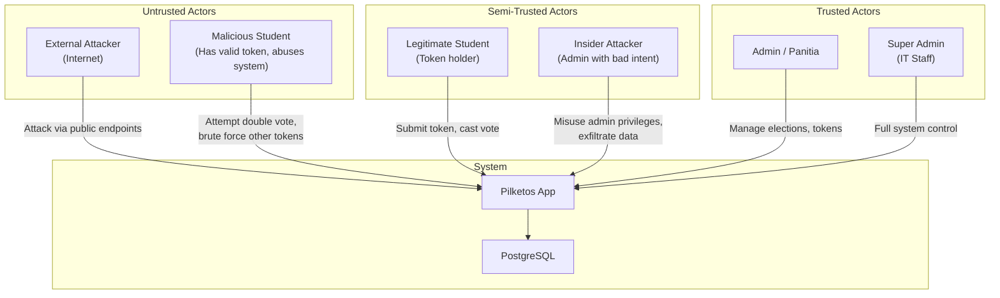

### Trust Boundaries

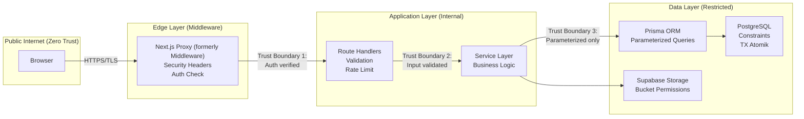

**Trust Boundary 1 (Edge → App):** Semua request dari internet dianggap tidak terpercaya. Middleware memverifikasi session sebelum meneruskan ke route handler. Semua security headers diinjeksi di sini.

**Trust Boundary 2 (Route Handler → Service):** Input telah divalidasi format (Zod) di route handler. Service layer mengasumsikan input sudah di-sanitize untuk format, tetapi tetap melakukan business logic validation.

**Trust Boundary 3 (Service → Database):** Hanya parameterized queries via Prisma yang diizinkan. Tidak ada string interpolation SQL.

### Entry Points & Attack Surface

| Entry Point      | Path                                                              | Exposure      | Mitigasi                                                                               |
| ---------------- | ----------------------------------------------------------------- | ------------- | -------------------------------------------------------------------------------------- |
| Token validation | `POST /api/vote/validate-token`                                   | Public        | Rate limit 10/min/IP; HMAC verify; generic error                                       |
| Vote cast        | `POST /api/vote/cast`                                             | Public        | Rate limit; atomic TX; FOR UPDATE lock                                                 |
| Admin login      | `POST /api/auth/signin` and `POST /api/auth/callback/credentials` | Public        | Rate limit 5/15min/IP; Argon2id; generic error                                         |
| Admin API        | `/api/admin/*`                                                    | Session-gated | NextAuth session; RBAC; middleware                                                     |
| Health check     | `GET /api/health`                                                 | Public        | No sensitive data; lightweight only                                                    |
| Static assets    | `/_next/static/*`                                                 | Public        | CDN-served; no dynamic content                                                         |
| Storage URLs     | `storage.supabase.co/*`                                           | Public read   | Bucket policy: public read only untuk foto; write/delete hanya via server service role |

### Threat Scenarios (STRIDE Analysis)

| ID   | Kategori                   | Threat                                | Target Asset  | Mitigasi                                                                               |
| ---- | -------------------------- | ------------------------------------- | ------------- | -------------------------------------------------------------------------------------- |
| T-01 | **Spoofing**               | Brute-force token plaintext           | VotingToken   | Rate limit + HMAC: harus tahu SECRET untuk verify                                      |
| T-02 | **Spoofing**               | Admin credential brute-force          | Admin session | Rate limit 5/15min; Argon2id memory-hard                                               |
| T-03 | **Spoofing**               | Session JWT forgery                   | Admin session | AUTH_SECRET kuat; HTTP-only cookie; HTTPS only                                         |
| T-04 | **Tampering**              | Double voting (race condition)        | Vote record   | `FOR UPDATE` lock dalam TX; `used_at` constraint                                       |
| T-05 | **Tampering**              | Ubah election state tanpa izin        | Election      | RBAC; session validation; state machine enforcement                                    |
| T-06 | **Tampering**              | Modifikasi vote setelah disimpan      | Vote record   | Immutable — tidak ada UPDATE/DELETE endpoint                                           |
| T-07 | **Tampering**              | Manipulasi audit log                  | AuditLog      | Append-only — tidak ada endpoint update/delete                                         |
| T-08 | **Tampering**              | SQL Injection                         | Database      | Prisma parameterized queries; no raw SQL user input                                    |
| T-09 | **Repudiation**            | Admin menyangkal telah melakukan aksi | AuditLog      | Immutable audit log per aksi dengan IP + user agent                                    |
| T-10 | **Information Disclosure** | Identifikasi siapa memilih siapa      | Vote↔Token    | Zero FK; HMAC; no plaintext; generic error messages                                    |
| T-11 | **Information Disclosure** | Token hash exposure via API           | VotingToken   | Token hash tidak pernah di-return dalam response API                                   |
| T-12 | **Information Disclosure** | Stack trace di error response         | Internal code | Structured error response; log di server saja                                          |
| T-13 | **Information Disclosure** | Secret exposure via env               | Secrets       | Server-only env vars; never to browser; config/env.ts                                  |
| T-14 | **Denial of Service**      | Request flood pada voting endpoint    | Availability  | Rate limiting per IP; lightweight health check                                         |
| T-15 | **Elevation of Privilege** | VIEWER akses endpoint ADMIN           | RBAC          | Middleware + service layer RBAC check                                                  |
| T-16 | **Elevation of Privilege** | CSRF attack pada admin                | Admin session | CSRF token via NextAuth; SameSite=Lax cookie                                           |
| T-17 | **Elevation of Privilege** | XSS untuk curi session cookie         | Admin session | CSP; HTTP-only cookie (tidak accessible via JS)                                        |
| T-18 | **Elevation of Privilege** | Clickjacking pada admin panel         | Admin session | X-Frame-Options: DENY                                                                  |
| T-19 | **Information Disclosure** | Kandidat foto diakses tanpa batas     | Storage       | Public bucket tapi hanya foto; tidak ada file sensitif                                 |
| T-20 | **Tampering**              | File upload berbahaya                 | Storage       | MIME validation; extension check; magic bytes verification; random CUID-style filename |

---

## Security Architecture

### Layered Security Model

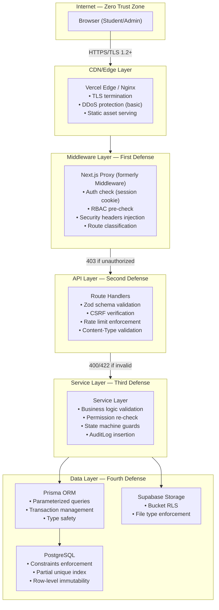

---

## Authentication Security

### Dual Authentication Domain

Sistem Pilketos mengoperasikan **dua domain autentikasi yang sepenuhnya terpisah**. Tidak ada jalur teknis yang menghubungkan keduanya. _(PRD §9.1)_

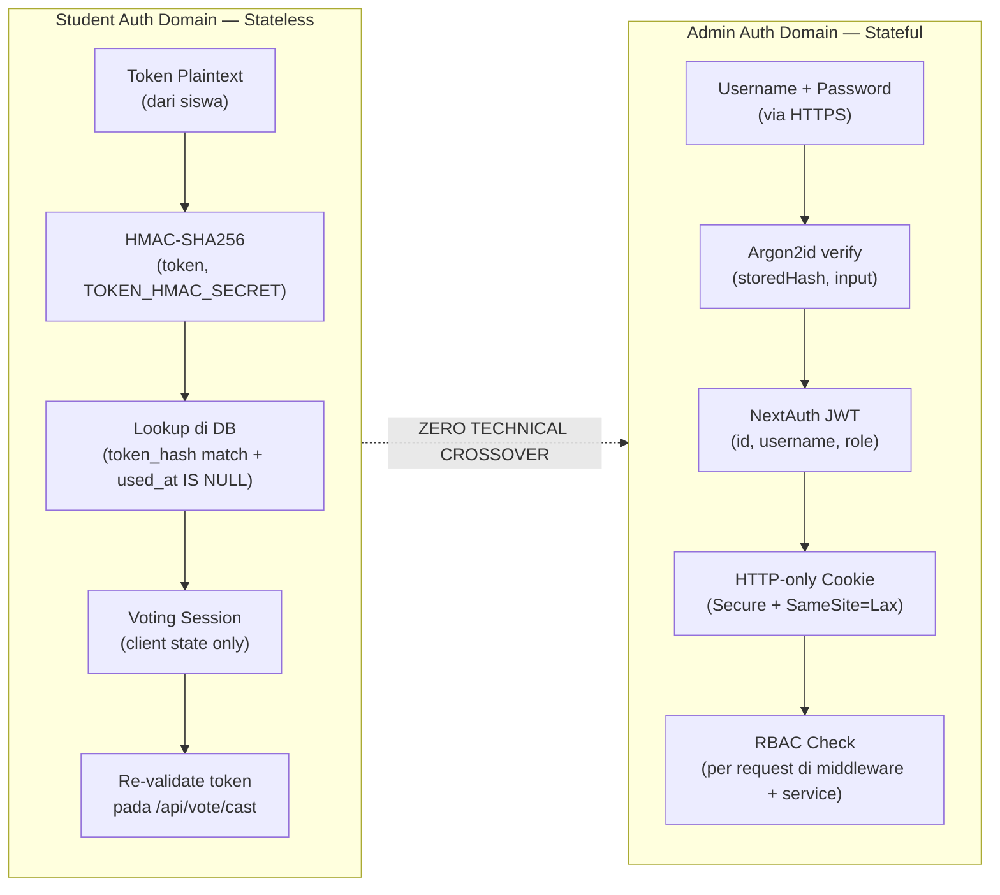

### Student Token Authentication

#### HMAC-SHA256 Token Architecture

| Aspek                  | Detail                                    | Alasan                                                              |
| ---------------------- | ----------------------------------------- | ------------------------------------------------------------------- |
| Algorithm              | HMAC-SHA256                               | Standard kriptografik; deterministik; tidak reversible tanpa SECRET |
| Input                  | `(tokenPlaintext, TOKEN_HMAC_SECRET)`     | Secret hanya ada di server                                          |
| Output                 | 256-bit hash (64 hex char)                | Tersimpan di kolom `token_hash`                                     |
| Plaintext              | Dibuang dari memori setelah hash dihitung | Tidak pernah tersimpan di DB, log, atau response                    |
| Secret                 | Environment variable `TOKEN_HMAC_SECRET`  | Server-only; tidak di-expose ke browser                             |
| Collision resistance   | Praktis tidak ada                         | SHA-256 collision resistance: 2^128                                 |
| Brute-force resistance | Token space × HMAC verify overhead        | Tergantung panjang token plaintext dan rate limit                   |

#### Token Validation Flow (Security View)

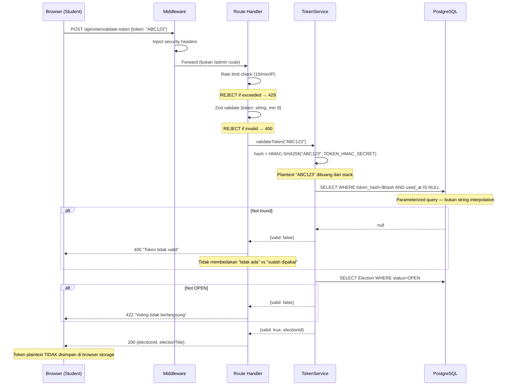

#### Token Security Properties

| Property                  | Nilai                                         | Dampak Security                               |
| ------------------------- | --------------------------------------------- | --------------------------------------------- |
| Panjang minimum token     | 8 karakter                                    | Ruang token cukup besar untuk sekolah         |
| Panjang maksimum          | 64 karakter                                   | Mencegah buffer abuse                         |
| Format token              | Alphanumeric (recommended)                    | Mudah dibaca siswa, tidak ambigu              |
| Single-use enforcement    | `used_at IS NOT NULL` check + DB constraint   | Double voting tidak mungkin secara teknis     |
| Race condition protection | `SELECT ... FOR UPDATE` dalam TX              | Concurrent requests pada token yang sama aman |
| Error message             | Identik untuk "tidak ada" dan "sudah dipakai" | Mencegah oracle attack / enumeration          |

### Admin Authentication

#### Argon2id Password Hashing

Argon2id dipilih karena kombinasi resistance terhadap berbagai attack vectors:

| Parameter       | Deskripsi            | Alasan                                                  |
| --------------- | -------------------- | ------------------------------------------------------- |
| **Algorithm**   | Argon2id             | Kombinasi Argon2i (side-channel) + Argon2d (GPU attack) |
| **vs bcrypt**   | Argon2id lebih kuat  | bcrypt tidak memory-hard; Argon2id tahan GPU cluster    |
| **vs PBKDF2**   | Argon2id lebih kuat  | PBKDF2 lebih rentan terhadap hardware acceleration      |
| **Memory cost** | ≥ 64MB (recommended) | Memory-hard: GPU attack menjadi mahal secara hardware   |
| **Time cost**   | ≥ 3 iterations       | Mempersulit brute-force bahkan dengan CPU cepat         |
| **Parallelism** | 1–4 threads          | Sesuai server capability                                |

Nilai parameter spesifik ditentukan saat implementasi berdasarkan kemampuan server — bukan di-hardcode di dokumen ini.

#### NextAuth Session Security

| Properti          | Nilai                              | Alasan                                                                |
| ----------------- | ---------------------------------- | --------------------------------------------------------------------- |
| Session type      | JWT (stateless)                    | Tidak butuh session store; scalable                                   |
| JWT payload       | `{ id, username, role, iat, exp }` | Minimal data; tidak ada password hash                                 |
| Signing algorithm | HS256 (default NextAuth)           | Simetrik; `AUTH_SECRET` hanya di server                               |
| Cookie name       | `next-auth.session-token`          | Standard NextAuth                                                     |
| Cookie: HttpOnly  | ✅                                 | JavaScript tidak bisa akses → XSS tidak bisa curi session             |
| Cookie: Secure    | ✅                                 | Hanya dikirim via HTTPS → tidak bocor di HTTP                         |
| Cookie: SameSite  | `Lax`                              | Proteksi CSRF untuk navigasi cross-site; masih bisa lintas domain sah |
| Cookie: Path      | `/`                                | Berlaku untuk semua path                                              |
| Session timeout   | 8 jam (rekomendasi)                | Keseimbangan usability vs security untuk admin sekolah                |
| CSRF Protection   | Built-in NextAuth                  | CSRF token di setiap mutating request                                 |

#### Admin Login Security Measures

| Measure               | Detail                                                                                        |
| --------------------- | --------------------------------------------------------------------------------------------- |
| Rate limiting         | 5 attempts / 15 menit / IP                                                                    |
| Error message         | Identik untuk "user tidak ada", "user nonaktif", "password salah" → mencegah user enumeration |
| Audit logging         | Setiap attempt (success + failure) dicatat dengan IP + User-Agent                             |
| No lockout stored     | Rate limiting di application level (v1); tidak ada account lockout field di DB                |
| Password requirements | Min 8 chars; kombinasi huruf besar, kecil, angka                                              |
| Password hashing      | Argon2id sebelum disimpan; plaintext tidak pernah tersimpan                                   |
| Last login tracking   | `Admin.last_login_at` diupdate setiap login sukses                                            |

---

## Authorization Model

### RBAC (Role-Based Access Control)

Sistem menggunakan 3 role dengan hierarki linear: VIEWER ⊂ ADMIN ⊂ SUPER_ADMIN.

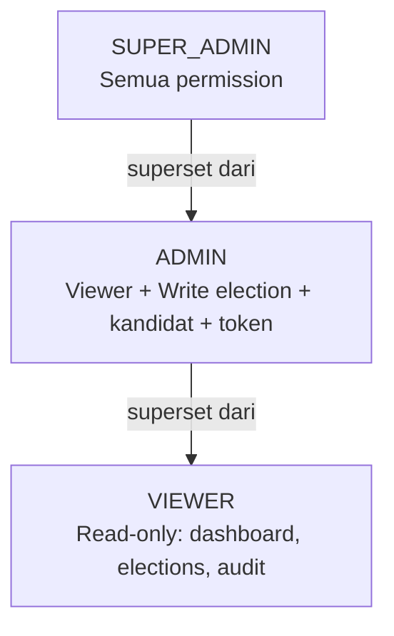

### Permission Matrix

| Resource / Action                |   VIEWER    | ADMIN | SUPER_ADMIN |
| -------------------------------- | :---------: | :---: | :---------: |
| **Dashboard**                    |             |       |             |
| Lihat dashboard stats            |     ✅      |  ✅   |     ✅      |
| Toggle Live Mode                 |     ❌      |  ✅   |     ✅      |
| **Elections**                    |             |       |             |
| List elections                   |     ✅      |  ✅   |     ✅      |
| Get election detail              |     ✅      |  ✅   |     ✅      |
| Create election                  |     ❌      |  ✅   |     ✅      |
| Update election (title, desc)    |     ❌      |  ✅   |     ✅      |
| Delete election (SETUP/ARCHIVED) |     ❌      |  ❌   |     ✅      |
| Transition state (SETUP→READY)   |     ❌      |  ✅   |     ✅      |
| Transition state (READY→OPEN)    |     ❌      |  ✅   |     ✅      |
| Transition state (OPEN↔PAUSED)   |     ❌      |  ✅   |     ✅      |
| Transition state (→CLOSED)       |     ❌      |  ✅   |     ✅      |
| Transition state (→ARCHIVED)     |     ❌      |  ✅   |     ✅      |
| **Candidates**                   |             |       |             |
| List candidates                  |     ✅      |  ✅   |     ✅      |
| Create candidate                 |     ❌      |  ✅   |     ✅      |
| Update candidate                 |     ❌      |  ✅   |     ✅      |
| Delete candidate                 |     ❌      |  ✅   |     ✅      |
| Upload candidate photo           |     ❌      |  ✅   |     ✅      |
| **Tokens**                       |             |       |             |
| View token stats                 |     ✅      |  ✅   |     ✅      |
| Generate token batch             |     ❌      |  ✅   |     ✅      |
| Export token metadata            |     ❌      |  ✅   |     ✅      |
| **Audit Log**                    |             |       |             |
| View audit log                   |     ✅      |  ✅   |     ✅      |
| Create/Delete audit log          |     ❌      |  ❌   | ❌ (nobody) |
| **Admin Management**             |             |       |             |
| List admins                      |     ❌      |  ❌   |     ✅      |
| Create admin                     |     ❌      |  ❌   |     ✅      |
| Update admin (role/status)       |     ❌      |  ❌   |     ✅      |
| Deactivate admin                 |     ❌      |  ❌   |     ✅      |
| Deactivate self                  |     ❌      |  ❌   | ❌ (nobody) |
| **Health**                       |             |       |             |
| GET /api/health                  | ✅ (public) |  ✅   |     ✅      |

### RBAC Enforcement Layers

RBAC diverifikasi di **dua layer** untuk defense in depth:

**Layer 1 — Middleware (Edge):**

- Semua route `/admin/*` memerlukan valid session → 403 jika tidak ada.
- Route `/admin/settings` memerlukan `role === SUPER_ADMIN` → 403 jika bukan.

**Layer 2 — Service Layer:**

- Setiap operasi write memverifikasi role dari session JWT sebelum eksekusi.
- Ini sebagai safety net jika middleware bypass (defense in depth).

**Kenapa dua layer?**
Middleware berjalan di Edge Runtime dan bisa di-bypass dalam skenario edge case (misalnya direct API call). Service layer adalah "ground truth" final untuk authorization.

---

## Data Protection

### Data In Transit

| Mekanisme        | Detail                                               |
| ---------------- | ---------------------------------------------------- |
| Protocol         | HTTPS/TLS 1.2+ untuk semua traffic                   |
| TLS termination  | Di Vercel Edge atau Nginx (VPS option)               |
| HTTP redirect    | HTTP → HTTPS redirect wajib; HSTS header di-set      |
| Internal traffic | Next.js ↔ Supabase: sudah via TLS (Supabase managed) |
| API calls        | Semua request menggunakan `https://` base URL        |
| HSTS             | `max-age=31536000; includeSubDomains`                |

### Data At Rest

| Data                | Storage          | Proteksi                                              |
| ------------------- | ---------------- | ----------------------------------------------------- |
| Vote records        | PostgreSQL       | Encrypted at rest (Supabase managed encryption)       |
| VotingToken hash    | PostgreSQL       | Encrypted at rest; hash tidak reversible tanpa SECRET |
| Admin password      | PostgreSQL       | Argon2id hash; bukan plaintext                        |
| Session JWT         | Browser cookie   | HTTP-only; Secure; tidak accessible via JS            |
| Candidate photos    | Supabase Storage | Server-side encryption (Supabase managed)             |
| Environment secrets | Server env       | Tidak di-commit ke repository; tidak di-log           |

### Password Security

```
Input Password (plaintext)
        ↓
Argon2id(password, salt, memory=64MB, time=3, parallel=1)
        ↓
Stored Hash (di kolom Admin.password_hash)
        ↓
Saat verifikasi: argon2.verify(storedHash, inputPassword)
        ↓
Result: true/false (timing-safe comparison)
```

Properti Argon2id yang relevan:

- **Memory-hard:** GPU attack membutuhkan memori fisik besar (tidak bisa dioptimasi dengan ASIC biasa).
- **Salt otomatis:** Salt unik per password disertakan dalam hash output — tidak perlu kolom salt terpisah.
- **Timing-safe:** `argon2.verify()` menggunakan constant-time comparison — tidak vulnerable terhadap timing attack.

### HMAC Token Security

```
Token Plaintext (dari siswa)
        ↓
HMAC-SHA256(tokenPlaintext, TOKEN_HMAC_SECRET)
        ↓
tokenHash (256-bit, 64 hex chars)
        ↓
Stored di VotingToken.token_hash
        ↓
Plaintext DIBUANG dari memori setelah hash dihitung

Verification:
HMAC-SHA256(inputToken, TOKEN_HMAC_SECRET) === storedHash?
```

**Mengapa HMAC, bukan hash biasa?**
Hash biasa (SHA-256 tanpa key) bisa di-rainbow-table attack. HMAC menggunakan `TOKEN_HMAC_SECRET` sebagai key — tanpa key ini, rainbow table tidak berguna. Bahkan jika database bocor, token tidak bisa di-reverse tanpa SECRET.

### Secrets Management

| Secret                      | Penyimpanan          | Akses                                             | Rotasi                        |
| --------------------------- | -------------------- | ------------------------------------------------- | ----------------------------- |
| `TOKEN_HMAC_SECRET`         | Environment variable | Server process only                               | Saat compromise terdeteksi    |
| `AUTH_SECRET`               | Environment variable | Server process only                               | Periodik atau saat compromise |
| `DATABASE_URL`              | Environment variable | Server process only                               | Saat credential rotation      |
| `SUPABASE_SERVICE_ROLE_KEY` | Environment variable | Server process only — **TIDAK PERNAH ke browser** |
| `DIRECT_URL`                | Environment variable | Migration process only                            | Sama dengan DATABASE_URL      |

**Secret Rotation Impact:**

| Secret              | Dampak Rotasi                                                                                                              |
| ------------------- | -------------------------------------------------------------------------------------------------------------------------- |
| `TOKEN_HMAC_SECRET` | **Semua token yang sudah di-generate menjadi tidak valid** — perlu generate ulang. Lakukan HANYA sebelum election dimulai. |
| `AUTH_SECRET`       | Semua session admin expired — perlu login ulang. Aman dilakukan kapan saja.                                                |
| `DATABASE_URL`      | Update connection string; restart server.                                                                                  |

---

---

## Privacy Architecture

Desain privasi adalah pilar utama sistem Pilketos. Untuk menjamin kerahasiaan hak pilih siswa, sistem ini dirancang dengan prinsip **zero correlation** antara pemilih (token) dan pilihan (suara). _(PRD §7.2)_

### Ketiadaan Foreign Key antara Vote dan VotingToken

Dalam database relasional tradisional, relasi satu-ke-satu atau satu-ke-banyak biasanya menggunakan _Foreign Key_ (FK). Namun, pada sistem Pilketos, FK sengaja ditiadakan antara tabel `VotingToken` dan tabel `Vote`.

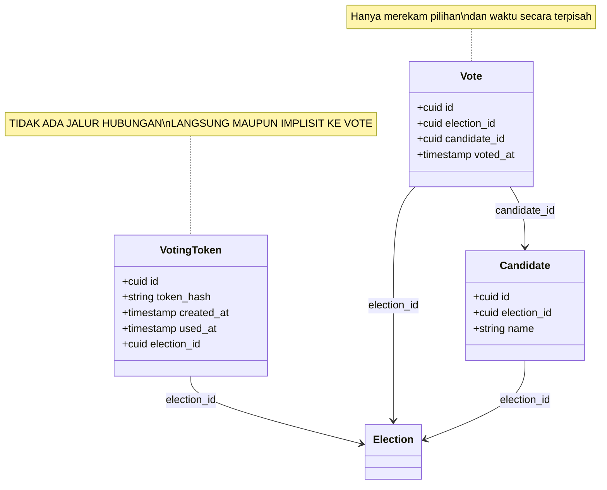

**Analisis Desain Database:**

1. **Tidak ada kolom `token_id`** atau referensi token apa pun pada tabel `Vote`.
2. **Tidak ada kolom `vote_id`** atau referensi suara apa pun pada tabel `VotingToken`.
3. Satu-satunya kesamaan adalah keduanya memiliki `election_id`, yang merupakan kebutuhan struktural untuk mengelompokkan data berdasarkan pemilihan, bukan individu.

### Penanganan Token di Memori Server (Ephemeral Token Lifecycle)

Untuk mencegah kebocoran token plaintext di memori server (seperti melalui dump memori atau heap analysis), siklus hidup token dirancang sependek mungkin.

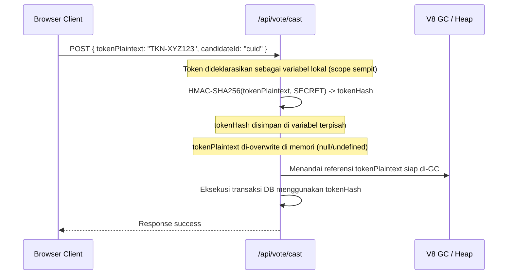

**Aturan Penanganan Memori Server:**

- Token plaintext hanya diterima di request body API `POST /api/vote/validate-token` dan `POST /api/vote/cast`.
- Begitu fungsi pembantu menghitung HMAC-SHA256 hash, variabel yang menyimpan token plaintext langsung ditimpa (_overwrite_) dengan nilai kosong atau dihapus referensinya dari cakupan memori (_scope scope_).
- Garbage Collector (V8 Engine) akan segera membersihkan memori yang tidak lagi memiliki referensi aktif tersebut.

### Pencegahan Inferensi pada Audit Log

Audit log mencatat setiap aktivitas administratif untuk menjaga transparansi dan akuntabilitas. Namun, audit log tidak boleh menjadi celah baru untuk merekonstruksi pilihan siswa. _(PRD §7.3)_

**Desain Audit Log untuk Aksi Siswa (`VOTE_CAST`):**

- Bidang `actor_id` di-set sebagai `null` (karena siswa bukan admin berotentikasi).
- Kolom metadata **TIDAK BOLEH** menyimpan informasi seperti:
  - Token plaintext atau hash token yang baru saja digunakan.
  - ID kandidat yang dipilih.
  - Kelas atau data demografi pemilih.
- Contoh entri log yang sah:
  ```json
  {
    "id": "cuid_log_123",
    "action": "VOTE_CAST",
    "target_type": "election",
    "target_id": "cuid_election_xyz",
    "result": "SUCCESS",
    "metadata": {},
    "created_at": "2026-07-28T00:15:00Z"
  }
  ```

### Pencegahan Inferensi pada Dashboard Real-time (Anti-Correlation Design)

Dashboard admin menyajikan visualisasi partisipasi dan perolehan suara. Jika suara diperbarui dan ditampilkan secara instan (real-time push), admin yang mengawasi TPS dapat mencocokkan waktu siswa yang baru saja keluar dari bilik suara dengan lonjakan angka di dashboard.

Untuk mencegah serangan _timing analysis_ ini, mekanisme pembaruan dashboard dirancang khusus:

1. **Throttled Polling (Default v1):** Dashboard admin hanya memanggil API `/api/admin/dashboard/stats` setiap 3-5 detik.
2. **Aggregated Data Only:** API stats hanya mengembalikan hasil hitung kumulatif (`COUNT`), bukan daftar baris suara individual.
3. **Tanpa Stream Detil:** Server tidak pernah mengirimkan detail seperti "Kandidat A mendapat suara baru pada pukul 08:01:23".
4. **Live Mode Projection:** Mode visualisasi untuk proyektor didesain bersih dari detail transaksional, hanya menyajikan grafik agregat tanpa timestamp transaksi terakhir jika jumlah pemilih di bawah ambang batas tertentu.

---

## API Security

Semua pertukaran data antara client dan server dilindungi di tingkat API untuk meminimalkan permukaan serangan.

### Validasi Input via Zod (Strict Schema Enforcement)

Setiap endpoint API memvalidasi input di pintu masuk menggunakan Zod. Schema validation bersifat _strict_, membuang semua properti yang tidak dideklarasikan (_no extra properties allowed_).

**Spesifikasi Validasi Endpoint Kritis:**

| Endpoint                   | Payload Field | Zod Type/Constraints                   | Alasan Keamanan                                                    |
| -------------------------- | ------------- | -------------------------------------- | ------------------------------------------------------------------ |
| `/api/vote/validate-token` | `token`       | `z.string().min(8).max(64).trim()`     | Mencegah payload yang sangat besar (DoS) dan injeksi karakter aneh |
| `/api/vote/cast`           | `token`       | `z.string().min(8).max(64).trim()`     | Proteksi input                                                     |
|                            | `candidateId` | `z.string().cuid()`                    | Mencegah SQL Injection via invalid identifier                      |
|                            | `electionId`  | `z.string().cuid()`                    | Mencegah SQL Injection                                             |
| `/api/auth/signin`         | `username`    | `z.string().min(3).max(50).alphanum()` | Batasi karakter input login                                        |
|                            | `password`    | `z.string().min(8).max(128)`           | Batasi ukuran input hashing Argon2id                               |

### Parameterized Queries (Anti SQL Injection)

Seluruh interaksi database menggunakan Prisma Client. Prisma secara default membungkus semua query menggunakan _parameterized queries_ (prepared statements).

- Nilai dari input pengguna tidak pernah digabungkan secara langsung (_string concatenation_) ke dalam raw SQL.
- Jika ada kasus khusus yang mengharuskan penggunaan query mentah (misal migrasi database manual), developer wajib menggunakan fungsi `prisma.$queryRaw` dengan template literals bawaan Prisma yang melakukan parameterisasi otomatis, bukan manipulasi string manual.

### Penanganan Error yang Aman (Security-Safe Error Responses)

Pesan error yang dikembalikan ke client tidak boleh membocorkan informasi internal server.

```
Request dari Client
       ↓
Route Handler (Try-Catch Block)
       ↓
Apakah terjadi error?
 ├─ Ya (Internal Server Error)
 │   ├─ LoggerService mencatat detil stack trace dan context di server.
 │   └─ Mengembalikan response HTTP 500: { "success": false, "error": { "code": "INTERNAL_ERROR", "message": "Terjadi kesalahan internal." } }
 └─ Ya (Application/Validation Error)
     └─ Mengembalikan response HTTP 4xx sesuai API Contract (misal 409 TOKEN_ALREADY_USED).
```

_Stack trace_ (seperti file path, database query dump, line number) **TIDAK BOLEH** dikirimkan ke browser dalam kondisi apa pun.

### Kebijakan CORS dan Content-Type

- **CORS (Cross-Origin Resource Sharing):** Karena domain pemilih dan admin berada dalam satu aplikasi Next.js (same-origin by default), CORS dinonaktifkan secara ketat untuk domain luar. Semua request dari origin yang berbeda ditolak secara default.
- **Content-Type Validation:** Server hanya menerima request dengan header `Content-Type: application/json` untuk endpoint JSON API. Jika header tidak sesuai, server langsung mengembalikan HTTP 415 Unsupported Media Type.
- **Request Size Limit:** Batas maksimal ukuran payload request JSON ditetapkan sebesar **1MB** untuk mencegah serangan kehabisan memori server (_payload limit exhaustion DoS_). Pengecualian hanya untuk endpoint upload foto kandidat (maksimal 2MB).

---

## Browser Security

Keamanan di tingkat peramban (browser) dikonfigurasi melalui respon header dan kebijakan penyimpanan client-side.

### HTTP Security Headers

Setiap respon yang dikirim oleh server disisipkan security headers berikut melalui Next.js Proxy (formerly Middleware):

| Header                      | Value                                                                                                                                                   | Alasan Keamanan                                                         |
| --------------------------- | ------------------------------------------------------------------------------------------------------------------------------------------------------- | ----------------------------------------------------------------------- |
| `Content-Security-Policy`   | `default-src 'self'; script-src 'self'; style-src 'self' 'unsafe-inline'; img-src 'self' data: blob: [supabase-url]; connect-src 'self' [supabase-url]` | Membatasi sumber aset yang boleh dieksekusi, mencegah XSS               |
| `Strict-Transport-Security` | `max-age=31536000; includeSubDomains`                                                                                                                   | Memaksa browser menggunakan HTTPS saja (HSTS)                           |
| `X-Frame-Options`           | `DENY`                                                                                                                                                  | Mencegah halaman aplikasi dimuat di dalam iframe, mencegah clickjacking |
| `X-Content-Type-Options`    | `nosniff`                                                                                                                                               | Mencegah browser melakukan MIME-sniffing pada respon                    |
| `Referrer-Policy`           | `strict-origin-when-cross-origin`                                                                                                                       | Membatasi data referer yang dikirim ke luar domain                      |

### Kebijakan Penyimpanan Client-Side (Client-Side Storage Policy)

Sistem Pilketos menerapkan kebijakan ketat terkait penyimpanan data sensitif di browser pemilih maupun admin:

| Data                | Storage Target               | Keamanan                              | Rationale                                                                                                        |
| ------------------- | ---------------------------- | ------------------------------------- | ---------------------------------------------------------------------------------------------------------------- |
| Token Plaintext     | **TIDAK DISIMPAN**           | N/A                                   | Harus dimasukkan manual oleh pemilih dan langsung dikirim, tidak disimpan di memori browser setelah sesi selesai |
| Session Token Admin | HTTP-only Cookie             | `Secure; SameSite=Lax`                | Mencegah pencurian token sesi menggunakan script berbahaya (XSS)                                                 |
| State Voting Siswa  | React State / SessionStorage | Ephemeral (terhapus saat tab ditutup) | Membantu navigasi stepper tanpa menyimpan bukti pilihan secara permanen                                          |
| Audit Log Data      | **TIDAK DISIMPAN**           | Client-side memory saja               | Hanya dirender dari respon API ke UI memori                                                                      |

### Fullscreen dan Keyboard Lock API Limits

- **Fullscreen API:** Diterapkan untuk mempersempit area fokus siswa agar meminimalkan distraction. Browser secara otomatis menghentikan fullscreen jika mendeteksi interaksi sistem operasi seperti Alt+Tab atau tombol Windows. Aplikasi mendeteksi ini melalui event `fullscreenchange` dan memunculkan overlay penghalang.
- **Keyboard Lock API:** Digunakan secara _best-effort_ pada browser yang mendukung (seperti Chrome/Edge). Ini mencegah tombol pintas (seperti Esc) keluar dari fullscreen secara tidak sengaja, namun tetap memberikan opsi keluar darurat melalui mekanisme tekan-dan-tahan atau visual overlay.

---

---

## Infrastructure Security

Sistem dapat dijalankan di infrastruktur serverless (Vercel) atau virtual server mandiri (VPS Docker). Desain keamanan infrastruktur menjamin isolasi setiap komponen.

### Skenario Deployment A: Vercel + Supabase

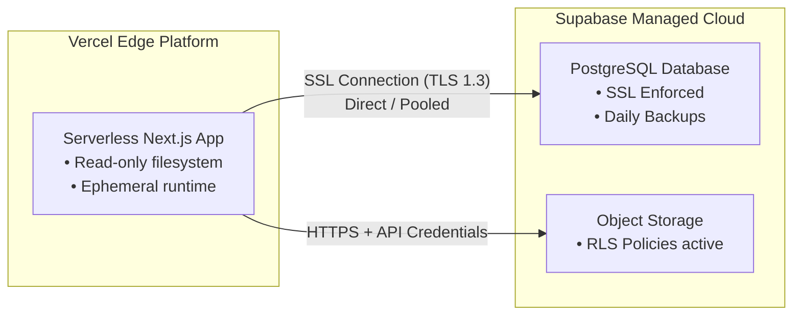

**Karakteristik Keamanan Vercel:**

- **Read-Only Filesystem:** Serverless functions berjalan di atas wadah yang _read-only_ (kecuali direktori `/tmp`). Penyerang tidak dapat melakukan deface aset statis atau menaruh webshell permanen.
- **Ephemeral Instance:** Masa hidup serverless container sangat pendek. Memory leaks atau payload eksploitasi memori akan hilang begitu container dihancurkan otomatis oleh platform.

### Skenario Deployment B: VPS Docker Self-Hosted

Jika sekolah memilih hosting VPS mandiri, Docker Compose digunakan untuk isolasi lingkungan.

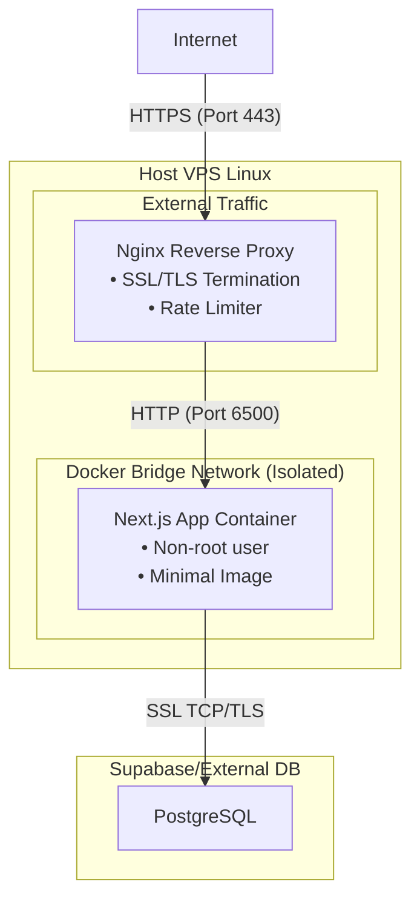

**Panduan Keamanan Docker Compose:**

- **User Non-Root:** Container Next.js dijalankan dengan user `node` (UID 1000), bukan `root` (UID 0), untuk mencegah pembobolan container (_container breakout escape_).
- **Docker Bridge Network:** Hanya port Nginx yang dibuka ke publik. Container Next.js hanya bisa dihubungi dari dalam network bridge internal oleh proxy Nginx.
- **Auto-restart Limit:** Menghindari serangan _fork bomb_ dengan membatasi penggunaan CPU dan memori per container.

---

## Database Security

Database PostgreSQL bertindak sebagai _ground truth_ perlindungan integritas data.

### Ensepsi SQL Injection

Prisma secara otomatis mereduksi ancaman SQL Injection karena menggunakan parameterized queries. Input dari pengguna diperlakukan sebagai nilai parameter murni oleh driver PostgreSQL, bukan sebagai bagian dari instruksi kode SQL.

### Database Constraints as Last Line of Defense

Aplikasi memvalidasi business rules di layer server, namun database tetap memberlakukan constraint keras sebagai benteng pertahanan terakhir:

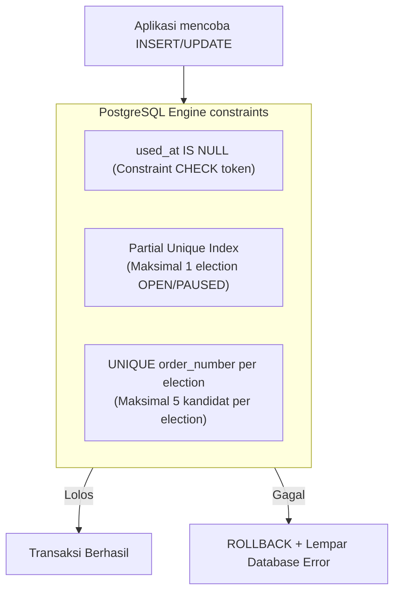

1. **Aturan Satu Election Aktif:** Ditegakkan menggunakan _partial unique index_ pada PostgreSQL:
   ```sql
   CREATE UNIQUE INDEX election_active_idx
   ON "Election" (status)
   WHERE status IN ('OPEN', 'PAUSED');
   ```
   Indeks ini menjamin bahwa jika aplikasi mencoba memicu transisi state ke `OPEN` padahal sudah ada election yang aktif, PostgreSQL akan langsung menolak dan melempar error integrasi.
2. **Aturan Maksimum Kandidat:** Setiap kandidat harus memiliki `order_number` unik dalam scope `election_id` yang sama.
   ```sql
   ALTER TABLE "Candidate"
   ADD CONSTRAINT candidate_order_number_unique
   UNIQUE (election_id, order_number);
   ```

### Keamanan Transaksi Database

Semua operasi penulisan kritis dibungkus dalam blok `prisma.$transaction()`. Hal ini menjamin sifat ACID (Atomicity, Consistency, Isolation, Durability) transaksi:

- Jika server kehilangan koneksi internet atau crash di tengah proses pencatatan suara siswa, seluruh operasi yang telah berjalan dalam rangkaian transaksi tersebut (seperti menandai token terpakai) akan dibatalkan (_rollback_) secara otomatis oleh PostgreSQL.

---

## File Upload Security

Aksi mengunggah gambar oleh admin (foto kandidat) memiliki risiko tinggi jika tidak dikontrol dengan ketat.

### Alur Validasi Unggah Foto

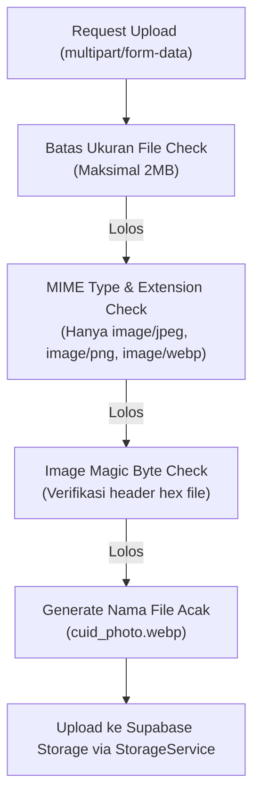

**Detail Langkah Keamanan:**

1. **Validasi MIME Type Ganda:** Server memeriksa header `Content-Type` yang dikirim browser serta membaca byte awal (_magic bytes_) file di server untuk memastikan file tersebut benar-benar gambar, bukan file executable `.sh` atau `.exe` yang diubah ekstensinya.
2. **Random File Naming:** Nama file asli yang diunggah oleh admin langsung dibuang. Server membuat nama acak menggunakan CUID baru sebelum disimpan di storage. Ini mencegah penyerang mengeksploitasi celah _Directory Traversal_ menggunakan nama file seperti `../../etc/passwd`.
3. **Storage Bucket Restrictions:**
   - Bucket Supabase Storage dikonfigurasi sebagai **public read-only** untuk umum. Siapa pun dapat membaca foto kandidat yang sah.
   - Hak menulis (_write/delete_) hanya diberikan kepada aplikasi server Pilketos menggunakan API Service Role Key yang dirahasiakan, tidak pernah melalui browser client secara langsung.

---

## Logging & Audit Security

Sistem membedakan secara tegas antara log audit administratif dan log operasional aplikasi demi kepatuhan keamanan (_compliance_).

### Klasifikasi Tipe Log

| Karakteristik         | Audit Log                                   | Application Log                        | Security Event                               |
| --------------------- | ------------------------------------------- | -------------------------------------- | -------------------------------------------- |
| **Tujuan**            | Bukti kepatuhan aktivitas admin             | Debugging operasional                  | Deteksi aktivitas mencurigakan               |
| **Penyimpanan**       | Tabel database `AuditLog`                   | Standar Output (Console) / File        | Log file khusus / SIEM                       |
| **Mutabilitas**       | **Immutable** (Append-only)                 | Mutable (tergantung rotasi file)       | Immutable (WORM storage)                     |
| **Sensitivitas**      | Sedang (tanpa data siswa)                   | Rendah (tidak mencatat data sensitif)  | Tinggi (berisi IP, payload gagal)            |
| **Kebijakan Retensi** | Minimum 1 tahun pasca pemilihan             | 14 - 30 Hari                           | 90 Hari                                      |
| **Contoh Entri**      | "Admin A mengubah status pemilihan ke OPEN" | "Koneksi database berhasil diinisiasi" | "5 kegagalan login berturut-turut dari IP X" |

### Penegakan Immutability pada Audit Log

Tabel `AuditLog` dirancang agar tidak bisa dimodifikasi oleh siapa pun melalui API aplikasi:

- Tidak ada route API `PATCH`, `PUT`, atau `DELETE` untuk resource `/api/admin/audit`.
- Pada tingkat database, akses user database produksi harus dibatasi agar tidak memiliki hak `UPDATE` atau `DELETE` pada tabel `AuditLog` (hanya `SELECT` dan `INSERT`).

---

---

## Rate Limiting Strategy

Rate limiting diterapkan pada tingkat API Route Handlers menggunakan mekanisme penyimpanan memory-based (untuk deployment VPS) atau Edge KV-store (untuk deployment Vercel). Hal ini berfungsi membatasi frekuensi request dari IP address yang sama untuk mencegah serangan bruteforce dan DoS.

### Konfigurasi Rate Limit per Endpoint

| Method | Endpoint                           | Limit      | Window   | Alasan Keamanan                                                             |
| ------ | ---------------------------------- | ---------- | -------- | --------------------------------------------------------------------------- |
| `POST` | `/api/vote/validate-token`         | 10 Request | 1 Menit  | Mencegah tebakan brutal (_brute force_) token plaintext oleh pemilih jahat  |
| `POST` | `/api/vote/cast`                   | 3 Request  | 5 Menit  | Mencegah race condition spamming suara dan double-click accidental          |
| `POST` | `/api/auth/signin`                 | 5 Request  | 15 Menit | Melindungi kredensial admin dari serangan dictionary attack / brute force   |
| `POST` | `/api/admin/tokens/generate`       | 5 Request  | 5 Menit  | Batasi operasi kriptografi berat untuk menghindari beban kerja CPU berlebih |
| `GET`  | `/api/admin/dashboard/stats`       | 30 Request | 1 Menit  | Batasi intensitas polling dashboard dari admin yang tidak aktif / botting   |
| `POST` | `/api/admin/candidates/[id]/photo` | 10 Request | 10 Menit | Batasi intensitas upload file besar untuk menghemat bandwidth               |
| `GET`  | `/api/health`                      | 60 Request | 1 Menit  | Mencegah penyalahgunaan monitoring endpoint untuk flooding                  |

---

## Security Monitoring

Pemantauan berkelanjutan dilakukan untuk mendeteksi anomali operasional sebelum menimbulkan dampak kerugian pada proses pemilihan.

### Indikator Aktivitas Mencurigakan (Indicators of Compromise / Anomaly)

| Kejadian                                  | Metrik Pemicu                                                       | Aksi Sistem                                                                  |
| ----------------------------------------- | ------------------------------------------------------------------- | ---------------------------------------------------------------------------- |
| **Kegagalan Login Berulang**              | 5x Gagal login dari IP yang sama dalam 15 menit                     | Kirim notifikasi alarm ke Super Admin; catat IP dalam Security Log           |
| **Validasi Token Gagal Massal**           | 20x Gagal token validation dari satu IP dalam 5 menit               | Blokir sementara IP tersebut dari endpoint voting selama 30 menit (HTTP 429) |
| **Akses Admin Tanpa Sesi**                | Permintaan berulang ke `/api/admin/*` menghasilkan 401              | Catat IP mencurigakan; periksa kemungkinan kebocoran route di frontend       |
| **Health Check Degraded**                 | Koneksi database atau storage error via `/api/health`               | Picu sistem peringatan internal DevOps; lakukan investigasi infrastruktur    |
| **Perubahan Status Election Tidak Valid** | Percobaan API bypass state machine (misal SETUP langsung ke CLOSED) | Tolak langsung; buat Security Event Log dengan tingkat keparahan tinggi      |

---

## Security Headers Specification

Next.js Proxy (formerly Middleware) menyisipkan header respons HTTP berikut untuk memperkuat pertahanan browser client:

| HTTP Header                 | Nilai Rekomendasi                                                                                                                                       | Penjelasan Fungsional Keamanan                                                                                                                   |
| --------------------------- | ------------------------------------------------------------------------------------------------------------------------------------------------------- | ------------------------------------------------------------------------------------------------------------------------------------------------ |
| `Content-Security-Policy`   | `default-src 'self'; script-src 'self'; style-src 'self' 'unsafe-inline'; img-src 'self' data: blob: [supabase-url]; connect-src 'self' [supabase-url]` | Mengontrol asal eksekusi aset. Menonaktifkan evaluasi skrip pihak ketiga dan inline scripts untuk mencegah XSS.                                  |
| `Strict-Transport-Security` | `max-age=31536000; includeSubDomains`                                                                                                                   | Memaksa browser menggunakan koneksi HTTPS terenkripsi selama minimal satu tahun, mencegah enkripsi diturunkan (_downgrade attacks_).             |
| `X-Frame-Options`           | `DENY`                                                                                                                                                  | Memastikan halaman web tidak dapat disematkan di dalam `<frame>`, `<iframe>`, atau `<embed>`. Ini adalah pertahanan utama terhadap Clickjacking. |
| `X-Content-Type-Options`    | `nosniff`                                                                                                                                               | Mencegah browser menafsirkan berkas sebagai tipe lain selain yang tertulis di header `Content-Type` (mencegah eksploitasi upload file).          |
| `Referrer-Policy`           | `strict-origin-when-cross-origin`                                                                                                                       | Melindungi privasi dengan membatasi data URL pengirim (_referrer_) saat mengklik tautan keluar dari domain aplikasi.                             |

---

## Security Decision Summary

Ringkasan seluruh keputusan arsitektur keamanan utama dalam sistem Pilketos v1:

| Area Keamanan             | Keputusan Desain                            | Rationale Keamanan                                                                                  | Ref Dokumen            |
| ------------------------- | ------------------------------------------- | --------------------------------------------------------------------------------------------------- | ---------------------- |
| **Penyimpanan Token**     | HMAC-SHA256 Hash                            | Database bocor tidak mengekspos token plaintext siswa; enkripsi satu arah yang aman.                | PRD §3                 |
| **Anonimitas Suara**      | Tanpa FK antara Vote ↔ Token                | Tidak ada relasi data secara fisik dalam DB; tidak mungkin melakukan pelacakan balik pilihan siswa. | PRD §7.2               |
| **Proteksi Double Vote**  | Transaksi atomik dengan `SELECT FOR UPDATE` | Menghindari celah _race condition_ (mengirim dua request vote bersamaan dengan satu token).         | DB §Design Decisions   |
| **Penyimpanan Password**  | Argon2id Hashing                            | Ketahanan superior terhadap serangan brute-force berbasis GPU/ASIC dibandingkan MD5 atau SHA1.      | PRD §9.2               |
| **Proteksi Sesi Admin**   | Cookie HTTP-Only & Secure                   | Mencegah malware/script JS membaca token sesi admin (proteksi XSS).                                 | PRD §9.1               |
| **Keamanan File Upload**  | Magic byte validation + Random naming       | Mencegah injeksi shell executable (.php/.sh) dan eksploitasi jalur direktori server.                | Security Specification |
| **Integrity Enforcement** | Partial Unique Index                        | Database melarang pembuatan atau aktivasi lebih dari satu pemilihan secara bersamaan.               | DB §Database Rules     |
| **Audit Logs**            | Append-only (tidak ada UPDATE/DELETE)       | Log aktivitas admin tidak dapat dimanipulasi oleh siapa pun untuk menutupi jejak jahat.             | PRD §7.3               |

---

## Future Security Enhancements (v2)

Peningkatan berikut diidentifikasi untuk meningkatkan postur keamanan pada versi berikutnya (v2) dan tidak termasuk dalam cakupan implementasi v1 saat ini:

1. **Multi-Factor Authentication (MFA) untuk Admin:** Mewajibkan OTP berbasis aplikasi authenticator (Google Authenticator/Authy) saat login admin untuk proteksi kredensial yang lebih ketat.
2. **Web Application Firewall (WAF):** Mengintegrasikan Cloudflare WAF atau AWS WAF untuk menyaring lalu lintas berbahaya seperti serangan SQLi, XSS, dan DDoS pada layer aplikasi sebelum menyentuh server Next.js.
3. **Penyimpanan Rahasia via Cloud Secrets Manager:** Menggantikan file `.env` statis dengan integrasi dynamic secret fetching dari Google Cloud Secret Manager atau HashiCorp Vault.
4. **Rate Limiting Terdistribusi via Redis:** Menggunakan Redis cluster untuk rate limiting terpusat yang aman saat Next.js dijalankan dalam skenario multi-instance auto-scaling.
5. **Enkripsi Backup Database Otomatis:** Mewajibkan enkripsi kunci publik (seperti GnuPG) pada berkas backup database SQL sebelum ditransfer ke media cold storage.
6. **CSP Nonce Dynamically Generated:** Menggunakan dynamic nonce yang di-generate per-request untuk inline style/scripts guna meningkatkan kompatibilitas strict CSP tanpa merusak fungsi runtime Next.js.
7. **Deteksi Anomali Berbasis SIEM:** Mengirimkan seluruh log aktivitas admin (`AuditLog`) dan log aplikasi ke platform SIEM (seperti Splunk atau ELK Stack) untuk analisis ancaman terpusat secara real-time.

---

> **Dokumen ini adalah spesifikasi desain keamanan resmi.** Setiap perubahan terhadap desain teknis aplikasi harus mematuhi prinsip keamanan yang tertulis di sini. Perubahan besar pada arsitektur keamanan harus ditinjau ulang oleh tim arsitek keamanan sebelum masa development dimulai.
