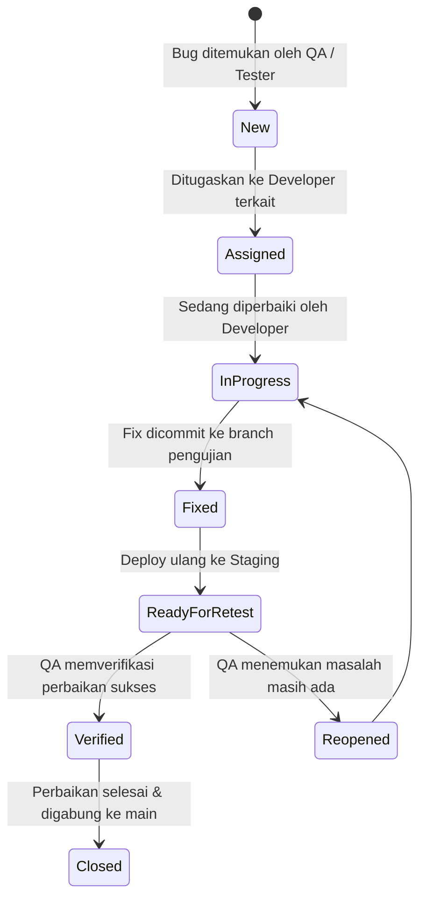

# 06 — Testing Plan
> **Status:** DRAFT — Pending Review
> **Version:** 1.0.0
> **Last Updated:** 2026-07-28
> **Authors:** Principal QA Engineer · Technical Tech Lead · Security Auditor
> **PRD Reference:** `00_PRODUCT_REQUIREMENTS_DOCUMENT.md` v1.1.0
> **DB Reference:** `01_DATABASE_DESIGN.md` v1.0.0
> **Arch Reference:** `02_SYSTEM_ARCHITECTURE.md` v1.1.0
> **API Reference:** `03_API_SPECIFICATION.md` v1.0.0
> **UI Reference:** `04_UI_UX_SPECIFICATION.md` v1.0.0
> **Security Reference:** `05_SECURITY.md` v1.0.0
> **Scope:** Full system testing blueprint — v1
> **Audience:** QA Engineer · Developer · Technical Program Manager

---

## Purpose

Dokumen ini mendefinisikan **strategi, rencana, dan cakupan pengujian** untuk sistem Pilketos E-Voting. Dokumen ini memastikan bahwa sebelum deployment produksi, seluruh aspek fungsionalitas, kegunaan (usability), aksesibilitas, kinerja, dan keamanan sistem telah divalidasi dan diverifikasi secara ketat.

Dokumen ini bertindak sebagai cetak biru pengujian (Testing Blueprint) — bukan kode pengujian aktif. Semua pengujian harus konsisten dengan spesifikasi yang telah didefinisikan dalam dokumen-dokumen referensi sebelumnya.

---

## Testing Principles

Strategi pengujian sistem Pilketos berpegang pada prinsip-prinsip berikut:

### 1. Test Automation First
- Seluruh pengujian regresi fungsional (unit, integrasi, API, dan alur UI utama) harus diotomatisasi untuk mencegah regresi di masa depan dan mempercepat proses CI/CD.

### 2. Isolation of Test State
- Setiap test case harus bersifat mandiri dan tidak boleh bergantung pada status yang ditinggalkan oleh test case sebelumnya. Database pengujian harus di-reset (clear & seed) sebelum dan sesudah pengujian dijalankan.

### 3. Critical Path Rigor
- Fitur penulisan suara siswa (*vote casting*) dan token validation mendapat porsi pengujian paling ketat, termasuk pengujian kondisi balapan (*race conditions*) dan konkurensi tinggi.

### 4. Zero Implicit Trust (Security QA)
- Semua input pengguna wajib diasumsikan berbahaya. Pengujian harus mencakup pengujian penetrasi input (*fuzzing*, invalid types, boundary values) untuk memastikan layer validasi (Zod) bekerja dengan benar.

### 5. Reality Simulation
- Pengujian E2E harus mensimulasikan interaksi browser nyata secara utuh, termasuk simulasi event hilangnya fokus (*blur*) dan interupsi fullscreen siswa.

---

## Testing Environments

| Karakteristik | Local / Dev | Staging / Testing (QA) | Production |
|---|---|---|---|
| **Tujuan** | Unit testing, pengerjaan fitur | Integrasi, E2E, UAT, load test | Penggunaan nyata pemilu sekolah |
| **Database** | SQLite / Local PostgreSQL | Supabase Testing DB (terpisah) | Supabase Production DB |
| **Data State** | Synthetic/Mock data | Mock data terstruktur + Seeder | Real production data |
| **Domain** | `localhost:3000` | `staging.pilketos.sch.id` | `pilketos.sch.id` |
| **File Storage** | Local filesystem / Mock | Supabase Testing Storage Bucket| Supabase Production Storage |
| **Debug Mode** | Active (`NODE_ENV=development`)| Active (`NODE_ENV=testing`) | Disabled (`NODE_ENV=production`)|

---

## Unit Testing Plan

Unit testing difokuskan pada pengujian komponen kode terkecil secara terisolasi (fungsi murni, utility, helper, dan validator schema).

### Target Pengujian & Tools
- **Test Runner:** Vitest atau Jest.
- **Mocking Library:** Vitest built-in mocks.

### Kasus Uji Unit (Unit Test Cases)

#### 1. Modul Kriptografi & Hashing (`src/lib/auth/argon.ts` & `src/services/token.service.ts`)
- **UT-01-01:** Fungsi hashing password (Argon2id) harus menghasilkan hash string yang valid.
- **UT-01-02:** Fungsi verifikasi password harus mengembalikan `true` jika password cocok dan `false` jika salah.
- **UT-01-03:** Fungsi HMAC-SHA256 token hashing harus menghasilkan hash yang deterministik (input sama menghasilkan hash sama).
- **UT-01-04:** Fungsi HMAC-SHA256 harus menghasilkan hash yang berbeda jika `TOKEN_HMAC_SECRET` diubah.

#### 2. Modul Validasi Skema Input (`src/schemas/`)
- **UT-02-01:** Zod schema untuk validasi token harus meloloskan string token yang valid (alphanumeric, min 8, max 64).
- **UT-02-02:** Zod schema untuk token harus menolak string kosong, spasi saja, atau string yang terlalu panjang.
- **UT-02-03:** Zod schema untuk kandidat harus membatasi nomor urut hanya pada rentang integer 1 hingga 5.
- **UT-02-04:** Zod schema untuk kandidat harus menolak format email yang tidak valid pada input data admin.

#### 3. Modul Konfigurasi Lingkungan (`src/config/env.ts`)
- **UT-03-01:** Konfigurasi harus meloloskan pembacaan jika semua environment variables wajib terisi lengkap.
- **UT-03-02:** Konfigurasi harus langsung melempar error (*throw error*) saat startup jika salah satu variabel penting (seperti `DATABASE_URL` atau `TOKEN_HMAC_SECRET`) bernilai kosong atau tidak terdefinisi.

---

## Integration Testing Plan

Integration testing memverifikasi interaksi antara beberapa komponen sistem (service layer, ORM Prisma, dan database fisik).

### Target Pengujian & Tools
- **Database:** PostgreSQL container (Docker) khusus testing.
- **Framework:** Vitest dengan Prisma Client terhubung ke DB testing.

### Kasus Uji Integrasi (Integration Test Cases)

#### 1. Transaksi Voting Kritis (Cast Vote - TX-1)
- **IT-01-01 (Happy Path):** Memanggil `VoteService.castVote()` dengan token valid dan ID kandidat valid harus:
  - Menyisipkan record baru ke tabel `Vote`.
  - Memperbarui kolom `used_at` pada tabel `VotingToken` dengan timestamp saat ini.
  - Berhasil commit tanpa rollback.
- **IT-01-02 (Token Terpakai):** Memanggil `castVote()` menggunakan token yang sudah memiliki nilai `used_at` harus memicu error `TOKEN_ALREADY_USED` dan membatalkan penulisan suara.
- **IT-01-03 (Election Ditutup):** Memanggil `castVote()` pada election dengan status `CLOSED` harus memicu error dan melakukan rollback transaksi database.
- **IT-01-04 (Kandidat Salah):** Memanggil `castVote()` dengan ID kandidat yang bukan milik election terkait harus memicu rollback dan error `CANDIDATE_NOT_IN_ELECTION`.

#### 2. Simulasi Konkurensi & Kondisi Balapan (Race Condition Test)
Ini adalah pengujian paling kritis untuk menjamin integritas pemilihan (mencegah double-voting).

- **IT-02-01 (Simultaneous Vote Attempt):**
  - **Skenario:** Jalankan 20 request `castVote()` secara paralel (menggunakan `Promise.all`) dalam milidetik yang sama menggunakan **satu token yang sama**.
  - **Hasil yang Diharapkan:**
    - Tepat **1 request** berhasil (HTTP 200 / commit sukses).
    - **19 request** sisanya ditolak dengan error `TOKEN_ALREADY_USED` atau `CONFLICT` (HTTP 409).
    - Tabel `Vote` hanya bertambah tepat **1 record suara**.
    - Memverifikasi mekanisme *Row Locking* (`SELECT ... FOR UPDATE`) bekerja dengan benar.

#### 3. Transaksi Transisi State Election (Status Machine - TX-2)
- **IT-03-01 (SETUP -> READY):** Transisi status election ke `READY` harus berhasil jika dan hanya jika election tersebut memiliki minimal 2 kandidat dan minimal 1 token terasosiasi.
- **IT-03-02 (Illegal Transition):** Percobaan transisi status langsung dari `SETUP` ke `CLOSED` harus ditolak dengan error `ELECTION_TRANSITION_INVALID`.
- **IT-03-03 (Active Election Check):** Mencoba mengaktifkan status election ke `OPEN` ketika sudah ada election lain yang berstatus `OPEN` atau `PAUSED` harus ditolak oleh DB constraint (SQL error unique index) dan dibungkus menjadi error `ACTIVE_ELECTION_EXISTS`.

---

---

## End-to-End (E2E) Testing Plan

E2E testing memverifikasi alur aplikasi lengkap dari perspektif pengguna nyata dengan mensimulasikan interaksi di browser.

### Target Pengujian & Tools
- **Framework:** Playwright (menawarkan simulasi API modern seperti Fullscreen dan browser state).
- **Target Browser:** Chromium (Chrome/Edge), Firefox, WebKit (Safari).

### Skenario Pengujian E2E (E2E Test Cases)

#### Skenario 1 — Alur Voting Siswa Lengkap (Happy Path)
1. **Langkah 1:** Browser membuka halaman `/vote`.
2. **Langkah 2:** Memasukkan token plaintext dummy yang valid. Menekan tombol "Validasi Token".
3. **Langkah 3:** Memastikan browser dialihkan ke `/vote/fullscreen`.
4. **Langkah 4:** Mengklik tombol "Mulai Voting". Memastikan browser memicu request fullscreen (Playwright mock API).
5. **Langkah 5:** Dialihkan ke `/vote/candidates`. Memverifikasi nama dan foto kandidat muncul di layar.
6. **Langkah 6:** Mengklik tombol "Pilih" pada salah satu kandidat. Memastikan card mendapat highlight terpilih dan tombol "Lanjut" di bottom bar aktif.
7. **Langkah 7:** Mengklik "Lanjut", dialihkan ke `/vote/confirm`.
8. **Langkah 8:** Memverifikasi ringkasan pilihan menampilkan kandidat yang benar. Mengklik "Ya, Konfirmasi".
9. **Langkah 9:** Dialihkan ke `/vote/done`. Memverifikasi pesan terima kasih muncul dan halaman otomatis me-redirect ke `/vote` setelah 3 detik.

#### Skenario 2 — Interupsi Layar Fullscreen
1. **Langkah 1:** Browser berada di halaman `/vote/candidates` dalam mode fullscreen.
2. **Langkah 2:** Mensimulasikan trigger event keluar fullscreen (`document.exitFullscreen()` via script injection) atau hilangnya fokus window.
3. **Langkah 3:** Memverifikasi bahwa **Fullscreen Overlay Interruption** muncul menutupi layar.
4. **Langkah 4:** Mencoba mengklik elemen di belakang overlay (memastikan tidak bisa di-klik / `pointer-events: none`).
5. **Langkah 5:** Mengklik tombol "Kembali ke Layar Penuh". Memastikan browser kembali fullscreen dan overlay menghilang.

#### Skenario 3 — Siklus Hidup Pengelolaan Pemilihan (Admin Flow)
1. **Langkah 1:** Admin membuka `/admin/login`, memasukkan username dan password valid, lalu login.
2. **Langkah 2:** Dialihkan ke `/admin/dashboard`. Memastikan data awal terisi.
3. **Langkah 3:** Navigasi ke `/admin/elections` dan klik "Buat Election".
4. **Langkah 4:** Membuat election baru berstatus `SETUP`.
5. **Langkah 5:** Masuk ke tab kandidat, menambahkan 2 kandidat (mengisi visi, misi, dan mengunggah foto dummy).
6. **Langkah 6:** Navigasi ke tab Token, generate 50 token. Memverifikasi modal token plaintext muncul dan trigger download CSV otomatis berjalan.
7. **Langkah 7:** Mengubah status election dari `SETUP` -> `READY` -> `OPEN`.
8. **Langkah 8:** Membuka jendela penyamaran browser baru, masuk ke `/vote` menggunakan salah satu token yang baru saja di-generate, dan berikan suara.
9. **Langkah 9:** Kembali ke dashboard admin, memverifikasi perolehan suara bertambah menjadi 1 dan partisipasi naik.
10. **Langkah 10:** Mengubah status election dari `OPEN` -> `CLOSED` -> `ARCHIVED`.

---

## Non-Functional Testing Plan

### 1. Performance & Load Testing
Pengujian beban bertujuan memastikan sistem tetap responsif dan stabil di bawah tekanan beban puncak (peak load) saat seluruh siswa melakukan voting secara bersamaan.

- **Tools:** k6 atau Apache JMeter.
- **Target Metrik:**
  - **Concurrent Users:** Menangani **500 concurrent users** melakukan aksi dalam window waktu 15 menit (skala sekolah).
  - **Response Time:** Target waktu respon API `/api/vote/cast` di bawah **500ms** pada beban puncak.
  - **Database Connection Pool:** Memastikan koneksi database tidak kehabisan pool (pooling limits check) selama lonjakan trafik.
- **Skenario k6 Script:**
  - Naikkan beban (*ramp-up*) dari 0 ke 100 virtual users (VUs) dalam 1 menit.
  - Tahan beban konstan pada 100 VUs selama 5 menit untuk mensimulasikan antrean voting bilik suara.
  - Naikkan beban puncak ke 500 VUs selama 1 menit (mensimulasikan jam istirahat sekolah).
  - Turunkan beban (*ramp-down*) ke 0 dalam 1 menit.

### 2. Security Verification Testing
Verifikasi keamanan memastikan seluruh pertahanan siber yang didefinisikan dalam `05_SECURITY.md` berfungsi dengan benar.

- **Bypass Route Protection:** Uji coba akses langsung ke URL `/admin/dashboard`, `/admin/settings`, dan `/api/admin/*` tanpa menyertakan cookie session NextAuth. Hasil harus ditolak dengan status HTTP 401/403.
- **Input Sanitization & Fuzzing:** Mengirimkan payload dengan skrip berbahaya (misal ``) ke input form nama kandidat, visi, misi, dan username admin. Hasil harus dibersihkan (sanitized) atau ditolak oleh validasi Zod (tidak dieksekusi di browser).
- **CSRF Token Validation:** Mencoba mengirimkan request `POST` ke API admin tanpa menyertakan CSRF token valid. Hasil harus diblokir oleh NextAuth (HTTP 403).
- **SQL Injection Verification:** Mengirimkan SQL payloads (seperti `' OR '1'='1`) pada input token dan parameter pencarian API. Hasil harus lolos sebagai string biasa tanpa mengubah query database (diuji via parameterized query logs).

### 3. Usability & Accessibility (a11y) Testing
Memastikan aplikasi inklusif dan ramez (aksesibel) untuk semua siswa, termasuk yang memiliki disabilitas ringan.

- **Keyboard Navigation Check:**
  - Siswa harus bisa melakukan seluruh proses voting hanya menggunakan tombol `Tab`, `Arrow keys`, `Space`, dan `Enter`.
  - Peringatan interupsi layar penuh harus otomatis memindahkan fokus keyboard ke tombol pemulihan.
- **Color Contrast Verification:** Menggunakan alat audit seperti Google Lighthouse a11y atau axe-core untuk memastikan rasio kontras warna teks minimal **4.5:1** (memenuhi tingkat WCAG AA).
- **Screen Reader Compatibility:** Pengujian pembacaan alur voting menggunakan screen reader bawaan (seperti VoiceOver di macOS/iOS atau NVDA/Narrator di Windows). Memastikan seluruh badge status dan stepper dibacakan dengan kontekstual yang tepat.

---

---

## Bug Tracking & Reporting Procedures

Untuk menjaga ketertiban proses pembenahan bug selama masa testing, alur berikut wajib diikuti oleh QA dan Developer:

### 1. Siklus Hidup Bug (Bug Lifecycle)

### 2. Format Laporan Bug (Bug Report Template)
Setiap bug yang dilaporkan dalam project management board wajib memiliki informasi minimum berikut:
- **ID & Judul:** `BUG-XXX: [Komponen] Deskripsi singkat masalah`
- **Tingkat Keparahan (Severity):**
  - **Blocker:** Merusak fungsionalitas kritis (misal: gagal cast vote, token validasi crash).
  - **Major:** Fungsi berjalan tetapi melanggar flow bisnis (misal: status election berubah tanpa log audit).
  - **Minor:** Masalah visual/tampilan (misal: layout bergeser pada mobile screen tertentu).
- **Langkah Mereproduksi (Steps to Reproduce):**
  1. Buka halaman X.
  2. Masukkan data Y.
  3. Tekan tombol Z.
- **Hasil Aktual (Actual Result):** Apa yang salah terjadi.
- **Hasil Diharapkan (Expected Result):** Perilaku sistem yang benar sesuai spesifikasi.
- **Lampiran (Attachments):** Screenshot, rekaman layar, atau log error server.

---

## Testing Decisions Summary

Rangkuman keputusan teknis strategi pengujian Pilketos:

| Decision | Choice | Rationale | Reference |
|---|---|---|---|
| **E2E Testing Tool** | Playwright | Dukungan native untuk Fullscreen API simulation, cross-browser, dan auto-wait assertions. | Testing Plan §E2E Testing |
| **Unit Testing Runner** | Vitest | Eksekusi cepat, konfigurasi minimal, kompatibel penuh dengan Vite/Next.js TypeScript. | Testing Plan §Unit Testing |
| **Load Test Simulator** | k6 | Menulis pengujian beban menggunakan JavaScript, efisiensi resource VUs tinggi di lokal. | Testing Plan §Non-Functional |
| **Testing Database** | Docker PostgreSQL Container | Memastikan hasil pengujian database mencerminkan kondisi SQL Server produksi. | Testing Plan §Integration Testing |
| **UAT Skenario Target** | 100% Happy Path & Interruption | Menjamin integritas pemilu sekolah tidak terganggu oleh aksi siswa yang keluar-masuk fullscreen. | Testing Plan §E2E Testing |

---

> **Dokumen Testing Plan ini bersifat mengikat.** Seluruh pengujian wajib diselesaikan dan lolos kriteria kelulusan (*exit criteria*) sebelum sistem dinyatakan siap rilis (*production-ready*) pada Roadmap Implementasi.
