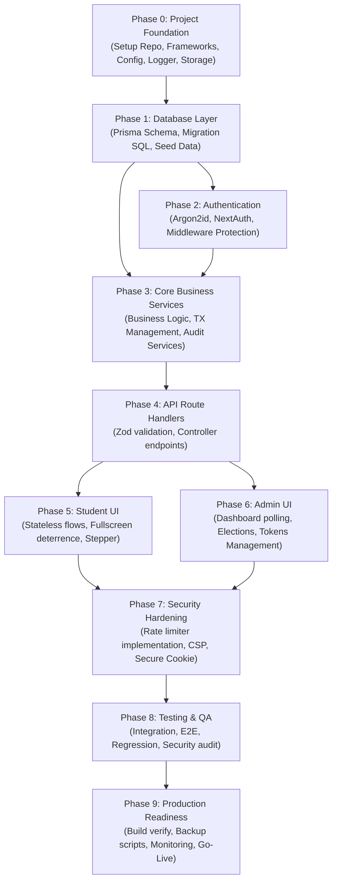

# 07 — Implementation Roadmap & SDP

> **Status:** DRAFT — Pending Review
> **Version:** 1.0.0
> **Last Updated:** 2026-07-28
> **Authors:** Principal Software Architect · Engineering Manager · TPM · Tech Lead
> **PRD Reference:** `00_PRODUCT_REQUIREMENTS_DOCUMENT.md` v1.1.0
> **DB Reference:** `01_DATABASE_DESIGN.md` v1.0.0
> **Arch Reference:** `02_SYSTEM_ARCHITECTURE.md` v1.1.0
> **API Reference:** `03_API_SPECIFICATION.md` v1.0.0
> **UI Reference:** `04_UI_UX_SPECIFICATION.md` v1.0.0
> **Security Reference:** `05_SECURITY.md` v1.0.0
> **Scope:** Full engineering roadmap and SDP — v1
> **Audience:** Core Developer · QA Engineer · Project Manager · DevOps

---

## Purpose

Dokumen ini adalah **Implementation Roadmap** dan **Software Development Plan (SDP)** untuk proyek Pilketos. Tujuannya adalah mendefinisikan urutan pembangunan sistem yang terstruktur berdasarkan dependensi teknis yang ketat untuk meminimalkan pengerjaan ulang (_rework_), mengoptimalkan paralelisme kerja tim kecil (2–5 developer), serta memastikan kepatuhan penuh terhadap spesifikasi arsitektur, database, API, UI/UX, dan keamanan yang telah disepakati.

Roadmap ini berfokus pada **tahapan teknis dan exit criteria** implementasi dari fondasi awal hingga siap rilis (_production-ready_), bukan estimasi tanggal kalender.

---

## Development Principles

Proses rekayasa perangkat lunak dalam proyek Pilketos dipandu oleh prinsip-prinsip berikut untuk memastikan kualitas kode dan stabilitas deployment:

### 1. Database-First Development

- **Definisi:** Skema database (`schema.prisma` dan migrasi) harus dideklarasikan, diverifikasi, dan di-seed sebelum menulis kode aplikasi.
- **Alasan:** Skema database adalah _ground truth_ dari struktur data. Perubahan skema di tengah jalan akan menyebabkan efek domino perubahan pada service layer, API, dan UI.

### 2. API Contract-First

- **Definisi:** Antarmuka API didefinisikan secara deklaratif (menggunakan Zod schemas untuk input dan typescript interfaces untuk response) berdasarkan `03_API_SPECIFICATION.md` sebelum business logic ditulis.
- **Alasan:** Frontend dan backend team dapat bekerja secara paralel dengan aman menggunakan mock API yang sesuai dengan kontrak.

### 3. Vertical Slice Development

- **Definisi:** Fitur dikembangkan secara lengkap dari database, service, API, hingga UI secara bertahap per modul bisnis (misalnya modul kandidat selesai penuh sebelum beralih ke modul token).
- **Alasan:** Menghindari penumpukan integrasi di akhir proyek (_integration hell_) dan memungkinkan tim mendemonstrasikan fungsionalitas yang berjalan secara inkremental.

### 4. Security by Design

- **Definisi:** Desain keamanan (seperti validasi input, sanitasi, otorisasi RBAC, isolasi data privasi) diterapkan langsung saat menulis modul terkait, bukan sebagai langkah pengerasan (_hardening_) di akhir proyek.
- **Alasan:** Menambal celah keamanan setelah sistem selesai jauh lebih sulit dan mahal daripada mendesainnya dengan aman sejak awal.

### 5. Incremental Delivery & Continuous Testing

- **Definisi:** Setiap potongan fungsionalitas baru harus memiliki tes verifikasi (unit/integration) sebelum digabungkan ke cabang utama (`main`).
- **Alasan:** Mencegah regresi fitur dan menjaga keandalan kode di setiap tahap rilis.

### 6. Feature Complete before Optimization

- **Definisi:** Prioritas utama adalah menyelesaikan seluruh alur fungsionalitas (happy path dan error path) sesuai DoD sebelum melakukan optimasi performa (caching, database indexing tuning, dll).
- **Alasan:** Optimasi dini (_premature optimization_) sering kali membuang waktu dan berisiko menambah kompleksitas yang tidak perlu.

---

## Dependency Graph

Grafik di bawah ini menunjukkan jalur dependensi teknis dalam proyek Pilketos. Aktivitas di hilir tidak boleh dimulai sebelum prasyarat di hulu selesai dan lolos verifikasi.

---

## Development Phases

### Phase 0 — Project Foundation

Fase ini bertujuan untuk mempersiapkan repositori kode, alat bantu developer, dan struktur folder awal agar seluruh tim memiliki standar pengembangan yang seragam.

#### Langkah Kerja:

1. **Repository Setup:** Inisiasi repositori Git, konfigurasi `.gitignore` untuk menyembunyikan environment variables, dan set aturan branching (branch protection untuk `main`).
2. **Framework Setup:** Inisialisasi Next.js 14+ dengan TypeScript (Strict mode enabled) dan App Router.
3. **Styling & UI Library Setup:** Instalasi TailwindCSS dan inisiasi shadcn/ui.
4. **ORM Setup:** Inisialisasi Prisma ORM di dalam workspace.
5. **Configuration Layer:** Membuat modul `src/config/env.ts` untuk memusatkan akses dan validasi `process.env` menggunakan Zod.
6. **Logger Service Abstraction:** Membuat interface `ILogger` dan implementasi `ConsoleLogger` di `src/lib/logger/`.
7. **Storage Service Abstraction:** Membuat interface `IStorageService` di `src/lib/storage/` untuk memisahkan logika aplikasi dari external storage provider (Supabase Storage).
8. **CI/CD Basic Pipeline:** Setup GitHub Actions untuk menjalankan build check, ESLint, dan Prettier otomatis pada setiap Pull Request.

---

### Phase 1 — Database Layer

Fase ini memigrasikan desain logical data ke database fisik PostgreSQL serta menyiapkan data awal untuk keperluan pengujian.

#### Langkah Kerja:

1. **Prisma Schema Definition:** Menulis seluruh entitas (`Admin`, `Election`, `Candidate`, `VotingToken`, `Vote`, `AuditLog`) beserta relasi, tipe data, dan default values ke dalam `prisma/schema.prisma` berdasarkan `01_DATABASE_DESIGN.md`.
2. **Custom SQL Migrations (Constraints & Indexes):**
   - Menghasilkan file migrasi dasar menggunakan `prisma migrate dev --create-only`.
   - Menyisipkan script SQL manual untuk pembuatan _partial unique index_ pada `Election(status)` guna membatasi satu pemilihan aktif.
   - Menyisipkan script SQL manual untuk constraint unik kombinasi `election_id` dan `order_number` pada kandidat.
3. **Database Migration Execution:** Menjalankan migrasi database ke instansi PostgreSQL lokal/development.
4. **Data Seeding Script:** Menulis skrip `prisma/seed.ts` untuk menghasilkan:
   - Satu akun Super Admin default (menggunakan password ter-hash).
   - Satu election dummy dalam state `SETUP` dengan 3 kandidat dummy.
5. **Verification:** Memverifikasi skema fisik database menggunakan Prisma Studio dan tool inspeksi database.

---

### Phase 2 — Authentication

Membangun sistem gerbang keamanan untuk domain admin menggunakan Auth.js (NextAuth) dan library Argon2id.

#### Langkah Kerja:

1. **Password Hashing Utility:** Mengintegrasikan library `hash-wasm` atau library Argon2 native untuk fungsi hashing aman `hashPassword` dan `verifyPassword`.
2. **NextAuth Setup:** Mengonfigurasi Auth.js dengan Credentials Provider. Payload JWT harus berisi `{ id, username, role }`.
3. **Secure Cookie Configuration:** Mengonfigurasi session cookie dengan flag `HttpOnly`, `Secure`, dan `SameSite=Lax`.
4. **Middleware Protection (Edge Runtime):** Menulis file `src/proxy.ts` untuk memverifikasi token session NextAuth pada route `/admin/*` dan memverifikasi role `SUPER_ADMIN` pada route `/admin/settings`.
5. **Security Headers Injection:** Menambahkan injeksi header HTTP (CSP, HSTS, X-Frame-Options, X-Content-Type-Options, Referrer-Policy) ke dalam middleware.

---

---

### Phase 3 — Core Business Services

Fase ini mengimplementasikan semua business logic aplikasi di dalam direktori `src/services/`. Logika ini harus sepenuhnya independen dari protokol HTTP (tidak bergantung pada request/response object Next.js).

#### Langkah Kerja:

1. **AuditService (`src/services/audit.service.ts`):**
   - Fungsi `writeLog(actorId, action, targetType, targetId, result, ipAddress, userAgent, metadata)` untuk penulisan log audit secara append-only.
2. **TokenService (`src/services/token.service.ts`):**
   - Fungsi `generateTokenBatch(electionId, count)` yang melakukan penulisan batch token baru dalam satu transaksi database (TX-3) dan mengembalikan token plaintext.
   - Fungsi `validateToken(tokenPlaintext)` yang mencocokkan hash HMAC-SHA256 token di database dan memastikan status election terkait adalah `OPEN`.
3. **VoteService (`src/services/vote.service.ts`):**
   - Fungsi `castVote(tokenPlaintext, candidateId, electionId)` yang melakukan operasi penulisan suara secara atomik (TX-1):
     - `SELECT FOR UPDATE` pada tabel `VotingToken` untuk penguncian baris (_row locking_).
     - Verifikasi token belum terpakai.
     - Penulisan entri baru di tabel `Vote` (tanpa FK ke token).
     - Update status token (`used_at = now()`).
     - Pemanggilan `AuditService` untuk mencatat log sukses tanpa referensi token/kandidat.
4. **ElectionService (`src/services/election.service.ts`):**
   - Fungsi CRUD election standar.
   - Fungsi `transitionStatus(electionId, newStatus)` yang memverifikasi kecocokan transisi state machine (TX-2) sesuai aturan bisnis, memperbarui database, dan mencatat log aktivitas.
5. **CandidateService (`src/services/candidate.service.ts`):**
   - Fungsi CRUD kandidat dengan validasi batasan jumlah kandidat (2-5) dan nomor urut unik.
   - Integrasi dengan `StorageService` untuk unggah/hapus foto kandidat.
6. **AdminService (`src/services/admin.service.ts`):**
   - Fungsi pengelolaan akun admin oleh Super Admin (buat, update role/status, deaktifasi akun).

---

### Phase 4 — API Route Handlers

Membangun endpoint API Next.js Route Handlers (`src/app/api/`) berdasarkan spesifikasi API.

#### Urutan Implementasi Endpoint:

Untuk meminimalkan hambatan teknis, endpoint diimplementasikan dengan urutan dependensi data:

1. **Public/Infrastructure:** `GET /api/health`
2. **Authentication:** `/api/auth/[...nextauth]`
3. **Admin - Election CRUD & State Control:**
   - `POST /api/admin/elections`
   - `GET /api/admin/elections`
   - `PATCH /api/admin/elections/[id]/status`
4. **Admin - Candidate CRUD:**
   - `POST /api/admin/candidates`
   - `GET /api/admin/candidates`
   - `POST /api/admin/candidates/[id]/photo` (menguji integrasi storage)
5. **Admin - Token Management:**
   - `POST /api/admin/tokens/generate`
   - `GET /api/admin/tokens/export`
6. **Student Voting API (Critical Path):**
   - `POST /api/vote/validate-token`
   - `POST /api/vote/cast` (menguji transaksi database atomik)
7. **Admin - Dashboard & Observability:**
   - `GET /api/admin/dashboard/stats`
   - `GET /api/admin/audit`
8. **Admin - Admin Management:**
   - `GET /api/admin/admins`
   - `POST /api/admin/admins`
   - `PATCH /api/admin/admins/[id]`

---

### Phase 5 — Student UI (State-Free Layout)

Fase ini mengimplementasikan antarmuka untuk domain siswa pemilih. Sesuai arsitektur, UI siswa dirancang _state-free_ (stateless) dari perspektif server, di mana progress voting disimpan di client state.

#### Langkah Kerja:

1. **Common Voting Layout:** Mengimplementasikan layout dengan dominasi warna `--color-vote-surface` dan header stepper linear.
2. **Landing & Token Input Screen (`/vote`):**
   - Input token dengan filter otomatis ke format huruf kapital.
   - Penanganan inline error jika token invalid/terpakai.
3. **Fullscreen Gate (`/vote/fullscreen`):**
   - Halaman edukasi visual untuk masuk mode layar penuh.
   - Pemicu fungsi `document.documentElement.requestFullscreen()`.
   - Implementasi visual fallback jika request fullscreen ditolak browser.
4. **Candidate List Screen (`/vote/candidates`):**
   - Grid card kandidat yang responsif (1 kolom mobile, 2-3 kolom desktop).
   - Modal detail kandidat untuk membaca visi dan misi lengkap.
   - Fixed bottom action bar untuk konfirmasi pemilihan.
5. **Fullscreen Interruption Overlay:**
   - Overlay yang memblokir interaksi jika event `fullscreenchange` atau `visibilitychange` mendeteksi siswa keluar dari layar penuh atau memindahkan fokus jendela browser.
6. **Confirmation Screen (`/vote/confirm`):**
   - Tampilan ringkasan pilihan dengan peringatan final bahwa keputusan tidak dapat diubah.
   - Tombol kirim suara dengan penanganan _double-click prevention_.
7. **Success Screen (`/vote/done`):**
   - Pesan terima kasih dengan countdown visual 3 detik sebelum otomatis keluar dari fullscreen dan kembali ke `/vote`.

---

### Phase 6 — Admin UI

Membangun antarmuka untuk pengelolaan dan monitoring pemilihan oleh panitia.

#### Langkah Kerja:

1. **Sidebar Layout & Admin Breadcrumbs:** Layout dasar admin panel dengan navigasi sidebar responsif.
2. **Login Screen (`/admin/login`):** Form login dengan validasi error generik untuk mencegah penelusuran nama pengguna.
3. **Elections & Candidate Manager:**
   - Tabel daftar pemilihan beserta status badge.
   - Slide-over panel dari arah kanan untuk tambah/edit data kandidat.
4. **Token Manager:**
   - Tampilan statistik token.
   - Modal pemicu generate batch token.
   - **One-time display modal** untuk mengunduh berkas CSV token plaintext sesaat setelah generate berhasil.
5. **Dashboard Monitor & Live Mode (`/admin/dashboard`):**
   - Pembuatan custom hook `useDashboardPolling` untuk polling statistik agregat setiap 3-5 detik dengan Page Visibility API.
   - Visualisasi perolehan suara per kandidat menggunakan horizontal bar chart.
   - Implementasi toggle **Live Mode** untuk menyembunyikan semua kontrol admin dan menyisakan statistik grafik untuk proyeksi proyektor.
6. **Audit Log & Settings Panel:**
   - Tabel audit log yang dapat diekspansi untuk melihat rincian metadata JSON aktivitas admin.
   - Halaman kelola pengguna admin (khusus Super Admin).

---

### Phase 7 — Security Hardening

Penerapan pengerasan keamanan pada kode aplikasi untuk mengurangi risiko serangan siber sebelum masuk ke tahap pengujian QA.

#### Langkah Kerja:

1. **Rate Limiter Integration:** Menghubungkan library rate limiter pada endpoint API kritis (Signin, Validate Token, Cast Vote).
2. **File Upload Security Verification:**
   - Menulis logika validasi berkas foto kandidat pada API `/photo` (MIME verification, file extension, magic byte validation, rename file acak).
3. **Cookie Configuration Audit:** Memastikan flag HTTP-Only, Secure, dan SameSite=Lax aktif pada token session admin di lingkungan production.
4. **CSP Policy Verification:** Melakukan uji coba eksekusi asset melalui browser console untuk memastikan Content Security Policy memblokir semua skrip luar yang tidak sah.

---

---

### Phase 8 — Testing & QA Preparation

Fase pengujian menyeluruh terhadap sistem untuk memastikan keandalan, integritas data, dan ketahanan keamanan.

#### Langkah Kerja:

1. **Unit Testing:** Menulis unit test untuk fungsi helper utilitas (seperti hashing, format tanggal, i18n).
2. **Integration Testing:**
   - Menulis tes integrasi untuk `VoteService.castVote` guna mensimulasikan kondisi transaksi atomik.
   - Simulasi kondisi _race condition_ (uji coba 20 request vote bersamaan menggunakan 1 token) untuk memastikan database hanya mencatat 1 suara dan mengembalikan error 409 pada sisanya.
3. **E2E Testing (Playwright/Cypress):**
   - Menulis skrip testing otomatis untuk skenario happy path pemilih: Input Token → Masuk Fullscreen → Pilih Kandidat → Kirim Suara → Selesai.
   - Skenario interupsi: Simulasi keluar fullscreen di tengah jalan dan memastikan overlay muncul menghalangi interaksi.
4. **Manual QA & UAT:**
   - Menyusun skenario pengujian manual (UAT) untuk panitia pemilihan sekolah.
   - Uji coba responsivitas tampilan pada berbagai perangkat (Lab PC desktop, tablet, smartphone OS Android dan iOS).
5. **Security Verification Audit:**
   - Pengujian penetrasi sederhana pada API admin tanpa session JWT untuk memastikan respon ditolak (401/403).
   - Verifikasi token plaintext tidak tersimpan di database, browser storage, maupun file log.

---

### Phase 9 — Production Readiness & Go-Live

Persiapan infrastruktur, deployment, dan skema pemulihan bencana (_disaster recovery_) sebelum sistem digunakan secara live.

#### Langkah Kerja:

1. **Production Build Verification:** Menjalankan `npm run build` lokal untuk memastikan tidak ada kesalahan kompilasi TypeScript atau CSS.
2. **Environment Validation:** Verifikasi ketersediaan dan keabsahan semua environment variables di server produksi (Vercel/VPS).
3. **Database Migration Go-Live:** Menjalankan perintah migrasi database Prisma ke server PostgreSQL produksi menggunakan connection string direct URL.
4. **Data Seeding & Verification:** Menjalankan seeder akun Super Admin produksi dan memastikan kredensial default diganti pada login pertama.
5. **Backup Strategy Automation:** Setup cron job berkala untuk melakukan backup database PostgreSQL (dump SQL terenkripsi) dan disimpan di cloud storage terpisah.
6. **Operational Monitoring Setup:** Setup alert monitoring sederhana (seperti uptime robot) yang memantau endpoint `/api/health`.

---

## Milestone Summary

| Milestone                    | Deskripsi                                     | Deliverables Utama                                                     | Exit Criteria                                                             |
| ---------------------------- | --------------------------------------------- | ---------------------------------------------------------------------- | ------------------------------------------------------------------------- |
| **M1: Foundation**           | Setup repositori, framework, database layer   | Config layer, `schema.prisma`, migrasi SQL, seeder                     | Build CI hijau, migrasi DB berjalan sukses di lokal, data seed terisi     |
| **M2: Core Services & Auth** | Implementasi authentication & business logic  | `AuthService`, `NextAuth` config, `VoteService` (TX-1), `TokenService` | Unit test & integration test untuk transaksi voting lulus 100%            |
| **M3: API Delivery**         | Penyelesaian seluruh endpoint API             | Route Handlers, Zod schemas validation                                 | Kontrak API cocok dengan spesifikasi, pengujian postman/curl sukses       |
| **M4: User Interface**       | Selesainya seluruh halaman UI pemilih & admin | Frontend pages, stepper component, dashboard polling                   | E2E testing Playwright sukses untuk happy path, responsive check OK       |
| **M5: Security Hardening**   | Pengerasan keamanan aplikasi                  | Middleware CSP, Rate limiter, File upload validation                   | Security headers terverifikasi aktif, rate limit terbukti memblokir spam  |
| **M6: Go-Live Ready**        | Sistem deployed di production environment     | Production build, backup script, live database                         | Health check hijau, deployment selesai tanpa error, UAT sekolah disetujui |

---

## Deliverables per Phase

Berikut adalah daftar berkas fisik dan artefak yang wajib diselesaikan pada akhir setiap fase:

- **Phase 0:** `package.json`, `tsconfig.json`, `src/config/env.ts`, `src/lib/logger/index.ts`, `src/lib/storage/index.ts`, `.github/workflows/ci.yml`.
- **Phase 1:** `prisma/schema.prisma`, `prisma/migrations/`, `prisma/seed.ts`.
- **Phase 2:** `src/proxy.ts`, `src/app/api/auth/[...nextauth]/route.ts`, `src/lib/auth/argon.ts`.
- **Phase 3:** `src/services/vote.service.ts`, `src/services/token.service.ts`, `src/services/election.service.ts`, `src/services/candidate.service.ts`, `src/services/audit.service.ts`, `src/services/admin.service.ts`.
- **Phase 4:** `src/app/api/vote/`, `src/app/api/admin/`, `src/app/api/health/route.ts`.
- **Phase 5:** `src/app/vote/`, `src/components/voting/`, `src/hooks/useFullscreen.ts`.
- **Phase 6:** `src/app/admin/`, `src/components/dashboard/`, `src/hooks/useDashboardPolling.ts`.
- **Phase 7:** `src/lib/rate-limiter/`, `src/schemas/` (Zod validation schemas).
- **Phase 8:** `tests/unit/`, `tests/integration/`, `tests/e2e/`.
- **Phase 9:** `scripts/backup-db.sh`, `Dockerfile` (opsional), production environment setup.

---

## Definition of Done (DoD)

Setiap item pekerjaan dianggap selesai hanya jika memenuhi kriteria berikut sesuai kategorinya:

### Definition of Done untuk Feature / User Story

- Kode dikompilasi tanpa error TypeScript.
- Memenuhi semua kriteria penerimaan (_acceptance criteria_) dalam PRD.
- Lolos pengujian linting (`npm run lint`) dan format kode (`npm run format`).
- Kode ditinjau (_reviewed_) dan disetujui (_approved_) oleh minimal satu developer lain melalui Pull Request.

### Definition of Done untuk API Endpoint

- Kontrak request dan response sesuai dengan `03_API_SPECIFICATION.md`.
- Input divalidasi ketat menggunakan Zod schema.
- Respon error konsisten menggunakan format `{ success: false, error: { code, message } }`.
- Endpoint dilindungi rate limiter dan otorisasi RBAC (jika di area admin).

### Definition of Done untuk UI Screen

- Tampilan responsif di semua breakpoint (Mobile, Tablet, Desktop).
- Elemen interaktif memiliki _focus-visible_ ring yang jelas.
- Memenuhi standar kontras warna WCAG AA.
- Tidak ada data statis (_hardcoded text_) yang bercampur di luar file kamus lokalisasi.

### Definition of Done untuk Service Layer

- Database transaction diimplementasikan untuk operasi multi-write.
- Mencatat aksi administratif menggunakan `AuditService` (append-only).
- Memiliki integration test untuk skenario transaksi kritis (seperti cast vote).

---

## Coding Standards

Aturan implementasi kode yang wajib ditaati oleh seluruh developer:

| Aturan                  | Spesifikasi Teknis                                                  | Alasan                                                                                |
| ----------------------- | ------------------------------------------------------------------- | ------------------------------------------------------------------------------------- |
| **TypeScript Strict**   | `"strict": true` di `tsconfig.json`                                 | Mencegah error runtime akibat type mismatch                                           |
| **No Dynamic Access**   | Dilarang memanggil `process.env` di luar `src/config/env.ts`        | Mencegah kebocoran environment variable                                               |
| **Clean Route Handler** | Dilarang menulis business logic di dalam Route Handlers             | Route handler hanya memvalidasi input, memanggil service, dan memformat HTTP response |
| **Storage Separation**  | Unggah gambar wajib melalui `StorageService` interface              | Mempermudah pergantian provider (Supabase → S3/R2) di masa depan                      |
| **Logging Separation**  | Dilarang menggunakan `console.log` langsung di aplikasi             | Gunakan `LoggerService` agar output log terstruktur dan mudah dialihkan ke file/SIEM  |
| **Database Access**     | Dilarang menggunakan raw SQL di aplikasi                            | Gunakan Prisma Client untuk type safety (kecuali dalam file migrasi SQL manual)       |
| **Naming Convention**   | Folder `kebab-case`, File pages `page.tsx`, Services `*.service.ts` | Konsistensi arsitektur Next.js                                                        |

---

## Risk Management

Identifikasi risiko selama proses pengembangan beserta mitigasinya:

### 1. Risiko Migrasi Skema Database

- **Risiko:** Perubahan skema database di tengah pengembangan menyebabkan kerusakan data testing atau inkonsistensi API.
- **Mitigasi:** Terapkan prinsip _Database-First_. Setiap perubahan skema di fase lanjut wajib melalui migrasi formal (`prisma migrate dev`) dengan data seeder yang diupdate secara paralel.

### 2. Risiko Kebocoran Anonimitas Pemilih

- **Risiko:** Token plaintext siswa bocor melalui log server atau tersimpan di database akibat kesalahan implementasi.
- **Mitigasi:** Lakukan audit kode statis khusus untuk memastikan tidak ada pemanggilan `LoggerService` yang mencatat isi variabel token plaintext, serta verifikasi skema database tidak menampung plaintext.

### 3. Risiko Race Condition Double-Voting

- **Risiko:** Pemilih jahat mengirim request vote bersamaan dalam hitungan milidetik sehingga sistem mencatat dua suara untuk satu token.
- **Mitigasi:** Enforce penggunaan database transaction dengan tingkat isolasi tepat dan `FOR UPDATE` lock pada baris token saat dibaca di awal transaksi (`VoteService.castVote`).

### 4. Risiko Kegagalan Fullscreen di Perangkat Siswa

- **Risiko:** Browser lab sekolah versi lama memblokir Fullscreen API secara otomatis.
- **Mitigasi:** Siapkan instruksi fallback visual yang jelas (cara tekan F11 manual) pada halaman Fullscreen Gate.

---

## Technical Debt Policy

Kebijakan penanganan hutang teknis (_technical debt_) agar tidak menghambat rilis produksi:

1. **Pencatatan:** Hutang teknis yang sengaja diambil (misalnya: tidak memakai caching untuk dashboard stats v1) wajib dicatat sebagai tiket issue di project management tool dengan label `tech-debt`.
2. **Prioritas:** Pembenahan hutang teknis dikelompokkan dalam siklus tersendiri:
   - **Blocker:** Harus diselesaikan jika menghambat exit criteria milestone.
   - **Deferrable:** Dapat ditunda hingga fase pemeliharaan pasca rilis pemilihan.
3. **Refactoring Window:** Alokasikan 10% waktu dari setiap fase pengembangan untuk melakukan pembenahan kode (_refactoring_) tanpa menambah fitur baru.

---

## Future Roadmap (v2+)

Fitur-fitur berikut secara sadar ditunda dari ruang lingkup pengembangan v1 untuk menjaga kesederhanaan dan kecepatan rilis:

- **Multi-Election Support:** Kemampuan mengelola lebih dari satu pemilihan secara bersamaan (saat ini v1 dibatasi maksimal satu election aktif).
- **Multi-Factor Authentication (MFA):** Pengamanan login akun admin menggunakan TOTP (Google Authenticator).
- **Redis Integration:** Penggunaan Redis untuk rate limiting terdistribusi dan caching dashboard stats.
- **Push-based Realtime Dashboard:** Menggantikan polling HTTP dengan Supabase Realtime (WebSockets) untuk visualisasi perolehan suara instan.
- **SIEM Integration:** Pengiriman logs terpusat untuk monitoring keamanan real-time skala enterprise.

---

## Development Decision Summary

Rangkuman keputusan teknis implementasi proyek Pilketos:

| Decision                | Choice                         | Rationale                                                          | Reference                       |
| ----------------------- | ------------------------------ | ------------------------------------------------------------------ | ------------------------------- |
| **Development Style**   | Vertical Slice Development     | Meminimalkan integrasi akhir yang rumit, fitur selesai per modul   | Roadmap §Development Principles |
| **API Boundary**        | Next.js Route Handlers         | Menghindari kompleksitas REST framework eksternal; route tipis     | Arch §Layered Architecture      |
| **Configuration**       | Centralized Zod env validation | Deteksi dini kesalahan konfigurasi saat aplikasi baru dinyalakan   | Arch §Configuration Layer       |
| **Storage Abstraction** | StorageService Interface       | Decoupling aplikasi dari pihak ketiga; mempermudah pengujian lokal | Arch §Storage Abstraction       |
| **Dashboard Update**    | useDashboardPolling Hook       | Implementasi sederhana, tanpa dependensi WebSocket, minim resource | Arch §Realtime Architecture     |
| **Testing Target**      | Playwright E2E Testing         | Simulasi interaksi fullscreen dan interupsi siswa secara akurat    | Roadmap §Phase 8                |

---

> **Dokumen implementation roadmap ini mengikat.** Setiap deviasi dari urutan pembangunan atau exit criteria yang tertulis di sini harus dikoordinasikan dengan TPM dan Arsitek Utama sebelum dieksekusi oleh tim developer.
